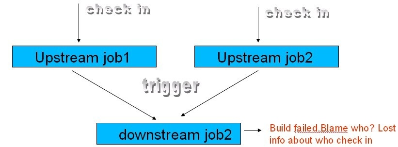

This plug-in provides utilities for getting svn info from upstream job
to downstream job

The original purpose of creating BlameSubversion is to solve
https://issues.jenkins-ci.org/browse/JENKINS-7509[JENKINS-7509].

*Why need BlameSubversion plugin?*

[.confluence-embedded-file-wrapper]##

*When some body check the code in , the Upstream job1 or upsteam job2
will build the source code. +
*When the upstream job1 or upsteam job2 is done, it will invoke the
build of downstream job2 +
*When the downstream job2 build failed, the svn info about who check in
upstream job1 or upstream job2 was lost

*How did BlameSubversion plugin work?*

*1 get the build of upstream job who trigger this build of downstream +
*2 get svn info from it +
*3 copy svn info to downstream build +
*4 provide interfaces for other official hudson plugins.

*How did BlameSubversion plugin work?*

Easy configure of BlameSubversion plugin +
1 choose the checkbox of Blame Subversion in Souce code Management +
2 choose the checkbox of Always Collect SVN info from upstream job if
you are sure to do it.

[[BlameSubversion-ChangeLog]]
== Change Log

[[BlameSubversion-Version1.200(Jan4,2012)]]
=== Version 1.200 (Jan 4, 2012)

* Release 1.200 to get rid of version order issue with 1.121 (assuming
this was a typo releasing 1.21)

[[BlameSubversion-Version1.25(Nov1,2010)]]
=== Version 1.25 (Nov 1, 2010)

* Fix a bug

[[BlameSubversion-Version1.24(Nov1,2010)]]
=== Version 1.24 (Nov 1, 2010)

* Add new feature for up down stream job build number synchronize
* Add help.html
* Fix a bug for notify

[[BlameSubversion-Version1.121(Oct15,2010)]]
=== Version 1.121 (Oct 15, 2010)
