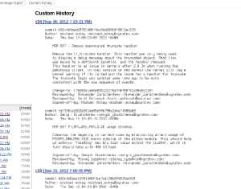

Show custom text in scm log manner +
  +
[.confluence-embedded-file-wrapper]##

This plugin shows text from file a file(configured per project ) in
report for keeping record in manner as scm history is showing. It could
be used for cases when

standard jenkins version control tools cannot be used because of build
process or when you want to track non scm description.
