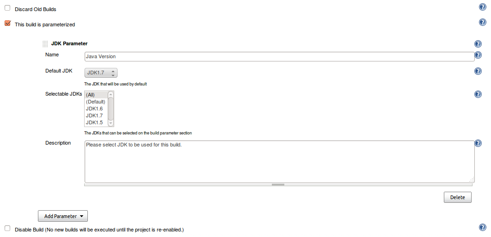
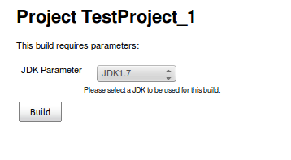

[.confluence-embedded-file-wrapper .confluence-embedded-manual-size]##

Developed by http://www.datalex.com/[Datalex] Infrastructure Team.

[[JDKParameterPlugin-Description]]
== Description

This plugin adds a build parameter which can be used to set the JDK to
be used with a job on a per-build basis. The JDKs that can be chosen
from can be specified on the configuration page of any job that has the
JDK parameter enabled. 

[[JDKParameterPlugin-Usage]]
== Usage

 The plugins configuration is located in the 'Parameters' section of the
job configuration UI.  +
There will be a dropdown list to select what should be used as the
default JDK on the build parameters page and a multi-selection box where
you can choose what JDKs are available to pick from as a build parameter
for that job.

[.confluence-embedded-file-wrapper]##

On the build parameters page there will be a dropdown choice of what JDK
to use for the build.

[.confluence-embedded-file-wrapper]##

[[JDKParameterPlugin-KnownIssues]]
== Known Issues

During the build phase of a job that has JDK Parameter configured, the
'JDK' option of Jenkins is replaced with the JDK selected on  'JDK
Parameter' and restored to the original value at the end of the build.
This means that if a job runs multiple builds at the same time, the
'JDK' option of the job configuration could be restored to the wrong
value.  

[[JDKParameterPlugin-Changelog]]
== *Changelog*

[[JDKParameterPlugin-Version1.0]]
=== Version 1.0 

Initial release.
