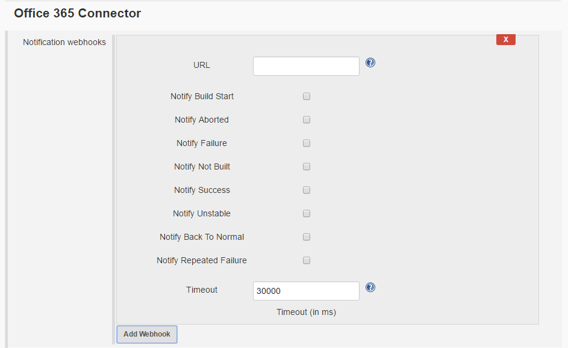

This plugin from Microsoft Corp. allows sending running Jobs status
notifications.

[[Office365ConnectorPlugin-Description]]
== Description

Plugin is used to send actionable messages in Outlook, Office 365
Groups, and Microsoft Teams.

https://docs.microsoft.com/en-us/outlook/actionable-messages/[Read more
about it]

Once the Office 365 Connector plugin is installed, webhooks for
notifications are defined in *Job Notification* section of the
configuration of job. Here is the screenshot for that section
[.confluence-embedded-file-wrapper]## +
Here are the steps to configure a webhook

* Click on the "Add Webhook" button.
* Enter the webhook URL which is displayed when you create JenkinsCI
connector in Office365.
* Check the boxes for which you want to receive notifications.
* Configure the timeout after which jenkins plugin would give on
unavailable server.

Once you configure this plugin, build related messages will appear in
the workplace messaging system.

To send messages from inside pipeline script:

* Configure the webhook you want to send message following the steps
mentioned above.
* In the Pipeline script use the following command: +
*office365ConnectorSend message: "<Your message>", status:"<Build
status>"*

To send message from inside Jenkinsfile:

* In the script use the following command: +
*office365ConnectorSend message: "<Your message>", status:"<Build
status>", webhookUrl:'<The connector webhook url>'*

[[Office365ConnectorPlugin-Requirements]]
=== Requirements

This plugin is created to work with Office 365 Groups.

[[Office365ConnectorPlugin-Release4.5]]
=== Release 4.5

. Added more logging and modified title of card to display branch name
as well.

[[Office365ConnectorPlugin-Release4.4]]
=== Release 4.4

. Added support for macros that allow to define when the connection is
triggered. User can define additional conditions that must be met to
trigger the notification. For example having generic build that builds
many envs it is possible to get notification only for one (eg based on
build params). +
[.confluence-embedded-file-wrapper .confluence-embedded-manual-size]#image:https://raw.githubusercontent.com/jenkinsci/office-365-connector-plugin/master/.README/config.png[image,height=250]#
. [.js-issue-title]##Allow additional parameter of "color" to be passed
to office365ConnectorSend. ##This will allow specifying the HEX color
code of the card used to display when the 'message' attribute is set.
+
Example: office365ConnectorSend message: "My Message", status:
"FAILURE", webhookUrl: "https://....", color: "d00000" +
[.confluence-embedded-file-wrapper]#image:https://raw.githubusercontent.com/jenkinsci/office-365-connector-plugin/master/.README/message.png[image]#

[[Office365ConnectorPlugin-Release3.0]]
=== Release 3.0

. Allow webhook parameter to be expanded, so for a build you can define
your webhook as `+$webhook +`and have the the ability to expand the
`+$webhook+` value to an actual URL either by environment variables,
build variables, build parameters and etc.
. Fix job name with slashes. Main cause branch names ie. feature/abc
. Add support for started card and completed card for pipeline. +
+
`+office365ConnectorSend status: "Started", webhookUrl: "${env.HOOK}"+` +
For messages +
`+office365ConnectorSend message: "Hello world", webhookUrl: "${env.HOOK}"+`
. Made webhookUrl as new default.
. Add the colors to the cards. +
See the effect in these screenshots:
+
https://user-images.githubusercontent.com/1661688/29613785-d7f2bcaa-8807-11e7-9812-d7d99ef7f143.png[[.confluence-embedded-file-wrapper]#image:https://user-images.githubusercontent.com/1661688/29613785-d7f2bcaa-8807-11e7-9812-d7d99ef7f143.png[image]#] +
https://user-images.githubusercontent.com/1661688/29613794-e47b2c6e-8807-11e7-991e-78826d908a17.png[[.confluence-embedded-file-wrapper]#image:https://user-images.githubusercontent.com/1661688/29613794-e47b2c6e-8807-11e7-991e-78826d908a17.png[image]#] +
https://user-images.githubusercontent.com/1661688/29613808-f26fe256-8807-11e7-921a-5935cadbf94f.png[[.confluence-embedded-file-wrapper]#image:https://user-images.githubusercontent.com/1661688/29613808-f26fe256-8807-11e7-921a-5935cadbf94f.png[image]#]

[[Office365ConnectorPlugin-Release2.5]]
=== Release 2.5

. When selected notification type as "Failure", then notification is
sent only when previous build is success and current build failed. No
notification would be sent for repeated failure. If user wants to
receive notification for repeated failure, then he/she should select
"Repeated Failure" notification type.
. Details about test cases and developers would be displayed in the card
only if those details are availble, else they would not be displayed.

[[Office365ConnectorPlugin-Release2.4.1]]
=== Release 2.4.1

. Removed unwanted logging on the console.

[[Office365ConnectorPlugin-Release2.4]]
=== Release 2.4

. Removed Build Start Time from the office365ConnectorSend message card.

[[Office365ConnectorPlugin-Release2.3]]
=== Release 2.3

. Added support to set "Status" of the card from office365ConnectorSend
command.
. Added facts culprits and developers when the build is triggered due to
SCM commit.

[[Office365ConnectorPlugin-Release2.2]]
=== Release 2.2

. Added support to send notification from inside Jenkinsfile. 
. Added option webhookUrl for the office365ConnectorSend command.

[[Office365ConnectorPlugin-Release2.1]]
=== Release 2.1

. Fixed Back To Normal Time showing some invalid time issue.

[[Office365ConnectorPlugin-Release2.0]]
=== Release 2.0

. Added support to send notification from inside the pipeline script.
The user can use office365ConnectorSend command to send any
notification.

[[Office365ConnectorPlugin-Release1.4]]
=== Release 1.4

. Included author name and number of files changed if the build is due
to SCM change.

[[Office365ConnectorPlugin-Release1.3.3]]
=== Release 1.3.3

. Tracks UNSTABLE to SUCCESS build status changes with Notify Back To
Normal event.

[[Office365ConnectorPlugin-Release1.3]]
=== Release 1.3

. Supports notification for pipeline jobs.

[[Office365ConnectorPlugin-Release1.2.1]]
=== Release 1.2.1

. Initial version.
