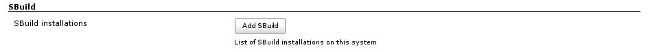
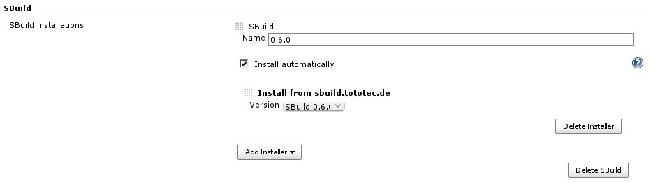
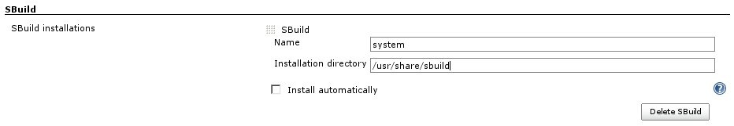

This plugin allows building projects using http://sbuild.org/[SBuild].

[[SBuildPlugin-Overview]]
== Overview

The SBuild Plugins enables Jenkins to run SBuild targets directly.
Multiple SBuild versions can be used.

[[SBuildPlugin-Features]]
=== Features

* Manage multiple SBuild installations, which can be automatically
downloaded and installed for you
* Support multiple buildfiles (which translate to `+--buildfile+` and
`+--additional-buildfile+` options)
* Support to build multiple target.

[[SBuildPlugin-Changelog]]
=== Changelog

For the changes of each release, refer to the
https://github.com/jenkinsci/sbuild-plugin/blob/master/ChangeLog.txt[Changelog].

[[SBuildPlugin-JenkinsConfiguration]]
== Jenkins Configuration

Before use, at least one SBuild installation must be configured. You
can, of course, configure as much installations as you want. You can, of
course, configure as much installations as you want.

[.confluence-embedded-file-wrapper]##

Press "Add SBuild" to configure one.

[[SBuildPlugin-AutomaticallyinstallanSBuildversion]]
=== Automatically install an SBuild version

Give a name, e.g. the version and check "Install automatically". Then
select the version you want to install from the "Version" drop down
selection.

[.confluence-embedded-file-wrapper]##

[[SBuildPlugin-UseofanexistingSBuildinstallation]]
=== Use of an existing SBuild installation

Give a name and uncheck "Install automatically". Then specify the
installation directory of your SBuild installation.

[.confluence-embedded-file-wrapper]##

[[SBuildPlugin-BuildJobConfiguration]]
== Build Job Configuration

It is recommended to use a "free style" project.
