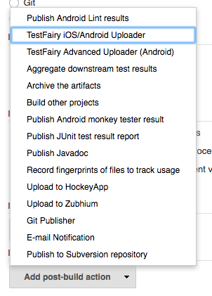
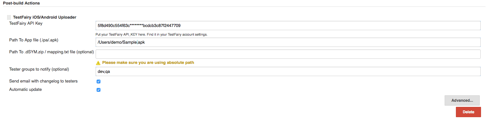
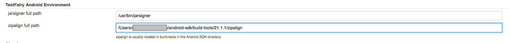
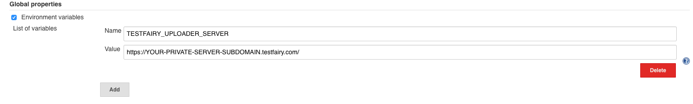

[.conf-macro .output-inline]##

[cols="",options="header",]
|===
|Plugin Information
|View TestFairy https://plugins.jenkins.io/TestFairy[on the plugin site]
for more information.
|===

[.aui-icon .aui-icon-small .aui-iconfont-info .confluence-information-macro-icon]##

Older versions of this plugin may not be safe to use. Please review the
following warnings before using an older version:

* https://jenkins.io/security/advisory/2019-04-03/#SECURITY-1062[Credentials
stored in plain text]

[.conf-macro .output-inline]#This plugin helps you to upload Android
APKs or iOS IPA files to http://www.testfairy.com/[www.testfairy.com]#

[[TestFairyPlugin-Howtouse]]
== How to use

Select *TestFairy iOS/Android* *Uploader* from *Add post-build action*
menu

[.confluence-embedded-file-wrapper]## +
 * *

*Job Configuration:*

[.confluence-embedded-file-wrapper]## +
* The API Key can be found in https://app.testfairy.com/settings/[your
account settings]   

To make sure Jenkins also uploads your iOS dSYMs to TestFairy, configure
the Xcode that builds the app on the Jenkins server to run a special
script.
https://docs.testfairy.com/iOS_SDK/How_To_Upload_dSYM.html#upload-dsym-from-xcode[Follow
these instructions].

The resulted TestFairy links will be listed in the console output

[.confluence-embedded-file-wrapper]##

[[TestFairyPlugin-ImportantforAdvancedUploaderonly:]]
=== *Important* **for Advanced Uploader only:*** *

* You should configure the "Path To Keystore file" and the
corresponding storepass & alias.
* You should configure "*TestFairy Android
Environment" *on http://localhost:8080/configure for example:
[.confluence-embedded-file-wrapper]##

[[TestFairyPlugin-Customchangelog]]
== Custom changelog

In order to add your own changelog or comments, please create a text
file in the following
location: $JENKINS_HOME/jobs/$JOB_NAME/builds/$BUILD_ID/testfairy_change_log

The content of this file will override the default changelog.

[[TestFairyPlugin-PrivateCloud/On-Premisesupport]]
== Private Cloud / On-Premise support 

In case you are using our Private Cloud or On-Premise product

please define an _TESTFAIRY_UPLOADER_SERVER_ environment variable.

You can do it by going to *Manage Jenkins* => *Configure*

Under section [.markup--strong .markup--p-strong]##Global
Properties, ##check *[.markup--strong .markup--p-strong]#Environment
variables# checkbox*. Now Jenkins allow us to add key and value pairs.

The name should be _TESTFAIRY_UPLOADER_SERVER_ and the value will be
your *server domain.*

[.confluence-embedded-file-wrapper .confluence-embedded-manual-size]##

The following line should be printed at your next job console output: 

[source,console-output]
----
"The server will be  https://YOUR-PRIVATE-SERVER-SUBDOMAIN.testfairy.com/"
----

 +
 +
Authors

This plugin was developed and open sourced
by http://testfairy.com/[TestFairy]

[[TestFairyPlugin-Credits]]
== Credits

The past plugin was developed by http://www.3pillarglobal.com/[3Pillar
Global]
