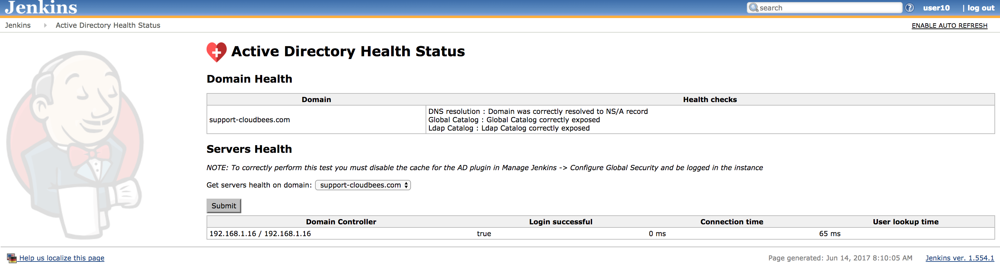
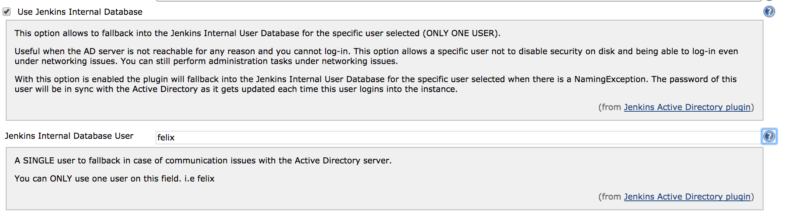
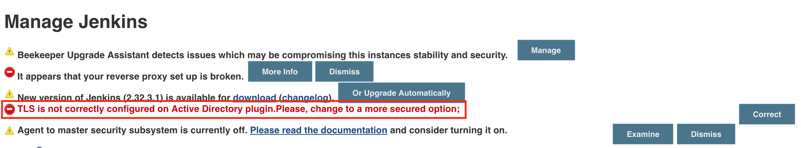
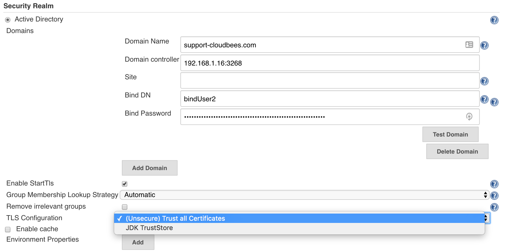
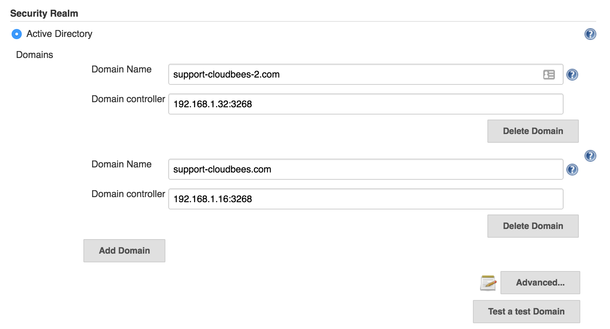
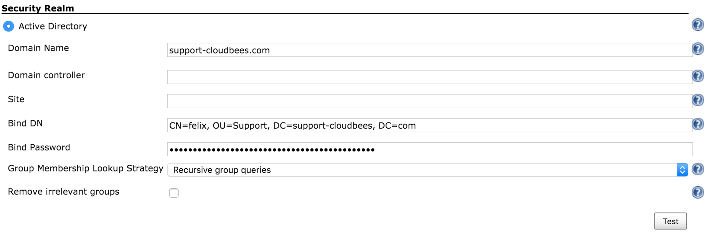
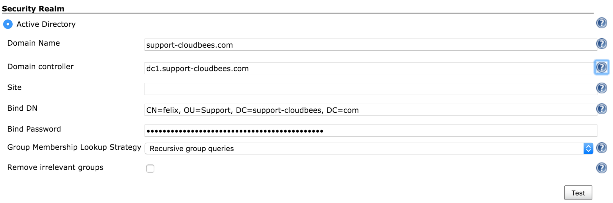

[.conf-macro .output-inline]##

[cols="",options="header",]
|===
|Plugin Information
|View Active Directory https://plugins.jenkins.io/active-directory[on
the plugin site] for more information.
|===

[.aui-icon .aui-icon-small .aui-iconfont-info .confluence-information-macro-icon]##

Older versions of this plugin may not be safe to use. Please review the
following warnings before using an older version:

* https://jenkins.io/security/advisory/2019-01-28/#SECURITY-859[Improper
certificate validation]
* https://jenkins.io/security/advisory/2017-03-20/[Man-in-the-middle
vulnerability due to missing certificate check]

With this plugin, you can configure Jenkins to authenticate the username
and the password through Active Directory.This plugin internally uses
two very different implementations, depending on whether Jenkins is
running on Windows or non-Windows and if you specify a domain.

* If Jenkins is running on a Windows machine and you do not specify a
domain, that machine must be a member of the domain you wish to
authenticate against. Jenkins uses ADSI to figure out all the details,
so no additional configuration is required.
* If Jenkins is running on a non-Windows machine (or you specify one or
more domains), then you need to tell Jenkins the name of Active
Directory domain(s) to authenticate with. Jenkins then uses DNS SRV
records and LDAP service of Active Directory to authenticate users.

Jenkins recognizes all the groups in Active Directory that the user
belongs to, so you can use those to make authorization decisions (for
example, you can choose the matrix-based security as the authorization
strategy and perhaps allow "Domain Admins" to administer Jenkins).

[[ActiveDirectoryplugin-ActiveDirectoryHealthStatus]]
== Active Directory Health Status

Since the version 2.5 the AD plugin adds a ManagementLink to report a
Health Status about the Domain and Domain controllers. In order to
correctly use this feature, you should be logged-in into the instance
and the cache should be disabled. Then, you will get:

* The Domain health
** DNS resolution
** Global Catalog
** Ldap Catalog
* The Domain Controller Health
** If the user can login into the DC
** The Connection time
** The total time in the lookup process

[.confluence-embedded-file-wrapper .confluence-embedded-manual-size]##

[[ActiveDirectoryplugin-Fall-backuser]]
== Fall-back user

Since the version 2.5 of the AD plugin, you can define a user to fall
back in case there is a communication issue between Jenkins and the AD
server. On this way, this admin user can be used to continue
administering Jenkins in case of communication issues, where usually you
were following the link
https://wiki.jenkins-ci.org/display/JA/Disable+security[Disable
security]. The password of this user is automatically synced with the
Jenkins Internal Database by this feature. In order to configure this
new feature you should enable *Use Jenkins Internal Database* in the AD
configuration under Manage Jenkins → Configure Global Security and
specify a SINGLE user by its username.

 +

[.confluence-embedded-file-wrapper .confluence-embedded-manual-size]##

[[ActiveDirectoryplugin-ActiveDirectoryPlugindidnotverifycertificateofADserver]]
== https://wiki.jenkins-ci.org/display/JENKINS/SECURITY-251[SECURITY-251] Active Directory Plugin did not verify certificate of AD server

From versions < 2.3 the Active Directory Plugin did not verify
certificates of the Active Directory server, thereby enabling
Man-in-the-Middle attacks. From version 2.3 the plugin allows to choose
between a secured option and continue trusting all the certificated.

In case there was an Active Directory configured previously on the
instance after upgrading the plugin the following Administrative Monitor
will appear.

[.confluence-embedded-file-wrapper .confluence-embedded-manual-size]##

To avoid this message to appear again in case you would like to continue
trusting all the certificates, the only thing you need to do is to go to
Manage Jenkins -> Configure Global Security and hit the button saved.
Then, the Administrative Monitor should not appear anymore as you
acknowledge that you are fine by continuing on this TrustAllCertificated
mode.

However, for security reasons the recommendation is to move to the
secured option. This can be done on the Active Directory configuration
under the Advanced button by selecting TLS configuration: JDK
TrustStore.When this option is enabled notice that then in case your
Active Directory server is using a self sing certificate, which usually
is the case, you must then:

[.confluence-embedded-file-wrapper .confluence-embedded-manual-size]##

{empty}1. Export the certificate from your AD server +
2. Create a custom keystore from the JVM keystore

For Unix:

....
CUSTOM_KEYSTORE=$JENKINS_HOME/.keystore/
mkdir -p $CUSTOM_KEYSTORE
cp $JAVA_HOME/jre/lib/security/cacerts $CUSTOM_KEYSTORE
....

For Windows:

....
CUSTOM_KEYSTORE=%JENKINS_HOME%\.keystore\
md  %CUSTOM_KEYSTORE%
copy %JAVA_HOME%\jre\lib\security\cacerts %CUSTOM_KEYSTORE%
....

{empty}3. Import your certificate

For Unix:

....
$JAVA_HOME/bin/keytool -keystore $JENKINS_HOME/.keystore/cacerts \
  -import -alias <YOUR_ALIAS_HERE> -file <YOUR_CA_FILE>
....

For Windows:

....
%JAVA_HOME%\bin\keytool -keystore %JENKINS_HOME%\.keystore\cacerts -import -alias <YOUR_ALIAS_HERE> -file <YOUR_CA_FILE>
....

{empty}4. Add the certificate to the Jenkins startup parameters:

The following JAVA properties should be added depending on your OS:

For Unix:

....
-Djavax.net.ssl.trustStore=$JENKINS_HOME/.keystore/cacerts \
-Djavax.net.ssl.trustStorePassword=changeit
....

For Windows:

....
-Djavax.net.ssl.trustStore=%JENKINS_HOME%\.keystore\cacerts
-Djavax.net.ssl.trustStorePassword=changeit
....

{empty}5. Follow section Securing access to Active Directory servers to
enable LDAPS

Disaster recover: In case that after all of this you cannot login
anymore, you should enable the logging on the plugin to understand why
it is failing. In case that after you enable the secured option you
cannot login on the instance anymore, you might want to quickly fallback
to the previous status specially on production environments. You can
easily do this by going to $JENKINS_HOME/config.xml and under the
section <securityRealm
class="hudson.plugins.active_directory.ActiveDirectorySecurityRealm"
revert the tlsConfiguration to the previous status. A restart is needed.

....
<tlsConfiguration>TRUST_ALL_CERTIFICATES</tlsConfiguration>
....

[[ActiveDirectoryplugin-IMPORTANTActiveDirectory2.0-Bettermulti-domainssupport]]
== IMPORTANT Active Directory 2.0 - Better multi-domains support

The latest release of the Active Directory plugin provides you a better
multi-domains support.

[.confluence-embedded-file-wrapper .confluence-embedded-manual-size]##

Users running Active Directory plugin 1.49 might be locked in case they
were using Multiple Domains with Multiple Domains Controllers - this is
the side effect of fixing the possibility of locking an account when not
using Domain Controllers by a simple password mistake. The problematic
https://github.com/jenkinsci/active-directory-plugin/pull/41[PR is
here].

In case this is the case and you are locked, you just need to go to
$JENKINS_HOME/config.xml and modify the <servers> section deleting the
ones which are not a member of the corresponded domain.

....
<securityRealm class="hudson.plugins.active_directory.ActiveDirectorySecurityRealm" plugin="active-directory@2.0">
    <domains>
      <hudson.plugins.active__directory.ActiveDirectoryDomain>
        <name>support-cloudbees-2.com</name>
        <servers>192.168.1.32:3268,192.168.1.33:3268</servers>
      </hudson.plugins.active__directory.ActiveDirectoryDomain>
      <hudson.plugins.active__directory.ActiveDirectoryDomain>
        <name>support-cloudbees.com</name>
        <servers>192.168.1.16:3268,192.168.1.17:3268</servers>
      </hudson.plugins.active__directory.ActiveDirectoryDomain>
    </domains>
    <bindName>bindUser</bindName>
    <bindPassword>dk5ISc2eOWTrub9YFUkfFzSsUvy061yV4/Udna+0Wa0=</bindPassword>
    <groupLookupStrategy>RECURSIVE</groupLookupStrategy>
    <removeIrrelevantGroups>false</removeIrrelevantGroups>
  </securityRealm>
....

A restart of the instance is needed after this.

[[ActiveDirectoryplugin-SecuringaccesstoActiveDirectoryservers]]
== Securing access to Active Directory servers

There are two possible options for securing access to Active Directory:

[[ActiveDirectoryplugin-A.-LDAP+StartTLS(bydefault)]]
=== A.- LDAP + StartTLS (by default) 

Active Directory plugin performs
http://en.wikipedia.org/wiki/Lightweight_Directory_Access_Protocol#StartTLS[TLS
upgrade] (StartTLS),  it connects to domain controllers through insecure
LDAP, then from within the LDAP protocol it "upgrades" the connection to
use https://en.wikipedia.org/wiki/Transport_Layer_Security[TLS],
achieving the same degree of confidentiality and server authentication
as LDAPS does.

As the server needs to have a valid X509 certificate for this to
function, if the server fails to do TLS upgrade, the communication
continues to happen over insecure LDAP. In other words, in the
environment that the server supports this, it'll automatically use a
properly secure connection. See
http://social.technet.microsoft.com/wiki/contents/articles/2980.ldap-over-ssl-ldaps-certificate.aspx[TechNet
article] for how to install a certificate on your AD domain controllers
to enable this feature.

To verify if the connection is upgraded or not, see
https://wiki.jenkins-ci.org/display/JENKINS/Logging[Logging] and adds a
logger to
`+hudson.plugins.active_directory.ActiveDirectorySecurityRealm+` for
FINE or above. Search for "TLS" in the log messages. 

[[ActiveDirectoryplugin-B.-LDAPS]]
=== B.- LDAPS

On the other hand, if you wish on using LDAPS, you should set:

* System property
-Dhudson.plugins.active_directory.ActiveDirectorySecurityRealm.forceLdaps=true as
a startup parameter to force Jenkins to start a connection with LDAPS. 
* Use secured port is defined 636 or 3269
(your.hostname.com[|:636|:3269])

 Note that
-Dhudson.plugins.active_directory.ActiveDirectorySecurityRealm.forceLdaps=true skips
the default  LDAP + TLS upgrade.

[[ActiveDirectoryplugin-Overridedomaincontrollers]]
== Override domain controllers

This plugin follows the standard lookup procedure to determine the list
of candidate Active Directory domain controllers, and this should
be sufficient for the normal circumstances. But if for some reasons it
isn't, you can manually override and provide the list of domain
controllers by specifying the "Domain controller" field in the advanced
section with the value of the format "host:port,host:port,...". The port
should normally be 3269 (for global catalog over SSL), 636 (LDAP over
SSL), 3268 (for global catalog), or 389 (LDAP).

For historical reasons, the system property
"hudson.plugins.active_directory.ActiveDirectorySecurityRealm.domainControllers"
for this purpose is still supported, but starting with 1.28, the
configuration in the UI is preferred.

If you have multiple AD domains federated into a forest, be sure to use
a
https://technet.microsoft.com/en-us/library/cc728188%28v=ws.10%29.aspx[global
catalog], or else you will fail to find group memberships that are
defined in other domains.

[[ActiveDirectoryplugin-GroupNames]]
== Group Names

If you have added a group and it appears in the list with a red stop
sign, Jenkins cannot find it. Remove it and investigate why.

If you are not sure what the notation for a group name is, try the
following procedure:

. Grant full access to anonymous user (in case you have to reconfigure
security having logged out)
. Configure the AD server, test it, and save the configuration
. Log in using the AD user. Click your name to see a page listing the
groups you were found in
. Add the relevant groups found to the security matrix with appropriate
permissions
. Do not forget to withdraw permissions from the anonymous user, taking
into consideration the Overall:Read permission (hover over the column
header for detail)

[[ActiveDirectoryplugin-Troubleshooting]]
== Troubleshooting

[[ActiveDirectoryplugin-Create/UpdateadedicatedLogsRecorder]]
=== Create/Update a dedicated Logs Recorder

If you think you've configured everything correctly but still not being
able to login (or any other problems), please
enable https://wiki.jenkins-ci.org/display/JENKINS/Logging[Logging] and
configure logging level for "hudson.plugins.active_directory" to ALL.
Attempt a login and then file a ticket with the log output.

Also, it might be useful to enable:

....
hudson.security = ALL
jenkins.security = ALL
org.acegisecurity.ldap = ALL
org.acegisecurity.providers.ldap = ALL
....

[[ActiveDirectoryplugin-Useatoollike'ldapsearch'tovalidatecredentialsandauthenticationsettings]]
=== Use a tool like 'ldapsearch' to validate credentials and authentication settings

Take care to escape special character with `\` in case it is necessary.

For TLS end-points:

....
ldapsearch -LLL -H ldaps://<DOMAIN_NAME_> -M -b "<searchbase>" -D "<binddn>" -w "<passwd>" "(<userid>)"
....

For non-TLS end-points:

....
ldapsearch -LLL -H ldap://<DOMAIN_NAME> -M -b "<searchbase>" -D "<binddn>" -w "<passwd>" "(<userid>)"
....

In case you don't want to show your password, you might want to use the
command below instead - to be prompted for it.

....
ldapsearch -LLL -H ldap://<DOMAIN_NAME> -M -b "<searchbase>" -D "<binddn>" -W "(<userid>)"
....

All these fields should match with the following fields in the AD plugin
configuration:

[.confluence-embedded-file-wrapper .confluence-embedded-manual-size]##

* <DOMAIN_NAME> -> Domain Name: support-cloudbees.com
* <searchbase> -> Organization Unit we want to look into. In the
example, it is OU=Support, DC=support-cloudbees, DC=com
* <binddn> -> Bind DN. In the exaple, CN=felix, OU=Support,
DC=support-cloudbees, DC=com
* <passwd> -> Bind Password
* <userid> -> User we want to look for. We can look for the managerDN
itself or for a different user on the tree. In the example, this can be
set-up for example to CN=felix, OU=Support, DC=support-cloudbees,
DC=com.

[[ActiveDirectoryplugin-IfusingDomaincontrollercheckthatallserversonthefarmareworkingcorrectly]]
=== If using Domain controller check that all servers on the farm are working correctly

In case, we are using a Domain Controller like in the example below we
might want to list all the AD servers in the farm by using:

....
nslookup <DOMAIN_CONTROLLER>
....

[.confluence-embedded-file-wrapper .confluence-embedded-manual-size]##

It might happen that one of the servers in the farm is incorrectly
replicated and the ad-plugin is sticky with this one, so we might want
to check with ldapsearch command or the Test button in the GUI that all
the servers are working correctly trying to look for an user on the
tree.

[[ActiveDirectoryplugin-IfusingDomaincontrollercheckthatallserversonthefarmareworkingcorrectly.1]]
=== If using Domain controller check that all servers on the farm are working correctly

You can check this by using:

....
nslookup -q=SRV _ldap._tcp.<DOMAIN_NAME>

nslookup -q=SRV _gc._tcp.<DOMAIN_NAME>
....

[[ActiveDirectoryplugin-Warningfor1.37]]
== Warning for 1.37

Be careful if you intend to install version 1.37. It has been known to
cause excessive load on Active Directory authentication servers. If you
install this version you should carefully monitor traffic on relevant
ports, e.g.: `+tcpdump port 389 or 3268+`.

[[ActiveDirectoryplugin-Changelog]]
== Changelog

 +

[[ActiveDirectoryplugin-Version2.16(2019/05/23)]]
=== Version 2.16 (2019/05/23)

* Reverts 2.15 since it breaks all the installations on Windows Server 
[.jira-issue .conf-macro .output-block]#
https://issues.jenkins-ci.org/browse/JENKINS-55813[[.aui-icon .aui-icon-wait .issue-placeholder]##
##JENKINS-55813] - [.summary]#Getting issue details...#
[.aui-lozenge .aui-lozenge-subtle .aui-lozenge-default .issue-placeholder]#STATUS#
#

[[ActiveDirectoryplugin-Version2.15(2019/05/20)]]
=== Version 2.15 (2019/05/20)

* Improve AD/LDAP attribute analysis for locked accounts 
[.jira-issue .conf-macro .output-block]#
https://issues.jenkins-ci.org/browse/JENKINS-55813[[.aui-icon .aui-icon-wait .issue-placeholder]##
##JENKINS-55813] - [.summary]#Getting issue details...#
[.aui-lozenge .aui-lozenge-subtle .aui-lozenge-default .issue-placeholder]#STATUS#
#

[[ActiveDirectoryplugin-Version2.14(2019/05/06)]]
=== Version 2.14 (2019/05/06)

* Some Exceptions launched by startTLS might break the log-in 
[.jira-issue .conf-macro .output-block]#
https://issues.jenkins-ci.org/browse/JENKINS-44787[[.aui-icon .aui-icon-wait .issue-placeholder]##
##JENKINS-44787] - [.summary]#Getting issue details...#
[.aui-lozenge .aui-lozenge-subtle .aui-lozenge-default .issue-placeholder]#STATUS#
#

[[ActiveDirectoryplugin-Version2.13(2019/04/01)]]
=== Version 2.13 (2019/04/01)

* Java 11 readiness: also build recommended configurations

[[ActiveDirectoryplugin-Version2.12(2019/02/08)]]
=== Version 2.12 (2019/02/08)

* Remove the problematic Administrative Monitor 
[.jira-issue .conf-macro .output-block]#
https://issues.jenkins-ci.org/browse/JENKINS-56047[[.aui-icon .aui-icon-wait .issue-placeholder]##
##JENKINS-56047] - [.summary]#Getting issue details...#
[.aui-lozenge .aui-lozenge-subtle .aui-lozenge-default .issue-placeholder]#STATUS#
#   [.jira-issue .conf-macro .output-block]#
https://issues.jenkins-ci.org/browse/JENKINS-55852[[.aui-icon .aui-icon-wait .issue-placeholder]##
##JENKINS-55852] - [.summary]#Getting issue details...#
[.aui-lozenge .aui-lozenge-subtle .aui-lozenge-default .issue-placeholder]#STATUS#
#

[[ActiveDirectoryplugin-Version2.11(2019/01/28)]]
=== Version 2.11 (2019/01/28)

* https://jenkins.io/security/advisory/2019-01-28/[Fix security issue]

[[ActiveDirectoryplugin-Version2.10(2018/11/5)]]
=== Version 2.10 (2018/11/5)

* TlsConfigurationAdministrativeMonitor is missing its name -  
[.jira-issue .conf-macro .output-block]#
https://issues.jenkins-ci.org/browse/JENKINS-54267[[.aui-icon .aui-icon-wait .issue-placeholder]##
##JENKINS-54267] - [.summary]#Getting issue details...#
[.aui-lozenge .aui-lozenge-subtle .aui-lozenge-default .issue-placeholder]#STATUS#
#

[[ActiveDirectoryplugin-Version2.9(2018/10/19)]]
=== Version 2.9 (2018/10/19)

* Configuration-as-Code compatibility -  
[.jira-issue .conf-macro .output-block]#
https://issues.jenkins-ci.org/browse/JENKINS-53576[[.aui-icon .aui-icon-wait .issue-placeholder]##
##JENKINS-53576] - [.summary]#Getting issue details...#
[.aui-lozenge .aui-lozenge-subtle .aui-lozenge-default .issue-placeholder]#STATUS#
#

[[ActiveDirectoryplugin-Version2.8(2017/06/23)FIXINGREGRESSIONIN2.7]]
=== Version 2.8 (2017/06/23) FIXING REGRESSION IN 2.7

* Advanced configuration missing on Configure Global Security (The
plugin did not work correctly on Windows Servers) 
[.jira-issue .conf-macro .output-block]#
https://issues.jenkins-ci.org/browse/JENKINS-52045[[.aui-icon .aui-icon-wait .issue-placeholder]##
##JENKINS-52045] - [.summary]#Getting issue details...#
[.aui-lozenge .aui-lozenge-subtle .aui-lozenge-default .issue-placeholder]#STATUS#
#  

[[ActiveDirectoryplugin-Version2.7(2017/06/18)]]
=== Version 2.7 (2017/06/18)

* AD recognizes groups by CN and sAMAccount when authorities only works
with CN  [.jira-issue .conf-macro .output-block]#
https://issues.jenkins-ci.org/browse/JENKINS-45576[[.aui-icon .aui-icon-wait .issue-placeholder]##
##JENKINS-45576] - [.summary]#Getting issue details...#
[.aui-lozenge .aui-lozenge-subtle .aui-lozenge-default .issue-placeholder]#STATUS#
#
* ActiveDirectorySecurityRealm constructor ignores TlsConfiguration 
[.jira-issue .conf-macro .output-block]#
https://issues.jenkins-ci.org/browse/JENKINS-45816[[.aui-icon .aui-icon-wait .issue-placeholder]##
##JENKINS-45816] - [.summary]#Getting issue details...#
[.aui-lozenge .aui-lozenge-subtle .aui-lozenge-default .issue-placeholder]#STATUS#
#
* The help button for Domain does not correctly explain how to add
multiple-domains  [.jira-issue .conf-macro .output-block]#
https://issues.jenkins-ci.org/browse/JENKINS-46228[[.aui-icon .aui-icon-wait .issue-placeholder]##
##JENKINS-46228] - [.summary]#Getting issue details...#
[.aui-lozenge .aui-lozenge-subtle .aui-lozenge-default .issue-placeholder]#STATUS#
#

 +

[[ActiveDirectoryplugin-Version2.6(2017/06/22)]]
=== Version 2.6 (2017/06/22)

* If getRecordFromDomain returns null report the problems - 
[.jira-issue .conf-macro .output-block]#
https://issues.jenkins-ci.org/browse/JENKINS-45009[[.aui-icon .aui-icon-wait .issue-placeholder]##
##JENKINS-45009] - [.summary]#Getting issue details...#
[.aui-lozenge .aui-lozenge-subtle .aui-lozenge-default .issue-placeholder]#STATUS#
#

[[ActiveDirectoryplugin-Version2.5(2017/06/20)]]
=== Version 2.5 (2017/06/20)

* Fail-over user to fallback when there are authentication issues - 
[.jira-issue .conf-macro .output-block]#
https://issues.jenkins-ci.org/browse/JENKINS-39065[[.aui-icon .aui-icon-wait .issue-placeholder]##
##JENKINS-39065] - [.summary]#Getting issue details...#
[.aui-lozenge .aui-lozenge-subtle .aui-lozenge-default .issue-placeholder]#STATUS#
#
* ManagementLink to improve the supportability of the AD plugin - 
[.jira-issue .conf-macro .output-block]#
https://issues.jenkins-ci.org/browse/JENKINS-41744[[.aui-icon .aui-icon-wait .issue-placeholder]##
##JENKINS-41744] - [.summary]#Getting issue details...#
[.aui-lozenge .aui-lozenge-subtle .aui-lozenge-default .issue-placeholder]#STATUS#
#

[[ActiveDirectoryplugin-Version2.4(2017/03/24)]]
=== Version 2.4 (2017/03/24)

* Guice failing on terminating
ActiveDirectorySecurityRealm.shutDownthreadPoolExecutors -
(https://issues.jenkins-ci.org/browse/JENKINS-43091[JENKINS-43091])

[[ActiveDirectoryplugin-Version2.3(2017/03/20)]]
=== Version 2.3 (2017/03/20)

* Enable StartTls is always TRUE in the UI -
(https://issues.jenkins-ci.org/browse/JENKINS-42831[JENKINS-42831])

[[ActiveDirectoryplugin-Version2.2(2017/03/15)]]
=== Version 2.2 (2017/03/15)

* NPE thrown at login when after AD Plugin update -
(https://issues.jenkins-ci.org/browse/JENKINS-42739[JENKINS-42739])
* Fix for version 2.1 on Windows Environments, where the plugin was
broken due not keeping on mind
https://github.com/jenkinsci/active-directory-plugin/commit/2711542bf4ef59552b66ad5ead3802cdeb317348[domains
can be null on Windows environments].

[[ActiveDirectoryplugin-Version2.1(2017/03/13)]]
=== Version 2.1 (2017/03/13)

* Support different bindUser per domain -
(https://issues.jenkins-ci.org/browse/JENKINS-39375[JENKINS-39375])
* Make site independent of each domain -
(https://issues.jenkins-ci.org/browse/JENKINS-39423[JENKINS-39423])
* Cannot populate servers via groovy script -
(https://issues.jenkins-ci.org/browse/JENKINS-39676[JENKINS-39676])
* Add a test per domain -
(https://issues.jenkins-ci.org/browse/JENKINS-39776[JENKINS-39776])
* Not throw any Exception in case there is not any domain -
(https://issues.jenkins-ci.org/browse/JENKINS-40599[JENKINS-40599])
https://wiki.jenkins-ci.org/display/JENKINS/Active+Directory+Plugin#[This
was making not to start and show a page with the Exception]
* Add description according to Wiki -
(https://issues.jenkins-ci.org/browse/JENKINS-42245[JENKINS-42245])
* Update ActiveDirectoryUserDetail on a different -
(https://issues.jenkins-ci.org/browse/JENKINS-38784[JENKINS-38784])
* Enable com.sun.jndi.ldap.connect.timeout -
(https://issues.jenkins-ci.org/browse/JENKINS-36041[JENKINS-36041])
* Configure startTls on the UI -
(https://issues.jenkins-ci.org/browse/JENKINS-42641[JENKINS-42641])
* Better handle of PartialResultException -
(https://issues.jenkins-ci.org/browse/JENKINS-42686[JENKINS-42686]) This
was producing intermittent login failures when using the LDAP catalog.
* Fix StartTLS
(https://issues.jenkins-ci.org/browse/JENKINS-25269[JENKINS-25269])

[[ActiveDirectoryplugin-Version2.0(2016/10/03)]]
=== Version 2.0 (2016/10/03)

* Much better support for multiple domain controllers -
(https://issues.jenkins-ci.org/browse/JENKINS-32033[JENKINS-32033]).
This version might lock the access to your instance, although this will
only happen in a very small quantity of cases. See *IMPORTANT Active
Directory 2.0 - Better multi-domains support* section for more
information.

[[ActiveDirectoryplugin-Version1.49(2016/09/17)]]
=== Version 1.49 (2016/09/17)

* Add a warning when displayed name is not used with several domains -
(https://issues.jenkins-ci.org/browse/JENKINS-38294[JENKINS-38294])
* Trim the domains so a space after comma does not get introduced -
(https://issues.jenkins-ci.org/browse/JENKINS-38294[JENKINS-38294])
* System Property to be able to ignore referrals -
(https://issues.jenkins-ci.org/browse/JENKINS-38290[JENKINS-38290])
* Support for multiple domain controllers -
(https://issues.jenkins-ci.org/browse/JENKINS-32033[JENKINS-32033])
* Not return null inside the cache -
(https://issues.jenkins-ci.org/browse/JENKINS-37582[JENKINS-37582])

[[ActiveDirectoryplugin-Version1.48(2016/09/09)]]
=== Version 1.48 (2016/09/09)

* Provide an ultimate speed option based on Security Groups -
(https://issues.jenkins-ci.org/browse/JENKINS-36248[JENKINS-36248])
* Not serialize userCache, neither groupCache -
(https://issues.jenkins-ci.org/browse/JENKINS-36212[JENKINS-36212])
* Return null inside the cache block is not allowed -
(https://issues.jenkins-ci.org/browse/JENKINS-37582[JENKINS-37582])

[[ActiveDirectoryplugin-Version1.47(2016/06/06)]]
=== Version 1.47 (2016/06/06)

* https://issues.jenkins-ci.org/browse/JENKINS-35031
(https://issues.jenkins-ci.org/browse/JENKINS-35031[JENKINS-35031])

[[ActiveDirectoryplugin-Version1.46(2016/05/19)]]
=== Version 1.46 (2016/05/19)

* LDAP users and groups cannot be verified anymore because of
https://github.com/jenkinsci/active-directory-plugin/pull/34[SECURITY-243]
-(https://issues.jenkins-ci.org/browse/JENKINS-34426[JENKINS-34426])

[[ActiveDirectoryplugin-Version1.45(2016/04/27)]]
=== Version 1.45 (2016/04/27)

* LDAP users and groups cannot be verified anymore
(https://issues.jenkins-ci.org/browse/JENKINS-34426[JENKINS-34426])
* Test button is reporting managerDN binding is successful but was not
able to find any user on the tree
(https://issues.jenkins-ci.org/browse/JENKINS-34444[JENKINS-34444])

[[ActiveDirectoryplugin-Version1.44(2016/04/20)ThisversionisbrokenbyJENKINS-34426-whichisfixedin1.45]]
=== Version 1.44 (2016/04/20) This version is broken by https://issues.jenkins-ci.org/browse/JENKINS-34426[JENKINS-34426] - which is fixed in 1.45

* Test Active Directory connection button reports success if the search
operation doesn't have any result
(https://issues.jenkins-ci.org/browse/JENKINS-34143[JENKINS-34143])
* Optional cache for users and groups
(https://issues.jenkins-ci.org/browse/JENKINS-21297[JENKINS-21297])

[[ActiveDirectoryplugin-Version1.43(2016/04/07)]]
=== Version 1.43 (2016/04/07)

* https://github.com/jenkinsci/active-directory-plugin/pull/19[Added
support for multiple servers without assigned ports]
* AD can not log on with email address
(https://issues.jenkins-ci.org/browse/JENKINS-26737[JENKINS-26737])
* https://github.com/jenkinsci/active-directory-plugin/pull/26[Update
help for irrelevantGroups]

[[ActiveDirectoryplugin-Version1.42(2016/03/02)]]
=== Version 1.42 (2016/03/02)

* https://github.com/jenkinsci/active-directory-plugin/commit/67ca117207fe98e15749f4bd5ed375c5efd92b3d[Correct
FindBugs issues]
* Chrome browser username autofill adds username as bindName in LDAP
(https://issues.jenkins-ci.org/browse/JENKINS-29280[JENKINS-29280])
* "Automatic" group lookup strategy is not so automatic
(https://issues.jenkins-ci.org/browse/JENKINS-28857[JENKINS-28857])
* TimeLimitExceededException produces "Automatic" group lookup strategy
not to work correctly
(https://issues.jenkins-ci.org/browse/JENKINS-33213[JENKINS-33213])
* Active Directory Plugin - Credential exception tying to authenticate
with special characters like / or #
(https://issues.jenkins-ci.org/browse/JENKINS-16257[JENKINS-16257])

[[ActiveDirectoryplugin-Version1.40(2015/04/06)]]
=== Version 1.40 (2015/04/06)

* De-emphasize custom domain setting in the ADSI mode, but once that's
selected, expose a full set of options
(https://issues.jenkins-ci.org/browse/JENKINS-27763[JENKINS-27763])

[[ActiveDirectoryplugin-Version1.39(2014/11/17)]]
=== Version 1.39 (2014/11/17)

* A hack-ish switch to enable faster group lookup
(https://issues.jenkins-ci.org/browse/JENKINS-24195[JENKINS-24195])
* Login based on `+userPrincipalName+` (which looks like an email
address) was not working

[[ActiveDirectoryplugin-Version1.38(2014/06/03)]]
=== Version 1.38 (2014/06/03)

* Apparently the "improvement" in 1.37 backfired for some users.
Providing an option for them to select the algorithm as a fallback
(https://issues.jenkins-ci.org/browse/JENKINS-22830[JENKINS-22830])

[[ActiveDirectoryplugin-Version1.37(2014/04/15)]]
=== Version 1.37 (2014/04/15)

* Drastically speed up the recursive group membership search through the
use of a Microsoft extension in the LDAP filter expression.

[[ActiveDirectoryplugin-Version1.36(2014/03/27)]]
=== Version 1.36 (2014/03/27)

* Fixed a thread leak problem when running on Windows
(https://issues.jenkins-ci.org/browse/JENKINS-16429[JENKINS-16429])

[[ActiveDirectoryplugin-Version1.35(2014/03/11)]]
=== Version 1.35 (2014/03/11)

* Implemented "remember me" support in conjunction with upcoming Jenkins
1.556. (https://issues.jenkins-ci.org/browse/JENKINS-9258[JENKINS-9258])

[[ActiveDirectoryplugin-Version1.34(2014/03/10)]]
=== Version 1.34 (2014/03/10)

* Make test-button work for multi-domain
configurations (https://github.com/jenkinsci/active-directory-plugin/pull/7[Pull
request #7])
* Fix forceLDAPs system property and fix ports when using the system
property
(https://issues.jenkins-ci.org/browse/JENKINS-21073[JENKINS-21073])
* Added form validation check to the ADSI codepath
(https://issues.jenkins-ci.org/browse/JENKINS-17923[JENKINS-17923])

[[ActiveDirectoryplugin-Version1.33(2013/05/06)]]
=== Version 1.33 (2013/05/06)

* Fixed a show-stopper that broke most ADSI deployments
(https://issues.jenkins-ci.org/browse/JENKINS-17676[JENKINS-17676])

[[ActiveDirectoryplugin-Version1.32(2013/05/01)]]
=== Version 1.32 (2013/05/01)

* Fixed a regression in 1.31 that caused encoding problems with ADSI
(https://issues.jenkins-ci.org/browse/JENKINS-17692[JENKINS-17692])

[[ActiveDirectoryplugin-Version1.31(2013/04/18)]]
=== Version 1.31 (2013/04/18)

* Performance improvement.
* Fixed a bug in handling OU that contains tricky characters like '/'.
* Ignore the lookup failure for the memberOf group as it's possible that
the authenticating user doesn't have permissions to access the group
(https://issues.jenkins-ci.org/browse/JENKINS-16205[JENKINS-16205])

[[ActiveDirectoryplugin-Version1.30(2012/11/06)]]
=== Version 1.30 (2012/11/06)

* NullPointerException encountered while testing connection.

[[ActiveDirectoryplugin-Version1.29(2012/06/06)]]
=== Version 1.29 (2012/06/06)

* Added additional logging statements for diagnosis.

[[ActiveDirectoryplugin-Version1.28(2012/05/07)]]
=== Version 1.28 (2012/05/07)

* Fixed a regression in 1.27
https://issues.jenkins-ci.org/browse/JENKINS-13650[JENKINS-13650]
* If an authentication fails (as opposed to a communication problem),
don't fallback to other domain controllers to prevent a cascade of login
failures, which can result in an account lock out.

[[ActiveDirectoryplugin-Version1.27(2012/04/26)]]
=== Version 1.27 (2012/04/26)

* Started caching group definitions to reduce the traffic to domain
controllers
* ADSI implementation now more eagerly releases COM objects without
waiting for GC
* Removed bogus error message when an user wasn't found
(https://issues.jenkins-ci.org/browse/JENKINS-12619[JENKINS-12619])
* When attempting anonymous bind, don't pass in the user name to prevent
it from counted as a failure in case anonymous bind is disabled
(https://issues.jenkins-ci.org/browse/JENKINS-13595[JENKINS-13595])
* Fixed a bug that broke the handling of exotic group names
(https://issues.jenkins-ci.org/browse/JENKINS-12907[JENKINS-12907])
* Canonicalize the user name as per writtein AD, instead of using what
the user gave us
(https://issues.jenkins-ci.org/browse/JENKINS-12607[JENKINS-12607])
* Updated com4j to use ADSI even on 64bit Windows JVMs
(https://issues.jenkins-ci.org/browse/JENKINS-11719[JENKINS-11719])

[[ActiveDirectoryplugin-Version1.26(2012/01/27)]]
=== Version 1.26 (2012/01/27)

* Improved caching on group information
(https://github.com/jenkinsci/active-directory-plugin/pull/3[pull #3])
* The "Test" button in the config page now supports multi-domain test.
(https://github.com/jenkinsci/active-directory-plugin/pull/2[pull #2])
* Honor LDAP timeout setting when talking to domain controllers
(https://github.com/jenkinsci/active-directory-plugin/pull/1[pull #1])

[[ActiveDirectoryplugin-Version1.25(2012/01/24)]]
=== Version 1.25 (2012/01/24)

* Fixed a security vulnerability that affects AD with anonymoud binding
enabled.

[[ActiveDirectoryplugin-Version1.24(2012/01/05)]]
=== Version 1.24 (2012/01/05)

* Fixed a bug in server lookup. We should still consider lower-priority
servers if higher priority ones are unreachable
* Supported group lookup by name
* Report all attempted authentication when trying to authenticate
against multiple domains
(https://issues.jenkins-ci.org/browse/JENKINS-11948[JENKINS-11948])

[[ActiveDirectoryplugin-Version1.23(2011/11/29)]]
=== Version 1.23 (2011/11/29)

* Fixed a poor interaction with the matrix security form check
(https://issues.jenkins-ci.org/browse/JENKINS-11720[JENKINS-11720])
* Fixed a regression in 1.22 that broke the distribution group lookup
(https://issues.jenkins-ci.org/browse/JENKINS-11668[JENKINS-11668])

[[ActiveDirectoryplugin-Version1.22(2011/11/8)]]
=== Version 1.22 (2011/11/8)

* "remember me" causes exception
(https://issues.jenkins-ci.org/browse/JENKINS-11643[JENKINS-11643])
* Avoid NPE if we fail to retrieve tokenGroups
(https://issues.jenkins-ci.org/browse/JENKINS-11644[JENKINS-11644])
* Fixed 8000500d COM error on Windows platform
(https://issues.jenkins-ci.org/browse/JENKINS-11660[JENKINS-11660])

[[ActiveDirectoryplugin-Version1.21(2011/11/4)]]
=== Version 1.21 (2011/11/4)

* Plugin shouldn't require a record on the domain
* Fixed a bug in the TLS upgrade
(https://issues.jenkins-ci.org/browse/JENKINS-8132[JENKINS-8132])
* Plugin was not recognizing the user's primary group ("Domain Users"
most typically)
* E-mail and full name are now propagated to Jenkins
(https://issues.jenkins-ci.org/browse/JENKINS-6648[JENKINS-6648])
* Made to correctly work with CLI username/password authentication
(https://issues.jenkins-ci.org/browse/JENKINS-7995[JENKINS-7995])

[[ActiveDirectoryplugin-Version1.20(2011/10/19)]]
=== Version 1.20 (2011/10/19)

* Fixed a security vulnerability (SECURITY-18)

[[ActiveDirectoryplugin-Version1.19]]
=== Version 1.19

* If we fail to check the account disabled flag, assume it's enabled
(https://issues.jenkins-ci.org/browse/JENKINS-10086[JENKINS-10086])
* If/when the socket factory is given, JRE appears to automatically try
to connect via SSL, so we can only do so during StartTLS call.
* Error only if there's no server (either configured or discovered.)
* Added the preferred Server functionality back

[[ActiveDirectoryplugin-Version1.18(2011/03/20)]]
=== Version 1.18 (2011/03/20)

* Add a preferred server in configuration options
* Update for Jenkins

[[ActiveDirectoryplugin-Version1.17(2010/11/16)]]
=== Version 1.17 (2010/11/16)

* Look up is now done via LDAPS instead of LDAP (although there's no
certificate check done now.)
* The plugin now talks to the global catalog for efficiency, as opposed
to a domain, if that's available.
* Some DNS returns '.' at the end of the host name. Handle it correctly
(https://issues.jenkins-ci.org/browse/JENKINS-2647[JENKINS-2647])
* Fixed a possible LDAP injection problem
(https://issues.jenkins-ci.org/browse/JENKINS-3118[JENKINS-3118])
* Try all the available servers before giving up. Useful when some of
your domain controllers aren't working properly.
(https://issues.jenkins-ci.org/browse/JENKINS-4268[JENKINS-4268])
* Added the site support
(https://issues.jenkins-ci.org/browse/JENKINS-4203[JENKINS-4203])
* Cleaned up the help text that incorrectly stated that this doesn't
work on Unix. It works.
(https://issues.jenkins-ci.org/browse/JENKINS-2500[JENKINS-2500])

[[ActiveDirectoryplugin-Version1.16(2009/12/8)]]
=== Version 1.16 (2009/12/8)

* Added a workaround for WebSphere in doing DNS lookup via JNDI
(https://issues.jenkins-ci.org/browse/JENKINS-5045[JENKINS-5045])

[[ActiveDirectoryplugin-Version1.15(2009/06/10)]]
=== Version 1.15 (2009/06/10)

* Fix bug introduced with 1.14 where an AD setup with circular group
references would cause a stack overflow.

[[ActiveDirectoryplugin-Version1.14(2009/06/02)]]
=== Version 1.14 (2009/06/02)

* Support nested groups (via the Unix provider)
(https://issues.jenkins-ci.org/browse/JENKINS-3071[JENKINS-3071])
* Fixed a bug that prevented the "authenticated" role being honoured
(https://issues.jenkins-ci.org/browse/JENKINS-3735[JENKINS-3735])
* Support authenticting against multiple domains
(https://issues.jenkins-ci.org/browse/JENKINS-3576[JENKINS-3576])

[[ActiveDirectoryplugin-Version1.13(2009/05/19)]]
=== Version 1.13 (2009/05/19)

* Fixed a bug that degraded Windows support (which forces you to enter
the domain name.)
* Implementation of group recognition (for displaying group icon in
matrix for instance.)

[[ActiveDirectoryplugin-Version1.12(2009/04/08)]]
=== Version 1.12 (2009/04/08)

* Some DNS returns '.' at the end of the host name. Handle it correctly
(https://issues.jenkins-ci.org/browse/JENKINS-2647[JENKINS-2647]) (not
correctly fixed until 1.17)
* Fixed NPE in the form field validation when a group name was added
(https://issues.jenkins-ci.org/browse/JENKINS-3344[JENKINS-3344])
* Lookup fails for members of groups with special characters in the name
(like '/')
(https://issues.jenkins-ci.org/browse/JENKINS-3249[JENKINS-3249])

[[ActiveDirectoryplugin-Version1.11(2009/03/25)]]
=== Version 1.11 (2009/03/25)

* No change. This is a re-release since 1.10 didn't hit the update
center.

[[ActiveDirectoryplugin-Version1.10(2009/03/20)]]
=== Version 1.10 (2009/03/20)

* On Windows, specifying the domain name in the "advanced" section
wasn't taking effect.

[[ActiveDirectoryplugin-Version1.9(2009/02/17)]]
=== Version 1.9 (2009/02/17)

* Modified to work with 64bit Winddows
(http://www.nabble.com/Exception-with-Active-Directory-and-Windows-XP-x64-p22064690.html[report])

[[ActiveDirectoryplugin-Version1.8(2009/02/13)]]
=== Version 1.8 (2009/02/13)

* Hudson honors the priority in the SRV entries
(http://www.nabble.com/Hudson-LDAP-and-Microsoft-Active-Directory-td21502972.html[patch])

[[ActiveDirectoryplugin-Version1.7(2009/01/15)]]
=== Version 1.7 (2009/01/15)

* Fixed a bug in handling alternative UPN suffix.
(http://www.nabble.com/Re%3A-Hudson-AD-plug-in-td21428668.html[discussion])

[[ActiveDirectoryplugin-Version1.6(2009/01/12)]]
=== Version 1.6 (2009/01/12)

* Fixed a bug in handling "referrals" (which I believe happens when you
run AD forest.)

[[ActiveDirectoryplugin-Version1.5(2008/06/24)]]
=== Version 1.5 (2008/06/24)

* Windows users can now also use the LDAP-based AD authentication (the
same code used on Unix.) This is apparently necessary when Hudson runs
as a local user instead of a domain user
(http://www.nabble.com/ActiveDirectory.-tp18013398p18013398.html[discussion])

[[ActiveDirectoryplugin-Version1.4(2008/06/11)]]
=== Version 1.4 (2008/06/11)

* Fixed a bug where the configuration page doesn't show the configured
AD domain name
* Fixed a bug that prevented this from working with user-defined
containers

[[ActiveDirectoryplugin-Version1.3(2008/06/09)]]
=== Version 1.3 (2008/06/09)

* Supported authentication from Hudson running on non-Windows machines

[[ActiveDirectoryplugin-Version1.2(2008/02/27)]]
=== Version 1.2 (2008/02/27)

* Fixed IllegalArgumentException in remember-me implementation
(https://issues.jenkins-ci.org/browse/JENKINS-1229[JENKINS-1229])

[[ActiveDirectoryplugin-Version1.0(2007/01/09)]]
=== Version 1.0 (2007/01/09)

* Initial version
