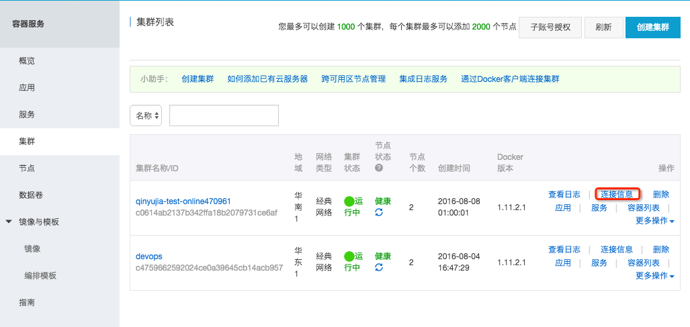
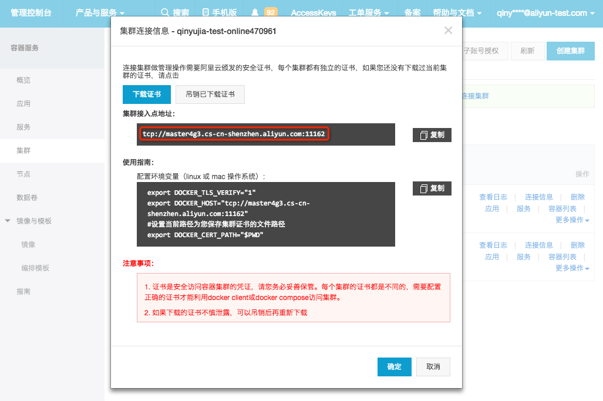
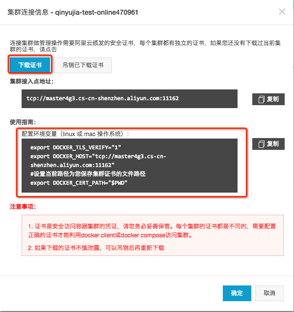
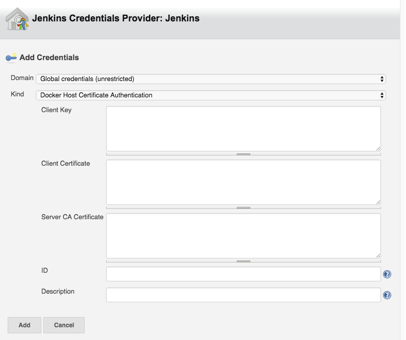

[[AliyunContainerServiceDeployPlugin-Summary]]
== Summary

Jenkins is a greate continuous delivery system.But you will find a
little confused When the continuous delivery job meets ths Aliyun
Container Service.Because current plugins can't relect the logical
concepts in Aliyun Container Service such as application,service and
something else. The Aliyun-Container-Service-Deploy plugin get through
the gap between Jenkins and Aliyun Container Service.You can simply
place a docker-compose configuration file in the root directory of the
code repository.The plugin will detect the specific docker-compose
configuration file , revoke the api of the Aliyun Container Service and
Deploy the application to the remote Aliyun Container Clusters.

[[AliyunContainerServiceDeployPlugin-Configuration]]
== Configuration

After installing the plugin,you'll get a new Build Step entry named
"Aliyun Container Service Deploy". Fill the configuration and it will
deploy the docker-compose configuration when the pre build step build
successfully.

[[AliyunContainerServiceDeployPlugin-Parameters]]
=== Parameters

[[AliyunContainerServiceDeployPlugin-MasterUrl]]
==== MasterUrl

MasterUrl is the endpoint of a container cluster.you can find the value
on the console of <a href="https://cs.console.aliyun.com/#/cluster"
target="_blank"/>Aliyun Container Service</a>.

[.confluence-embedded-file-wrapper]##

[.confluence-embedded-file-wrapper]##

[[AliyunContainerServiceDeployPlugin-ApplicationName]]
==== ApplicationName

Application is a logical concept in Aliyun Container Service.Application
is the mininum unit of a single releasement.A standard application
consist of several services and a service consist of serveral
containers.If you want to deploy a application to Aliyun Container
Service. You need to come up a awesome name firstly.

[[AliyunContainerServiceDeployPlugin-ComposeTemplate]]
==== ComposeTemplate

ComposeTemplate is the configuration of the application. The blank
requires the relative path of the docker-compose.If your
docker-compose.yml is under the path of docker/docker-compose.yml.Just
fill the blank with the path.

[[AliyunContainerServiceDeployPlugin-HostCredetials]]
==== HostCredetials

HostCredetials are the certs of the target cluster. You can visit the
remote container cluster with the specific certs on any computer with a
docker client.

[.confluence-embedded-file-wrapper]##

open the pem files , extract the content and fill the blank below.

[.confluence-embedded-file-wrapper]##

[[AliyunContainerServiceDeployPlugin-Knownissues]]
== Known issues

* not support blue-green development

[[AliyunContainerServiceDeployPlugin-Needhelp]]
=== Need help

Maintainers: +
mailto:yujia.qyj@alibaba-inc.com[YuJia Qin] +
mailto:zhongwei.lzw@alibaba-inc.com[Ringtail]

[[AliyunContainerServiceDeployPlugin-Changelog]]
== Changelog

[[AliyunContainerServiceDeployPlugin-0.1.0]]
=== 0.1.0

* beta version
