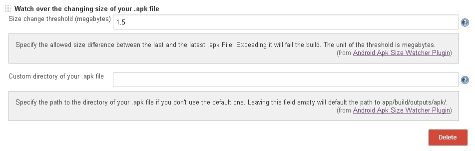
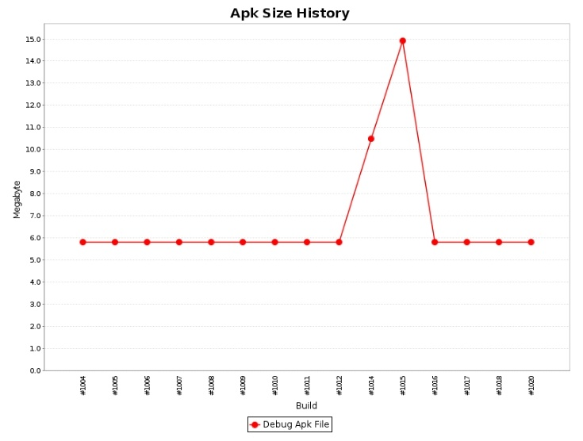

 

Watch over the changing size of your .apk file and fail your build once
the change exceeds your specified threshold.

[[AndroidApkSizeWatcherPlugin-PostBuildAction]]
== Post Build Action

The functionality is provided by the post build action 'Watch over the
changing size of your .apk file'.

[.confluence-embedded-file-wrapper .confluence-embedded-manual-size]## +
 +
There you can specify the allowed size increase from build A to build B
in megabytes. Should the increase +
exceed the threshold, the build is marked as failed and a corresponding
message is shown in the console.

*Apk Size Watcher Plugin: Build Failed* +
*Apk Size Watcher Plugin: The size difference between your last and
latest .apk file exceeded the specified threshold of 1.5 megabytes.*

There is also the possibility to specify a path to the directory of your
.apk file, if you don't use the default one. The default one
is _app/build/outputs/apk_.

[[AndroidApkSizeWatcherPlugin-ApkSizeHistory]]
== Apk Size History

To further increase your monitoring capabilities the plugin adds a
history to your job. There you can track the +
size of your .apk file over time. Clicking on the data points allows you
to directly jump to the responsible build. +
 +
[.confluence-embedded-file-wrapper .confluence-embedded-manual-size]##

[[AndroidApkSizeWatcherPlugin-Feedback]]
== Feedback

This is the very first plugin of the author, feel free to report any bug
or inconvenience. +
 +
Feedback of any kind is very appreciated!

[[AndroidApkSizeWatcherPlugin-VersionHistory]]
=== Version History

[[AndroidApkSizeWatcherPlugin-Version1.0.1(September08,2017)]]
==== Version 1.0.1 (September 08, 2017)

* The plugin can now look for the .apk file in workspaces of nodes, +
which enables the usage of the plugin when the android project is  +
build on a node/slave. Full credit for the implementation goes to +
https://github.com/scottdweber[Scott D. Weber], a huge thanks to you!

[[AndroidApkSizeWatcherPlugin-Version1.0(August29,2017)]]
==== Version 1.0 (August 29, 2017)

* Initial release
