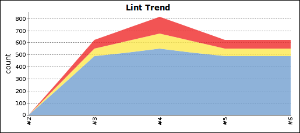
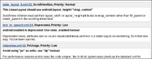
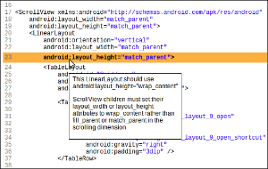
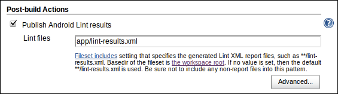

[.conf-macro .output-inline]##

[cols="",options="header",]
|===
|Plugin Information
|View Android Lint https://plugins.jenkins.io/android-lint[on the plugin
site] for more information.
|===

[.aui-icon .aui-icon-small .aui-iconfont-info .confluence-information-macro-icon]##

Older versions of this plugin may not be safe to use. Please review the
following warnings before using an older version:

* https://jenkins.io/security/advisory/2018-02-05/[XML External Entity
(XXE) processing vulnerability]

Parses output from the Android lint tool and displays the results for
analysis. +
See also:
https://wiki.jenkins-ci.org/display/JENKINS/Android+Emulator+Plugin[Android
Emulator Plugin].

[[AndroidLintPlugin-Features]]
== Features

http://tools.android.com/tips/lint[Android Lint] is a tool which scans
your Android projects and reports on potential bugs, performance,
security and translation issues, plus more.

This Jenkins plugin parses XML reports produced by running `+lint+`,
analyses them and displays the results for each build. +
Information shown includes a build summary, trend graphs, display of
warnings in context, and dashboard portlets.

This plugin builds on the work of the static analysis core plugin; see
the
https://wiki.jenkins-ci.org/display/JENKINS/Static+Code+Analysis+Plug-ins[Static
Code Analysis Plug-ins] page for a fuller list of features.

[.confluence-embedded-file-wrapper]##
 
[.confluence-embedded-file-wrapper]##
 
[.confluence-embedded-file-wrapper]##

[[AndroidLintPlugin-Requirements]]
== Requirements

* Jenkins 2.7 or newer
* The Static Analysis Utilities plugin — this will be automatically
installed when you install this plugin
* Android SDK Tools r17 or newer, but at least r21 is recommended

If the
https://wiki.jenkins-ci.org/display/JENKINS/Dashboard+View[Dashboard
View] plugin is also installed, you will be able to add Lint-specific
portlets to your dashboard views.

[[AndroidLintPlugin-Configuration]]
== Configuration

[[AndroidLintPlugin-Jobconfiguration]]
=== Job configuration

[[AndroidLintPlugin-Freestylejobconfiguration]]
==== Freestyle job configuration

Enable "Publish Android Lint results" in the "Post-build Actions" of
your Jenkins job.

By default, the plugin will parse any files matching the pattern
"`+lint-results*.xml+`", anywhere in your build's workspace. +
This behaviour can be overridden by entering a filename or
https://ant.apache.org/manual/Types/fileset.html[pattern], relative to
the root of your build's workspace.

[.confluence-embedded-file-wrapper]##

[[AndroidLintPlugin-Pipelinejobconfiguration]]
==== Pipeline job configuration

You can generate the required
https://wiki.jenkins-ci.org/display/JENKINS/Pipeline+Plugin[Pipeline]
syntax via the
https://jenkins.io/blog/2016/05/31/pipeline-snippetizer/[Snippet
Generator] by choosing the "androidLint: Publish Android Lint results"
step, but some quick examples follow.

The most basic configuration is this, which will analyse any files in
the workspace matching the default pattern `+**/lint-results*.xml+`:

[source,syntaxhighlighter-pre]
----
androidLint()
----

To specify the filenames or pattern to search for, use the `+pattern+`
parameter:

[source,syntaxhighlighter-pre]
----
androidLint pattern: 'foo/bar/my-app_lint-results.xml'
----

To mark the build as unstable if there are more than 10 Lint warnings,
and to mark the build as failed if there are more than 30 Lint warnings:

[source,syntaxhighlighter-pre]
----
androidLint unstableTotalAll: '10', failedTotalAll: '30'
----

To mark the build as failed if any high-priority warnings were
introduced since the last build:

[source,syntaxhighlighter-pre]
----
androidLint failedNewHigh: '0'
----

[[expander-914415848]]
[[expander-control-914415848]]
[.expand-icon .aui-icon .aui-icon-small .aui-iconfont-chevron-right]## ##[.expand-control-text]##Deprecated
Pipeline syntax…##

[[expander-content-914415848]]
_The syntax in this section is only required if you're using version 2.9
or older of the
https://wiki.jenkins-ci.org/display/JENKINS/Pipeline+Groovy+Plugin[Pipeline
Groovy Plugin], which was superseded in July 2016._

The most basic configuration is this, which will analyse any files in
the workspace matching the default pattern `+**/lint-results*.xml+`:

[source,syntaxhighlighter-pre]
----
step([$class: 'LintPublisher'])
----

To specify the filenames or pattern to search for, use the `+pattern+`
parameter:

[source,syntaxhighlighter-pre]
----
step([$class: 'LintPublisher', pattern: 'foo/bar/my-app_lint-results.xml'])
----

To mark the build as unstable if there are more than 10 Lint warnings,
and to mark the build as failed if there are more than 30 Lint warnings:

[source,syntaxhighlighter-pre]
----
step([$class: 'LintPublisher', unstableTotalAll: '10', failedTotalAll: '30'])
----

To mark the build as failed if any high-priority warnings were
introduced since the last build:

[source,syntaxhighlighter-pre]
----
step([$class: 'LintPublisher', failedNewHigh: '0'])
----

[[AndroidLintPlugin-ProducingLintoutput]]
==== Producing Lint output

Note that this plugin does not run Lint for you — you must provide Lint
results in XML format, either by running `+lint+` during a build, or by
copying the file(s) from somewhere else.

[[AndroidLintPlugin-ViaGradle]]
===== Via Gradle

If you're using the Gradle build system for Android, as of version 0.7
of the Android Gradle plugin, Lint integration is built-in.

By default, running the `+lint+` Gradle task will generate the Lint XML
file required by this plugin. +
However, you should disable the `+abortOnError+` option, to ensure that
the Gradle script reports success, even if Lint finds issues with your
project that it regards fatal.

You can do this by adding a `+lintOptions+` block at the end of your
`+android+` block in your `+build.gradle+` file:

....
android {
    // ...

    lintOptions {
        // Don't abort if Lint finds an error, otherwise the Jenkins build
        // will be marked as failed, and Jenkins won't analyse the Lint output
        abortOnError false
    }
}
....

Running `+./gradlew lint+` will compile your Android project, run Lint,
and write the results to `+build/lint-results.xml+`. +
As mentioned in the section above, this plugin will automatically find
and parse any files with this name.

If you run `+./gradlew lintDebug+`, the file will be called
`+lint-results-debug.xml+` — and the same pattern applies for other
build variants (i.e. the `+lintRelease+` task creates
`+lint-results-release.xml+`).

[[AndroidLintPlugin-Viathecommandline]]
===== Via the command line

If you're not using Gradle or some other build tool which automates the
execution of Lint, you will need to add an "Execute shell" build step to
your Jenkins job where you run `+lint+`.

For best results, run Lint in your Android application's directory,
e.g.: +
`+cd app; lint --xml --fullpath lint-results.xml .+`

*Note:* When running Jenkins on a headless system, or under a user ID
which doesn't have access to a graphical environment, you may see some
errors while running Lint. +
To combat this, you can run Java in headless mode, as follows: +
`+os_opts="-Djava.awt.headless=true" lint --xml --fullpath lint-results.xml .+`

[[AndroidLintPlugin-ChangingbuildoutcomebasedonLintresults]]
==== Changing build outcome based on Lint results

You can mark builds as unstable or failed, if the number of Lint issues
found — or introduced in the latest build — exceeds a certain threshold.

e.g. A build can be automatically flagged as unstable or failed if any
Lint issues with "Fatal" or "Error" severity are introduced.

To do this, in the job configuration, click "Advanced" in the "Publish
Android Lint results" section. Under "Status thresholds" you can change
the build to unstable (yellow ball) or failed (red ball). To mark a
build as unstable if there are more than 10 Lint issues in total, but
fail the build outright if even a single "Fatal"/"Error" issue exists,
then enter "10" under "All priorities" in the yellow row, and "0" under
"Priority high" in the red row.

i.e. If there are 12 normal-priority Lint issues found, this exceeds the
threshold of 10, causing the build to be marked as unstable. Or, if
there is a high-priority issue found, that would exceed the threshold of
0, thereby failing the build.

You should use this to be ruthless about fixing Lint issues as they
occur, and remember that you can exclude false positives by
http://tools.android.com/tips/lint/suppressing-lint-warnings[setting up
a `+lint.xml+` file] in the root of your app project.

[[AndroidLintPlugin-Versionhistory]]
== Version history

[[AndroidLintPlugin-Version2.6(Feb5,2018)]]
=== Version 2.6 (Feb 5, 2018)

* https://jenkins.io/security/advisory/2018-02-05/[Fix security issue]

[[AndroidLintPlugin-Version2.5(September9,2017)]]
=== Version 2.5 (September 9, 2017)

* Fixed missing Lint graphs on Pipeline project pages
(https://issues.jenkins-ci.org/browse/JENKINS-34621[JENKINS-34621])
** Thanks to https://github.com/warnyul[Balázs Varga]
* Fixed 404 error when trying to configure the graph from the job
configuration page
(https://issues.jenkins-ci.org/browse/JENKINS-41629[JENKINS-41629])
* Updated https://wiki.jenkins-ci.org/display/JENKINS/Static+Code+Analysis+Plug-ins[analysis-core] dependencies
to the latest
* Raised the minimum Jenkins version to 2.7

[[AndroidLintPlugin-Version2.4(August27,2016)]]
=== Version 2.4 (August 27, 2016)

* Integrated the
https://wiki.jenkins-ci.org/display/JENKINS/Structs+plugin[Structs
library plugin] to give this plugin a short name ("`+androidLint+`")
which allows for simplified syntax in plugins such as
https://wiki.jenkins-ci.org/display/JENKINS/Pipeline+Plugin[Pipeline]
** See the "Pipeline job configuration" section above for more details

[[AndroidLintPlugin-Version2.3(April27,2016)]]
=== Version 2.3 (April 27, 2016)

* Added support for the
https://wiki.jenkins-ci.org/display/JENKINS/Pipeline+Plugin[Pipeline
Plugin]
** Thanks to Manuel Recena
* Updated the default file pattern to `+**/lint-results*.xml+` (i.e.
will match `+lint-results-<buildType>.xml+` by default, as produced by
Gradle)
** Thanks to Karol Wrótniak
* Fixed bug that prevented the "hide projects with no warnings" option
from being enabled on the "Android Lint issues per project" dashboard
view (https://issues.jenkins-ci.org/browse/JENKINS-19713[JENKINS-19713])
* Updated
https://wiki.jenkins-ci.org/display/JENKINS/Static+Code+Analysis+Plug-ins[analysis-core]
dependencies to the latest

[[AndroidLintPlugin-Version2.2(October9,2014)]]
=== Version 2.2 (October 9, 2014)

* Added a new view column, showing the total Lint warnings count
(https://issues.jenkins-ci.org/browse/JENKINS-22176[JENKINS-22176])
* Upgraded analysis-core to the latest version, 1.61
** This fixes incorrect issue counts where Lint files contain duplicate
issues
* Fixed wrongly-escaped XML tags
** Thanks to Sebastian Schuberth for these fixes and features

[[AndroidLintPlugin-Version2.1(April11,2013)]]
=== Version 2.1 (April 11, 2013)

* Maven jobs are now supported, via the 'lint' goal used by the
https://code.google.com/p/maven-android-plugin/[Android Maven Plugin
3.5.1+] (see
https://issues.jenkins-ci.org/browse/JENKINS-14857[JENKINS-14857])
* Fixed issue where the Android icon wasn't displayed in Jenkins 1.501+
(see https://issues.jenkins-ci.org/browse/JENKINS-16075[JENKINS-16075])
* HTML-like tags (e.g. <TextView>) are no longer missing from issue
explanations
* Upgraded to the latest static analysis plugins, raising the minimum
Jenkins version to 1.424

[[AndroidLintPlugin-Version2.0.3(February12,2013)]]
=== Version 2.0.3 (February 12, 2013)

* Fixed issue where issues with "Informational" severity were being
shown as "Warning" (see
https://issues.jenkins-ci.org/browse/JENKINS-16645[JENKINS-16645])
* Fixed issue where some configuration settings weren't being honoured
correctly

[[AndroidLintPlugin-Version2.0.2(December30,2012)]]
=== Version 2.0.2 (December 30, 2012)

* Fixed issue where the Android icon wasn't always displayed (see
https://issues.jenkins-ci.org/browse/JENKINS-16075[JENKINS-16075])

[[AndroidLintPlugin-Version2.0.1(November13,2012)]]
=== Version 2.0.1 (November 13, 2012)

* Issues are now classified correctly, according to Lint 'severity'
rather than 'priority'
** Lint issues with severity "Fatal" or "Error" are now shown as high
priority, "Warning" has normal priority, "Informational" has low
priority
* Full explanations and context information for all issues are now
included, when using SDK Tools r21 or above
* Explanations for new Lint checks introduced in the future will appear
without having to upgrade this plugin
* Removed support for Maven job types, as this doesn't work
* Many thanks to https://plus.google.com/+TorNorbye[Tor Norbye] (from
the Android Tools team) for updating Lint to make this possible!

[[AndroidLintPlugin-Version1.0.1(March22,2012)]]
=== Version 1.0.1 (March 22, 2012)

* Fixed bug where gathering results would fail for builds running on a
slave, with Lint XML generated using SDK Tools r17

[[AndroidLintPlugin-Version1.0(March21,2012)]]
=== Version 1.0 (March 21, 2012)

* Initial release
* Thanks to https://wiki.jenkins-ci.org/display/~drulli[Unknown User
(drulli)] for writing analysis-core and providing code samples from his
many other static analysis plugins
