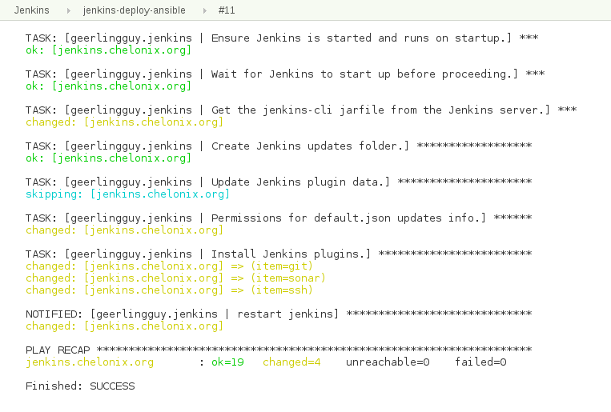

[.conf-macro .output-inline]##

[cols="",options="header",]
|===
|Plugin Information
|View Ansible https://plugins.jenkins.io/ansible[on the plugin site] for
more information.
|===

[.aui-icon .aui-icon-small .aui-iconfont-info .confluence-information-macro-icon]##

Older versions of this plugin may not be safe to use. Please review the
following warnings before using an older version:

* https://jenkins.io/security/advisory/2018-03-26/#SECURITY-630[Host key
verification disabled by default]

 

 [.conf-macro .output-inline]#This plugin allows to
execute http://www.ansible.com/[Ansible] tasks as a job build step.#

[[AnsiblePlugin-TableofContents]]
== Table of Contents

[[AnsiblePlugin-GlobalConfiguration]]
== *Global Configuration*

Ansible needs to be on the PATH for the build job in order to be used.
This can be done through either Jenkins Global Tool Configuration or
including Ansible on the OS User PATH variable.

[[AnsiblePlugin-GlobalToolConfiguration]]
=== Global Tool Configuration

Configuring Ansible through the Global Tool Configuration in Jenkins
(Jenkins → Manage Jenkins → Global Tool Configuration) allows for
multiple Ansible installations to be present and used by different
Jenkins jobs.

. Click Add Ansible
. Configure the name and path +
 +
+
[cols=",",options="header",]
|===
|Field name |Description
|Name |Symbolic name used to identify a specific Ansible installation
when multiple installations are configured

|Path to ansible executables directory |Directory containing the
_ansible,_ _ansible-playbook_, and _ansible-vault_ binaries
|===
. Repeat for any additional desired installations

 

[[AnsiblePlugin-OSUserPATH]]
=== OS User PATH

Ansible can also be added to the PATH user used by the Jenkins executor
instead of configured through Global Tool Configuration. This is done
through normal OS tools outside of Jenkins and is not covered by this
guide.

 

'''''

[[AnsiblePlugin-Adhoc]]
== *Adhoc*

http://docs.ansible.com/ansible/latest/intro_adhoc.html[Adhoc commands]
allow for simple operations to be done without writing a full playbook.
This allows for a convenient way of doing quick tasks with Ansible.

[[AnsiblePlugin-Examples]]
=== Examples

[[AnsiblePlugin-Scripted]]
==== Scripted

Due to https://issues.jenkins-ci.org/browse/JENKINS-43782[JENKINS-43782]
and https://issues.jenkins-ci.org/browse/JENKINS-49056[JENKINS-49056],
adhoc commands cannot be run with a pipeline job.

[[AnsiblePlugin-Declarative]]
==== Declarative

 

[[AnsiblePlugin-Arguments]]
=== Arguments

See also https://jenkins.io/doc/pipeline/steps/ansible/[jenkins.io]
documentation.

[cols=",,",options="header",]
|===
|Freestyle Name |Pipeline Name |Description
|Ansible installation |  |Ansible installation to use for the playbook
invocation

|Host pattern |  |The host pattern to manage. See
http://docs.ansible.com/ansible/latest/intro_patterns.html[Ansible
Patterns] for details.

|Module |  |CLI arg: -m

|Module arguments or command to execute |  |CLI arg: -a

|Inventory file or host list |  a|
See the
https://wiki.jenkins-ci.org/display/JENKINS/Ansible+Plugin#AnsiblePlugin-Inventory[Inventory]
section for additional details.

CLI arg: -i

|Inventory Inline content |  a|
See the
https://wiki.jenkins-ci.org/display/JENKINS/Ansible+Plugin#AnsiblePlugin-Inventory[Inventory]
section for additional details.

CLI arg: -i

|Credentials |  |The Jenkins credential to use for the SSH connection.
See the
https://wiki.jenkins-ci.org/display/JENKINS/Ansible+Plugin#AnsiblePlugin-Authentication[Authentication]
section for additional details.

|Vault Credentials |  a|
The Jenkins credential to use as the vault credential. See the
https://wiki.jenkins-ci.org/display/JENKINS/Ansible+Plugin#AnsiblePlugin-VaultCredentials[Vault
Credentials] section for additional details.

CLI arg: --vault-password-file

|sudo |  |CLI arg: -s

|sudo user |  |CLI arg: -U

|Number of parallel processes |  |CLI arg: -f

|Check host SSH key |  a|
Toggle checking of the host key.

Sets the environment variable ANSIBLE_HOST_KEY_CHECKING, similar to the
recommendations for running with
http://docs.ansible.com/ansible/latest/guide_vagrant.html[Vagrant].

|Unbuffered stdout |  a|
Toggle buffering of standard out.

Sets the environment variable PYTHONUNBUFFERED, similar to the
recommendations for running with
http://docs.ansible.com/ansible/latest/guide_vagrant.html[Vagrant].

|Colorized stdout |  a|
Toggle color codes in console text. See
https://wiki.jenkins-ci.org/display/JENKINS/Ansible+Plugin#AnsiblePlugin-ColorizedOutput[Colorized
Output] section for example usage.

Sets the environment variable ANSIBLE_FORCE_COLOR, similar to the
recommendations for running with
http://docs.ansible.com/ansible/latest/guide_vagrant.html[Vagrant].

|Extra Variables |  |CLI arg: -e

|Additional parameters |  |String passed to the Ansible Command Line
invocation as-is
|===

* *

'''''

[[AnsiblePlugin-Playbook]]
== *Playbook*

 

http://docs.ansible.com/ansible/latest/playbooks.html[Ansible playbook]
operations can be run with the plugin. The plugin provides several
conveniences such as easily using credentials from the Jenkins
credential store, unbuffered color output in the log, etc. 

[[AnsiblePlugin-Examples.1]]
=== Examples

[[AnsiblePlugin-Scripted.1]]
==== Scripted

*Jenkinsfile*

[source,syntaxhighlighter-pre]
----
ansiblePlaybook credentialsId: 'private_key', inventory: 'inventories/a/hosts', playbook: 'my_playbook.yml'
----

 

[[AnsiblePlugin-Declarative.1]]
==== Declarative

*Jenkinsfile*

[source,syntaxhighlighter-pre]
----
ansiblePlaybook(credentialsId: 'private_key', inventory: 'inventories/a/hosts', playbook: 'my_playbook.yml')
----

 

Additional scripted and declarative pipeline examples can be found on
the plugin's https://github.com/jenkinsci/ansible-plugin[GitHub readme].

[[AnsiblePlugin-Arguments.1]]
=== Arguments

https://jenkins.io/doc/pipeline/steps/ansible/[jenkins.io] documentation

[cols=",,",options="header",]
|===
|Freestyle Name |Pipeline Name |Description
|Ansible installation |installation |Ansible installation to use for the
playbook invocation

|Playbook path |playbook |Mandatory. The name of the playbook to run.

|Inventory file or host list |inventory a|
See the
https://wiki.jenkins-ci.org/display/JENKINS/Ansible+Plugin#AnsiblePlugin-Inventory[Inventory]
section for additional details.

CLI arg: -i

|Inventory Inline content |inventoryContent a|
See the
https://wiki.jenkins-ci.org/display/JENKINS/Ansible+Plugin#AnsiblePlugin-Inventory[Inventory]
section for additional details.

CLI arg: -i

|Credentials |credentialsId |The Jenkins credential to use for the SSH
connection. See the
https://wiki.jenkins-ci.org/display/JENKINS/Ansible+Plugin#AnsiblePlugin-Authentication[Authentication]
section for additional details.

|Vault Credentials |vaultCredentialsId a|
The Jenkins credential to use as the vault credential. See the
https://wiki.jenkins-ci.org/display/JENKINS/Ansible+Plugin#AnsiblePlugin-VaultCredentials[Vault
Credentials] section for additional details.

CLI arg: --vault-password-file

|sudo |sudo |CLI arg: -s

|sudo user |sudoUser |CLI arg: -U

|Host subset |limit |CLI arg: -l

|Tags to run |tags |CLI arg: -t

|Tags to skip |skippedTags |CLI arg: --skip-tags

|Task to start at |startAtTask |CLI arg: --start-at-task

|Number of parallel processes |forks |CLI arg: -f

|Check host SSH key |hostKeyChecking a|
Toggle checking of the host key.

Sets the environment variable ANSIBLE_HOST_KEY_CHECKING, similar to the
recommendations for running with
http://docs.ansible.com/ansible/latest/guide_vagrant.html[Vagrant].

|Colorized stdout |colorized a|
Toggle color codes in console text. See
https://wiki.jenkins-ci.org/display/JENKINS/Ansible+Plugin#AnsiblePlugin-ColorizedOutput[Colorized
Output] section for example usage.

Sets the environment variable ANSIBLE_FORCE_COLOR, similar to the
recommendations for running with
http://docs.ansible.com/ansible/latest/guide_vagrant.html[Vagrant].

|Additional parameters |extras |String passed to the Ansible Command
Line invocation as-is

|Extra Variables |extraVars |CLI arg: -e
|===

Refer to the ansible-playbook manual page for details on how each
command line argument is interpretted.

[[AnsiblePlugin-Authentication]]
=== Authentication

[[AnsiblePlugin-SSHKeys]]
==== SSH Keys

https://help.ubuntu.com/community/SSH/OpenSSH/Keys[SSH keys] are the
recommended authentication method for SSH connections. The plugin
supports the credential type "SSH Username with private key" configured
in the Jenkins credential store through the
https://plugins.jenkins.io/ssh-credentials[SSH crendentials plugin].

[[AnsiblePlugin-Password]]
==== Password

Even if using SSH keys is recommended authentication method, password
authentication may sometimes be required. The plugin has supported
password based authentication since 0.3.0. When using password based
authentication, the http://sourceforge.net/projects/sshpass/[sshpass]
binary is expected to be on the PATH. The plugin supports the credential
type "Username with password" configured in the Jenkins credential store
through the https://plugins.jenkins.io/ssh-credentials[SSH crendentials
plugin].

[[AnsiblePlugin-VaultCredentials]]
=== Vault Credentials

Vault credentials can be setup in the Jenkins credential store as either
a "Secret text" or a "Secret file". 

[[AnsiblePlugin-ColorizedOutput]]
=== *Colorized Output*

The https://plugins.jenkins.io/ansicolor[AnsiColor plugin] is needed for
colorized console output. Once installed, colorized output can be
enabled with the argument "[.pl-c1]#colorized#: [.pl-c1]#true#".

*Jenkinsfile*

[source,syntaxhighlighter-pre]
----
ansiColor('xterm') {
    ansiblePlaybook( 
        playbook: 'path/to/playbook.yml',
        inventory: 'path/to/inventory.ini', 
        credentialsId: 'sample-ssh-key',
        colorized: true) 
}
----

[.confluence-embedded-file-wrapper .confluence-embedded-manual-size]## +

[[AnsiblePlugin-ExtraParameters]]
=== Extra Parameters

Extra parameters is a string passed to the Ansible Command Line
invocation as-is and can be useful for arguments occasionally added to
an invocation at runtime, such as tags and host limits.

[[AnsiblePlugin-Inventory]]
=== Inventory

[[AnsiblePlugin-File]]
==== File

A string path to the inventory file to use with the playbook invocation.

[[AnsiblePlugin-Inline]]
==== Inline

The provided content is used as the content of the inventory file for
the playbook invocation.

[[AnsiblePlugin-UsingJenkinsEnvironmentVariables]]
=== *Using Jenkins Environment Variables*

Jenkins environment variables can be accessed from within an Ansible
playbook. The Jenkins variables are injected as environment variables
making them available through the Ansible
http://docs.ansible.com/ansible/latest/playbooks_lookups.html[lookup
plugin].

The following Ansible playbook accesses the Jenkins BUILD_TAG variable:

*playbook.yml*

[source,syntaxhighlighter-pre]
----
---
- hosts: example
  tasks:
    - debug: msg="{{ lookup('env','BUILD_TAG') }}"
----

 

'''''

[[AnsiblePlugin-Vault]]
== *Vault*

Most https://docs.ansible.com/ansible/latest/vault.html[Ansible Vault]
operations can be performed with the plugin. Interactive operations such
as create, edit, and view are not supported through the plugin. One use
case for this enabling developers to encrypt secret values while keeping
the vault password a secret.

[[AnsiblePlugin-Examples.2]]
=== Examples

[[AnsiblePlugin-Scripted.2]]
==== Scripted

*Encrypts a File*

[source,syntaxhighlighter-pre]
----
ansibleVault action: 'encrypt', input: 'vars/secrets.yml', vaultCredentialsId: 'ansible_vault_credentials'
----

*Encrypts a String*

[source,syntaxhighlighter-pre]
----
ansibleVault action: 'encrypt_string', content: 'secret_content', vaultCredentialsId: 'ansible_vault_credentials'
----

[[AnsiblePlugin-Declarative.2]]
==== Declarative

*Jenkinsfile*

[source,syntaxhighlighter-pre]
----
ansibleVault(action: 'encrypt', input: 'vars/secrets.yml', vaultCredentialsId: 'ansible_vault_credentials')
----

*Jenkinsfile*

[source,syntaxhighlighter-pre]
----
ansibleVault(action: 'encrypt_string', content: 'secret_content', vaultCredentialsId: 'ansible_vault_password')
----

 

[[AnsiblePlugin-Arguments.2]]
=== Arguments

See also https://jenkins.io/doc/pipeline/steps/ansible/[jenkins.io]
documentation.

[cols=",,",options="header",]
|===
|Freestyle Name |Pipeline Name |Description
|Ansible installation |installation |Ansible installation to use for the
vault operation

|Action |action |Mandatory. The name of the action to use. Interactive
operations such as create, edit, and view are not supported.

|Vault Credentials |vaultCredentialsId a|
The Jenkins credential to use as the vault credential. See the
https://wiki.jenkins-ci.org/display/JENKINS/Ansible+Plugin#AnsiblePlugin-VaultCredentials[Vault
Credentials] section for additional details.

CLI arg: --vault-password-file

|New Vault Credentials |newVaultCredentialsId a|
The Jenkins credential to use as the vault credential. See the
https://wiki.jenkins-ci.org/display/JENKINS/Ansible+Plugin#AnsiblePlugin-VaultCredentials[Vault
Credentials] section for additional details.

CLI arg: --new-vault-password-file

|Content |content |The content to encrypt with the encrypt_string action

|Input |input |The file to encrypt with the encrypt action

|Output |output |CLI arg: --output
|===

[[AnsiblePlugin-VaultCredentials.1]]
=== Vault Credentials

Vault credentials can be setup in the Jenkins credential store as either
a "Secret text" or a "Secret file". 

 

'''''

[[AnsiblePlugin-OpenIssues]]
== *Open Issues*

[[refresh-module--385996037]]
[[refresh--385996037]][[jira-issues--385996037]]
T

Key

Summary

Assignee

Reporter

Status

Created

[.refresh-action-group]# #

[[refresh-issues-loading--385996037]]
[.aui-icon .aui-icon-wait]#Loading...#

[#refresh-issues-button--385996037]##
[#refresh-issues-link--385996037]#Refresh#
[#error-message--385996037 .error-message .hidden]# #

See also
https://issues.jenkins-ci.org/browse/JENKINS-49061?jql=project%20%3D%20JENKINS%20AND%20component%20%3D%20ansible-plugin[All
Open Items]

 

'''''

[[AnsiblePlugin-Changelog]]
== *Changelog*

[[AnsiblePlugin-Version1.0(26March2018)]]
=== *Version 1.0 (26 March 2018)*

* {blank}
** {blank}
*** https://jenkins.io/security/advisory/2018-03-26/#SECURITY-630[Fix
security issue]: Do not disable host key verification by default. *This
may break existing configurations as host key verification will be
enabled everywhere by default.*

[[AnsiblePlugin-Version0.8.0(16Jan2018)]]
=== *Version 0.8.0 (16 Jan 2018)* 

* {blank}
** {blank}
*** Add support for Ansible Vault
[https://issues.jenkins-ci.org/browse/JENKINS-48499[JENKINS-48499]]
*** Add hostKeyChecking option to
pipeline [https://issues.jenkins-ci.org/browse/JENKINS-42445[JENKINS-42445]] 

[[AnsiblePlugin-Version0.6.2(3Jan2017)]]
=== *Version 0.6.2 (3 Jan 2017)* 

* {blank}
** {blank}
*** Fix blocker bug when launched from a pipeline
[https://issues.jenkins-ci.org/browse/JENKINS-40780[JENKINS-40780]] 

[[AnsiblePlugin-Version0.6.1(1Jan2017)]]
=== *Version 0.6.1 (1 Jan 2017)*

* {blank}
** {blank}
*** Use latest parent project definition in order to deploy
plugin (thanks to https://github.com/alecharp[alecharp] for the help and
the PR)

[[AnsiblePlugin-Version0.6(31Dec2016)]]
=== *Version 0.6 (31 Dec 2016)*

*WARN: 0.6.x version will be the last one to support Jenkins 1.xxx and
Ansible 1.x - The 0.7.x and next releases will require Jenkins 2.32.1
(or higher) and Ansible 2.2 (or higher)*

* {blank}
** {blank}
*** Add a "do not specify" option for
inventory [https://issues.jenkins-ci.org/browse/JENKINS-34627[JENKINS-34627]]
*** Support inventoryContent in pipeline (thanks
to https://github.com/leewin12[leewin12] for the PR)
*** Add support of extra variables in jobdsl (thanks
to https://github.com/pawbur[pawbur] for the PR)
*** Support empty forks (number of parallel processes)
parameter [https://issues.jenkins-ci.org/browse/JENKINS-39438[JENKINS-39438]]
*** Escape '%' character in private key path (thanks
to https://github.com/ewollesen[ewollesen] for the PR) 
*** Omit ansible option when expanded environment variable is empty
(thanks to https://github.com/vjestin[vjestin] for the PR) 
*** Add the --forks parameter configurable in pipeline step (thanks to
https://github.com/anguswilliams[anguswilliams] for the PR)
*** Fix usage of environment variable in ansiblePlaybook pipeline step
(thanks to https://github.com/thomasKalmar[thomasKalmar]
and https://github.com/barthorre[barthorre] for the
PR) [https://issues.jenkins-ci.org/browse/JENKINS-38289[JENKINS-38289]]

[[AnsiblePlugin-Version0.5(5May2016)]]
=== *Version 0.5 (5 May 2016) *

* {blank}
** {blank}
*** Add support for ansible extra variables
[https://issues.jenkins-ci.org/browse/JENKINS-29863[JENKINS-29863]]
*** Improve Pipeline plugin
integration [https://issues.jenkins-ci.org/browse/JENKINS-32911[JENKINS-32911]]
*** Add the possibility to use the default inventory file (thanks
to Johann Schmitz for the PR)
*** Add colorized output in pipeline jobs (thanks to Kirill Merkushev
for the PR)
*** Make Jenkins build variables available as environment variables for
ansible (thanks to Kevin Mooney for the
PR) [https://issues.jenkins-ci.org/browse/JENKINS-29284[JENKINS-29284]]

[[AnsiblePlugin-Version0.4(25December2015)]]
=== *Version 0.4 (25 December 2015) *

* {blank}
** {blank}
*** Support for password protected SSH
keys [https://issues.jenkins-ci.org/browse/JENKINS-30656[JENKINS-30656]]
*** Initial support for the workflow
plugin [https://issues.jenkins-ci.org/browse/JENKINS-30398[JENKINS-30398]]
*** Add support for Job DSL plugin (thanks to Kirill Merkushev for the
PR) [https://issues.jenkins-ci.org/browse/JENKINS-31790[JENKINS-31790]]

[[AnsiblePlugin-Version0.3.1(15July2015)]]
=== *Version 0.3.1 (15 July 2015)*** **

* {blank}
** {blank}
*** Fix execution on slave
nodes [https://issues.jenkins-ci.org/browse/JENKINS-29294[JENKINS-29294]]

[[AnsiblePlugin-Version0.3(20June2015)]]
=== *Version 0.3 (20 June 2015) *

* {blank}
** {blank}
*** Add support for password based SSH authentication (with sshpass)
*** Environment variables can be used in Module and Module arguments
text field in Ad-hoc command builder
*** Environment variables can be used in inline inventory text box
[https://issues.jenkins-ci.org/browse/JENKINS-28547[JENKINS-28547]]

[[AnsiblePlugin-Version0.2(11May2015)]]
=== *Version 0.2 (11 May 2015) *

* {blank}
** {blank}
*** Fix NullPointerException when no credentials are selected
*** Fix --skippedTags parameter configuration which was ignored
*** Fix NullPointerException and print an error message in the build
console when the inventory is not set in the job configuration

[[AnsiblePlugin-Version0.1(01May2015)]]
=== *Version 0.1 (01 May 2015)*

* {blank}
** {blank}
*** Initial version
