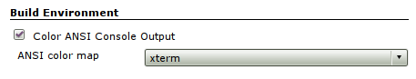
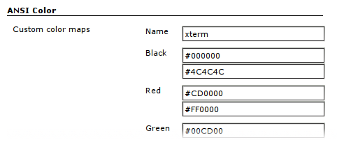
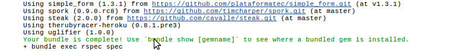

[[AnsiColorPlugin-AnsiColorPlugin]]
== AnsiColor Plugin

This plugin adds support for ANSI escape sequences, including color, to
Console Output.

[[AnsiColorPlugin-Install]]
=== Install

[[AnsiColorPlugin-]]
=== [.confluence-embedded-file-wrapper]##

[[AnsiColorPlugin-Enable]]
=== Enable

[[AnsiColorPlugin-.1]]
=== [.confluence-embedded-file-wrapper]##

[[AnsiColorPlugin-Usinginpipelineworkflows]]
==== Using in pipeline workflows

The build wrapper can be used to colorize the output of steps in a
pipeline build (plugin formally known as workflows). The example below
shows how to use it.

[source,syntaxhighlighter-pre]
----
wrap([$class: 'AnsiColorBuildWrapper', 'colorMapName': 'xterm']) {
  sh 'something that outputs ansi colored stuff'
}
----

Also the following pipeline syntax can be used without allocating a node
and a separate build wrapper.

[source,syntaxhighlighter-pre]
----
ansiColor('xterm') {
    echo 'something that outputs ansi colored stuff'
}
----

[[AnsiColorPlugin-Customize]]
=== Customize

[.confluence-embedded-file-wrapper]##

[[AnsiColorPlugin-Color!]]
=== Color!

[.confluence-embedded-file-wrapper]##

[[AnsiColorPlugin-Contribute]]
=== Contribute

Fork me on Github at https://github.com/jenkinsci/ansicolor-plugin.

 

[[AnsiColorPlugin-Knownbugs]]
=== Known bugs

[[refresh-module--1987287254]]
[[refresh--1987287254]][[jira-issues--1987287254]]
Key

Summary

T

Created

Updated

Due

Assignee

Reporter

P

Status

Resolution

[.refresh-action-group]# #

[[refresh-issues-loading--1987287254]]
[.aui-icon .aui-icon-wait]#Loading...#

[#refresh-issues-button--1987287254]##
[#refresh-issues-link--1987287254]#Refresh#
[#error-message--1987287254 .error-message .hidden]# #

[[AnsiColorPlugin-Changelog]]
=== Changelog

See https://github.com/jenkinsci/ansicolor-plugin/blob/master/CHANGELOG.md
