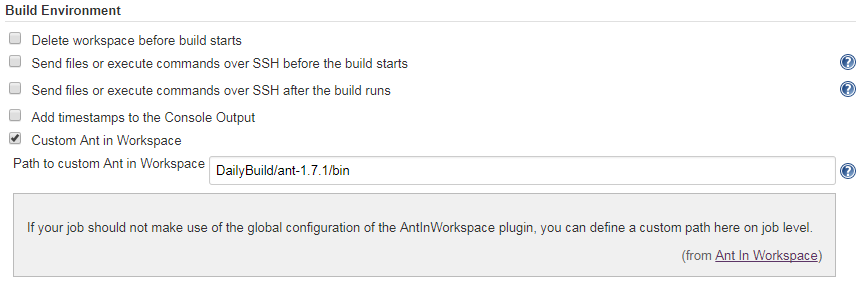
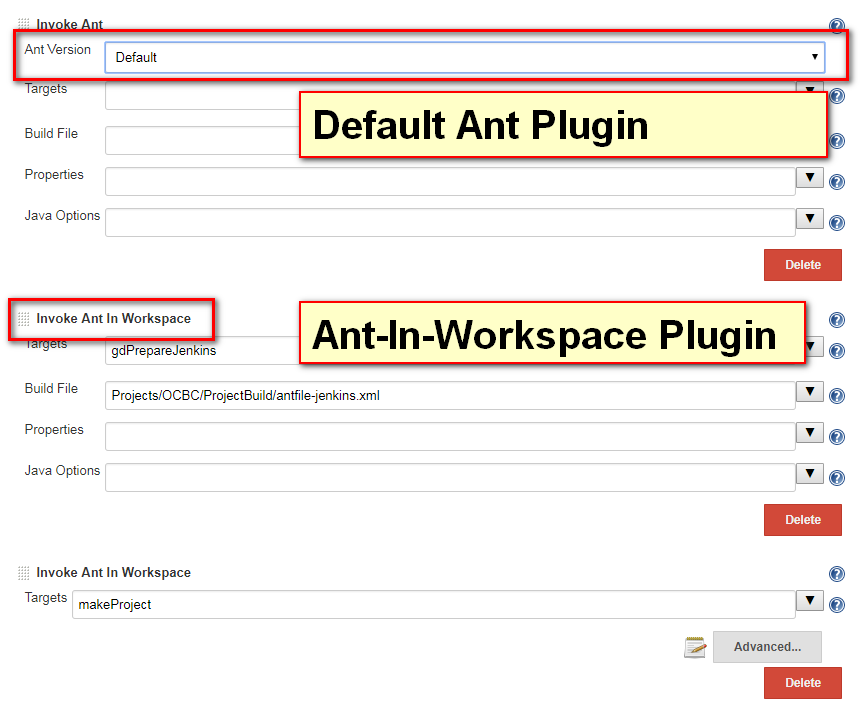
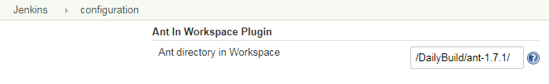

Allows users to configure an ANT based build that utilizes an Ant that
is located in the workspace.

[[AntInWorkspacePlugin-Whatisthis?]]
== What is this?

This Plugin extends the official Jenkins Ant Plugin. It provides a new
Builder based on Ant that has disabled the functionality to choose
between different Ant versions. But it will allow to use an Ant version
that is available in the workspace.

This is to allow (legacy) builds to use a special Ant that is checked
into the SCM. When building the Job this special Ant version is returned
and file-permissions (+x) are set. It is possible to configure the path
to Ant in a global AntInWorkspace parameter or a per-Job parameter.

[[AntInWorkspacePlugin-Example]]
== Example

We are using this because we are using a special/patched Ant version for
building our software. This Ant is checked-in into the SCM and so we
have to check it out, make it executable (on Unix) and use it to build
the software. As our software is used in multiple customer projects,
there is an option to define the path to the Ant installation on a
per-Job level or globally in Jenkins.

[[AntInWorkspacePlugin-ConfigurationExample]]
== Configuration Example

[[AntInWorkspacePlugin-ProjectConfiguration-PathperJob]]
=== Project Configuration - Path per Job

[.confluence-embedded-file-wrapper .confluence-embedded-manual-size]##

[[AntInWorkspacePlugin-ProjectConfiguration-AntPluginvs.Ant-In-WorkspacePlugin]]
=== Project Configuration - Ant Plugin vs. Ant-In-Workspace Plugin

Default Ant-Plugin lets you choose between various Ant versions.
Ant-In-Workspace Plugin will choose either the globally configured Ant
or the project wise configured one.

[.confluence-embedded-file-wrapper .confluence-embedded-manual-size]##

[[AntInWorkspacePlugin-GlobalConfiguration]]
=== Global Configuration

Configuring the global Path.

[[AntInWorkspacePlugin-]]
== [.confluence-embedded-file-wrapper .confluence-embedded-manual-size]##

[[AntInWorkspacePlugin-Authors]]
== Authors

Stephan Watermeyer

[[AntInWorkspacePlugin-License]]
== License

Licensed  under
the https://github.com/heremaps/buildrotator-plugin/blob/master/LICENSE[MIT
License (MIT)].
