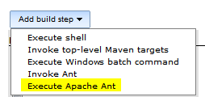
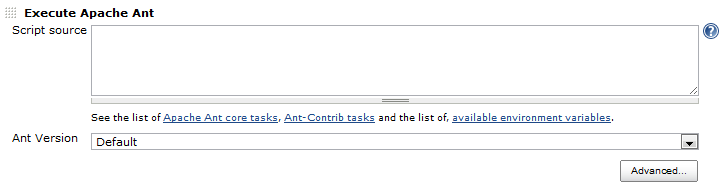
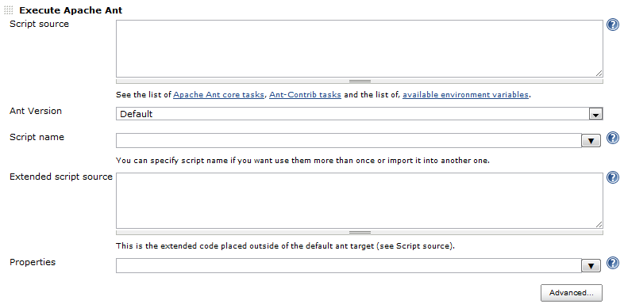
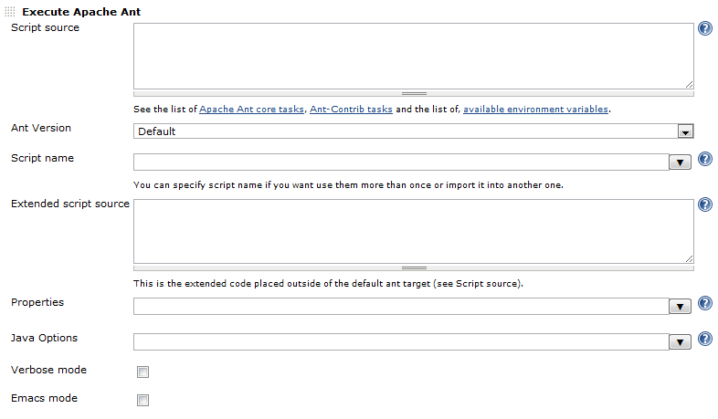
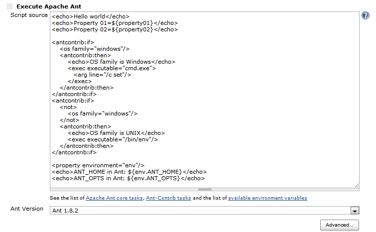
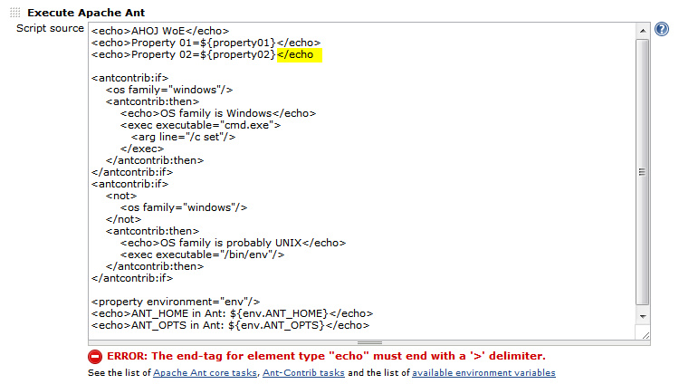

smoyers

This plugin makes it possible to run Apache Ant code directly from
Jenkins-CI.

[[AntExecplugin-Features]]
== Features

* Adding build step to execute Ant code
* Bundled ant-contrib to support ant-contrib tasks (needs to be enable
in global config)
* Easy to write simple Ant build file directly into the build step
* Ability to write the fully functional Ant build file directly into
Jenkins as a build step
* You can reuse the build file created by the build step
* Supports multi-line parameters

[[AntExecplugin-Someusecases]]
== Some use cases

* To do some platform independent tasks
* To do some advanced build preparation steps
* To write the custom Ant build file maintained by Jenkins
* To maintain custom Ant build file when you don't have access into the
VCS of the current project
* To write Ant targets that use multi-line text parameters (currently
not possible using the core Ant plugin)
* And much more
image:docs/images/wink.svg[(wink)]

[[AntExecplugin-Supportformulti-linetextparameters]]
== Support for multi-line text parameters

If your job uses text parameters (as opposed to string parameters) and
the parameter values contain newline characters, the core ant plugin
fails with the following syntax error:

....
  Building in workspace c:\svn\automation\baf
  baf $ cmd.exe /C '"ant.bat "-Dmulti_line_text=This is line 1
  This is line 2
  This is line3" usage && exit %%ERRORLEVEL%%"'
  The syntax of the command is incorrect.
  Build step 'Invoke Ant' marked build as failure
  Finished: FAILURE
....

The problem is that parameters are passed verbatim to the command line,
and if they contain any line breaks, cmd.exe will discard everything
after the first line break, inevitably leading to a syntax error. The
AntExec plugin gets around this problem by saving the build parameters
into a .properties file on the fly and loading this file into the Ant
session automatically. This also means that you can no longer verify in
the build log the list of parameters that were handed down to Ant. If
you need this (presumably for debugging purposes) then check the *Keep
buildfile* check box, which will cause the plugin to retain the build
file, as well as the parameter properties file, in the workspace of the
plugin.

[[AntExecplugin-Changelog]]
== Changelog

[[AntExecplugin-1.11(2015-08-18)]]
=== 1.11 (2015-08-18)

* Passing parameters and properties through the generated property file
instead of command-line which caused problems (especially on Windows)
* Changed core dependency from 1.480 to 1.596
* Updated dependency on "token-macro" plugin (1.10)
* Dropped compatibility with Java 1.5

[[AntExecplugin-1.10(2013-10-31)]]
=== 1.10 (2013-10-31)

* Fixed missing job options in command line properties
* Load environment variables with <property environment="env"/> by
default, so they are accessible via $\{env.VARIABLE}

[[AntExecplugin-1.9(2013-07-15)]]
=== 1.9 (2013-07-15)

* Fixing upgrade issue with ant-contrib in version 1.8
* Build files are now automatically deleted by default so you need to
update job configuration if you want to keep them

[[AntExecplugin-1.8(2013-06-28)]]
=== 1.8 (2013-06-28)

* Remove archive copying of buildfile to job directory
* Cleanup dependencies in pom.xml

[[AntExecplugin-1.7(2013-06-24)]]
=== 1.7 (2013-06-24)

* Added option to keep build files for each build step, it's deleted by
default now
* Option for disabling  ant-contrib has been moved to build step
configuration
* Changed dependency to core 1.480
* Added dependency on "ant" plugin (1.2)
* Added dependency on "token-macro" plugin (1.7)

[[AntExecplugin-1.6(2012-08-28)]]
=== 1.6 (2012-08-28)

* Fixing typo in extendedScriptSource

[[AntExecplugin-1.5(2012-06-21)]]
=== 1.5 (2012-06-21)

* Fixing typo

[[AntExecplugin-1.4(2012-06-20)]]
=== 1.4 (2012-06-20)

* Fixing build file when extended script source is null

[[AntExecplugin-1.3(2012-06-06)]]
=== 1.3 (2012-06-06)

* First public release

[[AntExecplugin-Screenshots:]]
== Screenshots:

[[AntExecplugin-Addingnewbuildstep]]
=== Adding new build step

[.confluence-embedded-file-wrapper]##

[[AntExecplugin-NewAntExecbuildstep]]
=== New AntExec build step

[.confluence-embedded-file-wrapper]##

[[AntExecplugin-NewAntExecbuildstepwith1stlevelofadvancedoptions]]
=== New AntExec build step with 1st level of advanced options

[.confluence-embedded-file-wrapper]##

[[AntExecplugin-NewAntExecbuildstepwith2ndlevelofadvancedoptions]]
=== New AntExec build step with 2nd level of advanced options

[.confluence-embedded-file-wrapper]##

[[AntExecplugin-CodeExample]]
=== Code Example

[.confluence-embedded-file-wrapper]##

[[AntExecplugin-CodeValidationExample]]
=== Code Validation Example

[.confluence-embedded-file-wrapper]##
