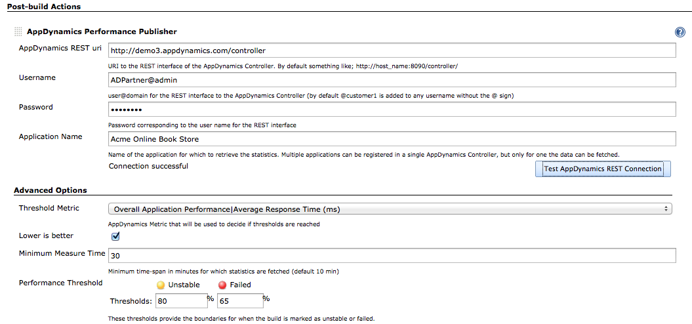
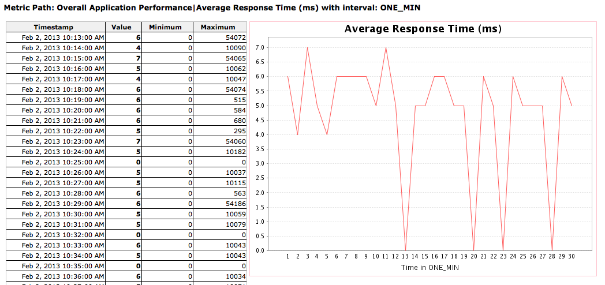
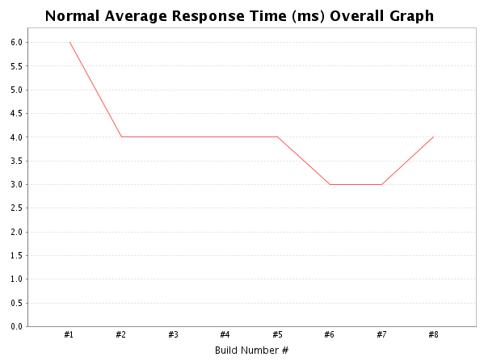

[.conf-macro .output-inline]# #

[.aui-icon .aui-icon-small .aui-iconfont-info .confluence-information-macro-icon]##

Older versions of this plugin may not be safe to use. Please review the
following warnings before using an older version:

* https://jenkins.io/security/advisory/2019-03-06/#SECURITY-1087[Credentials
stored in plain text]

This plugin integrates with http://www.appdynamics.com/[AppDynamics] to
fetch measurements.

[[AppDynamicsPlugin-PluginFeatures]]
== Plugin Features

This plugin makes it possible to integrate data
from http://www.appdynamics.com/[AppDynamics] into your Jenkins build. A
performance test should be run during build time (e.g. by
using http://jakarta.apache.org/jmeter/[JMeter]), and having AppDynamics
connected to your application. After the build, the performance
statistics will be fetched from the REST uri and shown in the Jenkins
interface. +
It includes the feature of setting the final build status as good,
unstable or failed, based on the reported metrics.

[[AppDynamicsPlugin-Changelog:]]
== Changelog:

[[AppDynamicsPlugin-v1.0.14]]
=== v1.0.14

* Better handling of custom metrics. Especially when changing the 'main'
metric, it might not be always available in previous reports. Now will
skip those in counting averages and creating graphs.

[[AppDynamicsPlugin-v1.0.13]]
=== v1.0.13

* Added possibilities for custom metrics, thanks to Volodymyr
Lukashevych.
* Updated to one of the later Jenkins versions, using newer dependency
versions.

[[AppDynamicsPlugin-v1.0.3-12]]
=== v1.0.3-12

* Various releases that failed because of updates. Can be ignored.

[[AppDynamicsPlugin-v1.0.2]]
=== v1.0.2

* Minor fix for NPE when no metrics found.

[[AppDynamicsPlugin-v1.0.1]]
=== v1.0.1

* Minor fix for running and testing the plugin locally. Plugin
configuration could not be opened. Solved by stepping up the Jenkins
build system version.

[[AppDynamicsPlugin-v1.0.0]]
=== v1.0.0

* First release, working version to fetch statistics from AppDynamics
REST interface and display the results
* Only several default metrics available, all on 'overall application'
level.
* One main metric that can be selected on which basis the build is
marked as successful, unstable or failed.

[[AppDynamicsPlugin-JenkinsBuildConfiguration]]
== Jenkins Build Configuration

* Create a new build for executing the performance tests.

* Add a build-step for e.g. JMeter, or a script that will generate load
on your system under test.

* Add the AppDynamics plugin as post-build-step to fetch actual metrics
and generate reports.

[[AppDynamicsPlugin-AppDynamicsPluginusage]]
== AppDynamics Plugin usage

[[AppDynamicsPlugin-Configuration]]
=== Configuration

Default configuration for the AppDynamics plugin only needs the
following information to connect to the AppDynamics REST api:

* REST uri: The uri where AppDynamics Controller is living. Same uri as
you would use for logging into the AppDynamics dashboard.
* Username: Username for authentication. Don't forget the "@<domain>"
part if using a multi-tenant Controller.
* Password: Password for authentication.
* Application Name: Name of the application that should be monitored,
exactly as it appears in the Controller (possibly with spaces). Also
accepts the application id (numeric value).

[.confluence-embedded-file-wrapper]##

Furthermore, some advanced settings are available. You can configure the
error percentage thresholds which would make the project unstable or
failed or leave them blank to disable the feature.

* Threshold Metric: The metric that will be used to determine whether
the build is succeeded, unstable or failed. Normally the average
response time is used.
* Lower is better: Checkbox to specify whether the measurements
belonging to the metric, are better when higher or better when lower
values are measured.
* Minimum Measure Time: The plugin will fetch measurements from the time
the build started. But in case the load-generation is not directly
executed within this build, it is possible to specify a minimum time for
which measurements must be fetched.
* Performance Threshold: Specify a percentage as to when the build is
marked as unstable or failed. These values specify a boundary for the
new build, for wich the performance is taken as percentage of the
average.

[[AppDynamicsPlugin-Output]]
=== Output

The AppDynamics plugin will show output per build, and as overall
statistics for the project. The following two images are two examples:

[.confluence-embedded-file-wrapper]##

Build output

[.confluence-embedded-file-wrapper]##

Overall graph for the project (and floating box on the project page)

[[AppDynamicsPlugin-Compiling]]
== Compiling

To use the latest plugin release, you need to download, compile and
install by hand. To do it, you need Git, Maven and Java 6 installed in
your computer.

....
$ git clone https://github.com/jenkinsci/appdynamics-plugin.git
$ cd appdynamics-plugin
$ mvn package
$ cp target/appdynamics-dashboard.hpi <path_to_jenkins>/data/plugins
....

Remember to restart jenkins in order to use / reload the plugin.
