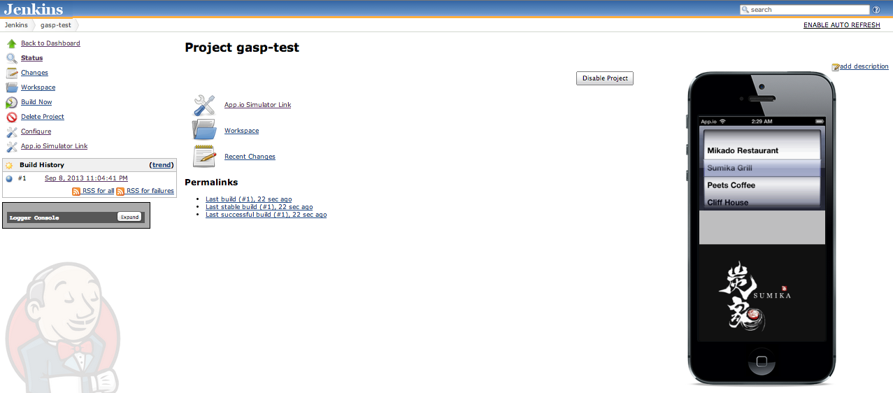
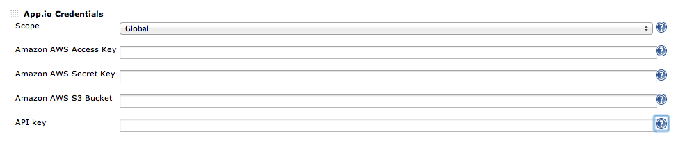
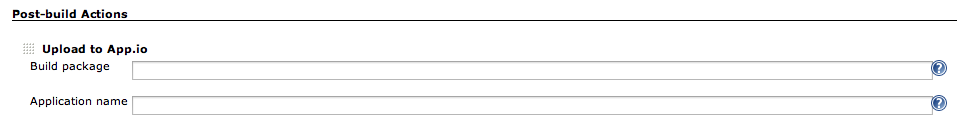

This plug-in allows you to upload an iOS application package to App.io
so that you can see the app running on a remote iPhone/iPad simulator:
if successful, the simulator will be displayed embedded on the main
project page as shown below, and there is also a link that will take you
to the App.io site, where you can customize your application view. There
is an example of the plugin in use on
the https://partnerdemo.ci.cloudbees.com/job/iOS-dev/job/stockfish-ios-appio/[CloudBees] partnerdemo
site, with the Jenkins configuration.

[.confluence-embedded-file-wrapper]##

[[App.ioPlugin-KnownLimitations]]
== Known Limitations

Limitations that I am aware of in the current implementation include:

* Need for Proxy Server support
* Allow user to configure simulator iPad/iPhone Landscape/Portrait
orientation
* More generic mechanism for file upload (currently uses a simple Amazon
S3 scheme

[[App.ioPlugin-ConfiguringthePlugin]]
== *Configuring the Plugin*

[[App.ioPlugin-GlobalConfigurationParameters]]
=== Global Configuration Parameters

The plugin uses Amazon's S3 service to upload the zipped .app iOS build:
use Jenkins->Manage Jenkins->Manage Credentials to enter the AWS Access
and Secret Key and S3 bucket to use for uploading. We strongly recommend
that you create an IAM user specifically for this purpose and configure
a security profile that limits access to that specific bucket, like
this:

....
{
    "Statement": [
        {
            "Sid": "AllowPublicRead",
            "Action": [
                "s3:GetObject",
                "s3:PutObject",
                "s3:PutObjectAcl"
            ],

            "Effect": "Allow",
            "Resource": [
                "arn:aws:s3:::mqp-appio/*"
            ]
        }
    ]
}
....

The following properties are configured via the Credentials page:

* AWS Access Key: (used for S3 file uploads)
* AWS Secret Key: (used for S3 file uploads)
* AWS S3 Bucket Name: (used for S3 file uploads)
* App.io API Key: (used for App.io REST API calls) -
see https://app.io/account/api

[.confluence-embedded-file-wrapper]##

[[App.ioPlugin-ConfiguringaPost-buildAction]]
=== Configuring a Post-build Action

The following parameters need to be set:

* Build package: the name of the .app iOS build package to upload to
App.io. This must be a simulator build - typically this would be
something like WORKSPACE/build/Debug-iphonesimulator/<package>.app. The
package will be zipped and uploaded to App.io via S3.
* Application name: the name that App.io will use for this application
(validation is performed via the App.io API).

[.confluence-embedded-file-wrapper]##

[[App.ioPlugin-Changelog]]
== Changelog

[[App.ioPlugin-Version1.3(Sep10,2013)]]
=== Version 1.3 (Sep 10, 2013)

* Added App.io logo to Action and ProminentProjectAction links

[[App.ioPlugin-Version1.2(Sep8,2013)]]
=== Version 1.2 (Sep 8, 2013)

* Fixed bug in AppioAppObject: changed model classes to include only
required fields
* Changed plugin to use "prismadrop" as default URL where no succesful
build exists
* Added Application Name validation to AppioRecorder descriptor  

[[App.ioPlugin-Version1.0(Jun18,2013)]]
=== Version 1.0 (Jun 18, 2013)

* Initial release
