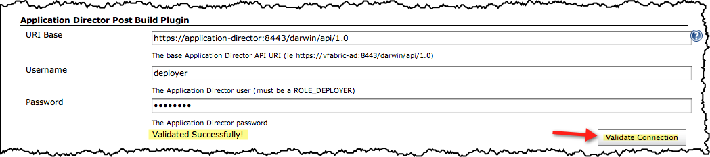
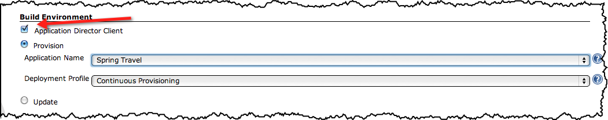
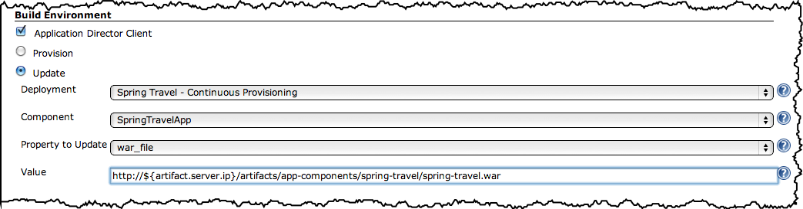

[.conf-macro .output-inline]# #

[.aui-icon .aui-icon-small .aui-iconfont-error .confluence-information-macro-icon]#
#

The current version of this plugin may not be safe to use. Please review
the following warnings before use:

* https://jenkins.io/security/advisory/2019-09-25/#SECURITY-1541[Credentials
stored in plain text]

Enables deployment of a cloud based application through
https://www.vmware.com/products/application-platform/vfabric-application-director/overview.html[vFabric
Application Director].  Your build can trigger the teardown and re
provisioning of an end to end application environment or the release of
your build to an existing
https://www.vmware.com/products/application-platform/vfabric-application-director/overview.html[Application
Director] managed environment.   +

[[vFabricApplicationDirectorPlugin-TableofContents]]
===== Table of Contents

[[vFabricApplicationDirectorPlugin-Purpose]]
== Purpose

When
leveraging https://www.vmware.com/products/application-platform/vfabric-application-director/overview.html[vFabric
Application Director] to accelerate the consistent provisioning and / or
deployment of your multi tiered application to infrastructure clouds, it
is often necessary to automate and integrate the process with your
Jenkins based jobs.  This plugin allows you to exercise
a https://www.vmware.com/products/application-platform/vfabric-application-director/overview.html[vFabric
Application Director] based application blueprint to achieve continuous
provisioning or the deployment of your build artifacts to an
existing https://www.vmware.com/products/application-platform/vfabric-application-director/overview.html[vFabric
Application Director] managed application for continuous deployment or
delivery.

[[vFabricApplicationDirectorPlugin-Features]]
== Features

This plugin lets you automate the re-provisioning or release of your
multi tiered application during a Jenkins build:

* Global Configuration
** Base Application Director REST URI
** Username and Password
** Connection Validation 
* Job
** Provisioning
*** Select from existing application blueprints
*** Select from existing deployment profiles
*** Schedules the teardown of the first existing deployment found for
this application
*** Schedules the re-provisioning of the selected blueprint / deployment
profile
** Update
*** Select from list of existing deployments
*** Select from list of application components
*** Select from a list of update properties per component
*** Provide new value for a specific property.  Will typically point to
the recently build application artifact  (ie. war file)
*** Update the selected existing deployment.  Application Director will
maintain all update history.
* Application Director feedback provided to the job build console

[[vFabricApplicationDirectorPlugin-Requirements]]
== Requirements

[[vFabricApplicationDirectorPlugin-Jenkins]]
=== Jenkins

This plugin was tested against Jenkins ver. 1.466.

[[vFabricApplicationDirectorPlugin-vFabricApplicationDirector]]
=== vFabric Application Director

This plugin was tested against vFabric Application Director 5.0.  The
1.0 version of the REST API was used   

[[expander-60387014]]
[[expander-control-60387014]]
[.expand-icon .aui-icon .aui-icon-small .aui-iconfont-chevron-right]## ##[.expand-control-text]##Application
Director - Jenkins Integration Best Practices##

[[expander-content-60387014]]
* Continuous Provisioning
** *Create a single, dedicated deployment profile for any application
blueprint you want to exercise*.  Use a distinct name for the deployment
profile such as "Continuous Provisioning."  Only use this deployment
profile for use by your Jenkins job.  The Jenkins plugin will search for
any existing deployment that match the application blueprint name and
deployment profile name.  It will schedule a teardown for the first
match that is found for scheduling the new deployment.  If there is no
match, no teardown will be scheduled but he provisioning process will
continue.
* Continuous Deployment / Delivery (Release Management)
** *Create a single, dedicated deployment profile for the deployment to
be updated.*  Use a distinct name for the deployment profile such as
"Continuous Deployment."  Only use this deployment profile for use by
your Jenkins job and ensure that a deployment exists before configuring
you Jenkins job.  The Jenkins plugin will present a list of existing
deployments for which to update.  If you have multiple deployment using
the same deployment profile, it will be difficult to identify which
deployment you intend to update.
* Build Artifacts
** *Your blueprint should be configured to download application
artifacts from a Jenkins / Application Director common repository*.  It
is common practice to host application artifacts (ie jar, war, ear) in
an artifact repository.  Your Jenkins build job should have access to
upload built artifacts to this location.  Your Application Director
virtual appliance should be able to download those artifacts.

[[vFabricApplicationDirectorPlugin-Configuration]]
== Configuration

[[vFabricApplicationDirectorPlugin-GlobalConfiguration]]
=== Global Configuration

Provide the base URI for your Application Director REST API and the
credentials for a user with at least the ROLE_DEPLOYER role assigned.
 Validate that the information entered is correct and that Jenkins can
connect to Application Director by clicking the 'Validate Connection'
button.

 
[.confluence-embedded-file-wrapper]##

[[vFabricApplicationDirectorPlugin-JobConfiguration]]
=== Job Configuration

[[vFabricApplicationDirectorPlugin-Provisioning]]
==== Provisioning

Select the Application Director Client checkbox and choose 'Provision'.
 Select the application blueprint and deployment profile fromt the list
that is populated from Application Director.
[.confluence-embedded-file-wrapper]##

[[vFabricApplicationDirectorPlugin-Update]]
==== Update

Select the 'Update' option and choose from a list of existing
deployments.  Select the appropriate component property to update and
provide a value to be used when updating.
[.confluence-embedded-file-wrapper]##

[[vFabricApplicationDirectorPlugin-Knownissues]]
==== Known issues

[[expander-819998602]]
[[expander-control-819998602]]
[.expand-icon .aui-icon .aui-icon-small .aui-iconfont-chevron-right]## ##[.expand-control-text]##View
known issues...##

[[expander-content-819998602]]
[[vFabricApplicationDirectorPlugin-Potentialupcomingfeatures]]
=== Potential upcoming features

[[expander-545240110]]
[[expander-control-545240110]]
[.expand-icon .aui-icon .aui-icon-small .aui-iconfont-chevron-right]## ##[.expand-control-text]##View
potential upcoming features...##

[[expander-content-545240110]]
* The ability to configure you Jenkins job to verify the SSL certificate
presented by Application Director
* The option to have your Jenkins job poll Application Director until
the completion of the scheduled Application Director actions.  

[[vFabricApplicationDirectorPlugin-Sourcecode]]
== Source code

The latest source code can be found on GitHub: +
https://github.com/jenkinsci/application-director-plugin

[[vFabricApplicationDirectorPlugin-Versionhistory]]
== Version history

[[expander-1517930236]]
[[expander-control-1517930236]]
[.expand-icon .aui-icon .aui-icon-small .aui-iconfont-chevron-right]## ##[.expand-control-text]##View
version history....##

[[expander-content-1517930236]]
[[vFabricApplicationDirectorPlugin-Version1.3(November25,2012)]]
==== Version 1.3 (November 25, 2012)

* Changed the global configuration namespace to ensure uniqueness with
other plugins

[[vFabricApplicationDirectorPlugin-Version1.2(November24,2012)]]
==== Version 1.2 (November 24, 2012)

* Initial Release
