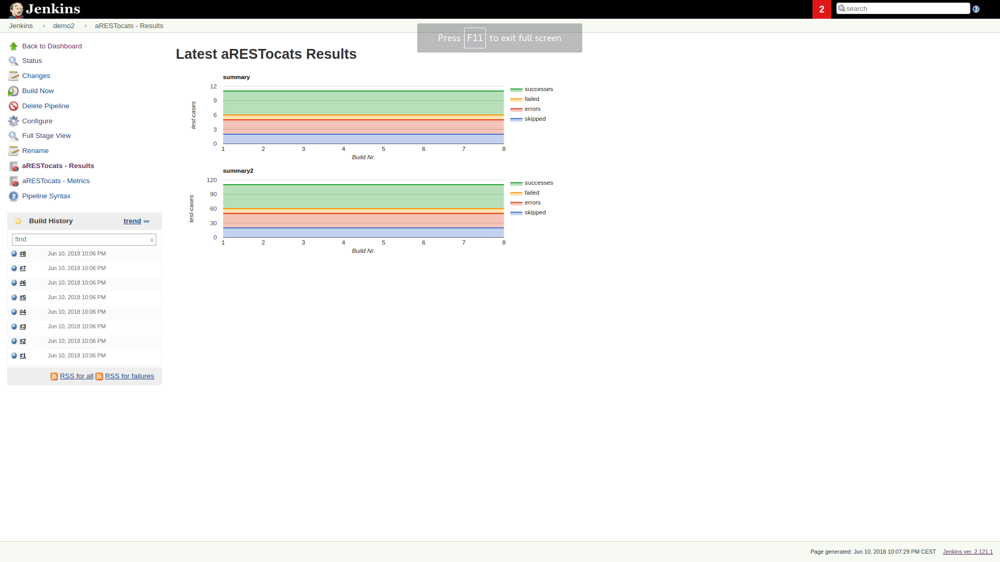
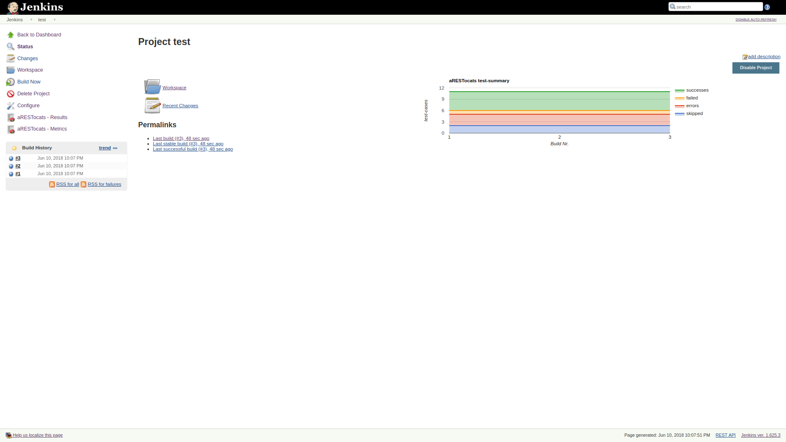
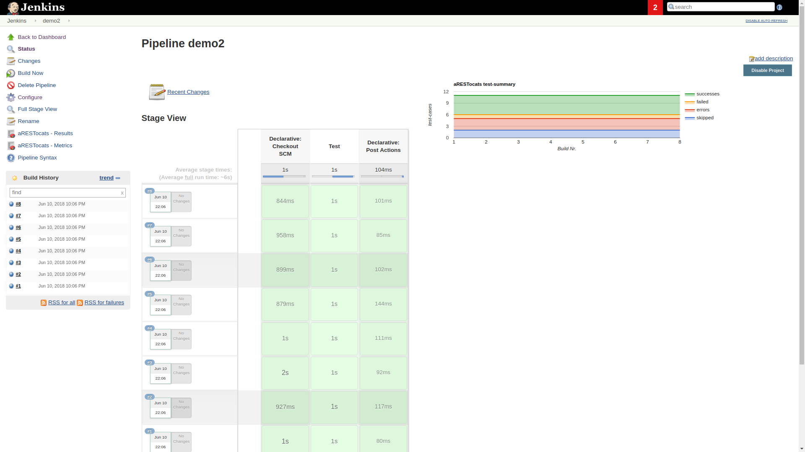
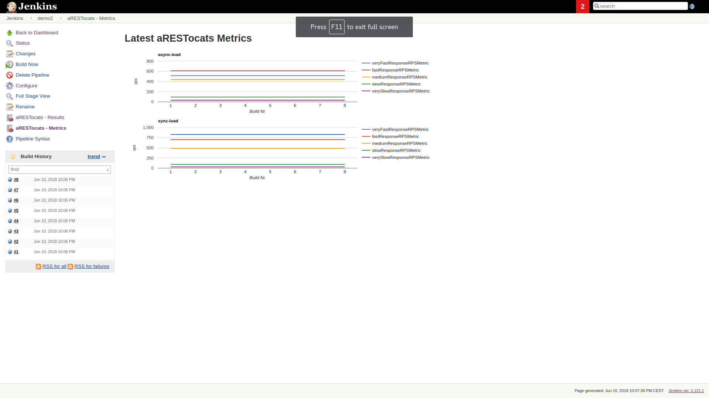

Jenkins-Plugin for tracking metrics created with the aRESTocats REST API
testing toolkit available
at https://www.npmjs.com/package/arestocats and https://github.com/aixigo/arestocats.

[.confluence-embedded-file-wrapper .confluence-embedded-manual-size]##

[.confluence-embedded-file-wrapper .confluence-embedded-manual-size]##

[.confluence-embedded-file-wrapper .confluence-embedded-manual-size]##

[.confluence-embedded-file-wrapper .confluence-embedded-manual-size]##

[[aRESTocats-Plugin-Issues:]]
== Issues:

Please report any issues
to https://github.com/jenkinsci/arestocats-plugin/issues

[[aRESTocats-Plugin-Changelog:]]
== Changelog:

 

Version 2.1

* Add result and metrics links in sidepanel of pipeline overview
* Add summary plot to pipeline overview
* Add summary plot to project page
* Add logging to confirm arestocats is storing plots
* Replace result LineCharts by AreaCharts. +
 +

Version 2.0

* Performance improvements, plots are displayed alot faster!
* Added test-case result plots. +
 +

Version 1.1

* JEP-200 Fix

 

Version 1.0

* First Release

 

 
