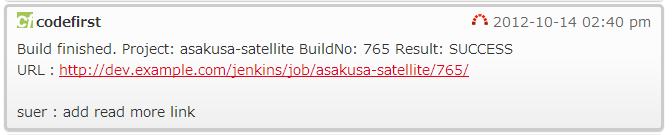
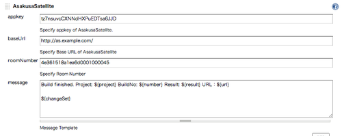
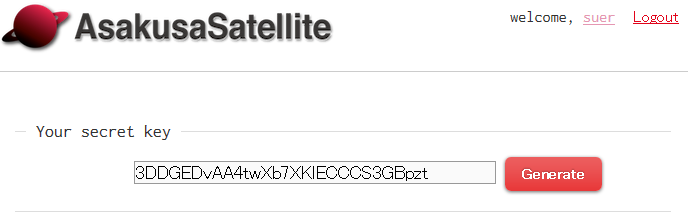

This plugin notifies
https://github.com/codefirst/AsakusaSatellite[AsakusaSatellite] of build
results.

[[AsakusaSatellitePlugin-Features]]
== *Features*

* Notify https://github.com/codefirst/AsakusaSatellite[AsakusaSatellite]
of build results

[.confluence-embedded-file-wrapper .confluence-embedded-manual-size]##

[[AsakusaSatellitePlugin-Setup]]
== *Setup*

At (your project) > Configure > AsakusaSatellite, set room information
at your AsakusaSatellite.

[.confluence-embedded-file-wrapper]##

* *appkey*: secret key of your AsakusaSatellite acount. You can get this
key at your acount page at AsakusaSatellite.

         
[.confluence-embedded-file-wrapper .confluence-embedded-manual-size]##

* *baseUrl*: a Base URL of AsakusaSatellite
* *roomNumber*: a room id. Typically, URL of rooms are such as
*baseUrl*/chat/room/*roomNumber*
* *message*: a message template. You can use following variables
** $\{project}: a project name
** $\{number}: a build number
** $\{result}: a build result
** $\{url}: a url of build result
** $\{changeset}: change set of this build

[[AsakusaSatellitePlugin-VersionHistory]]
== Version History

[[AsakusaSatellitePlugin-Version0.1(22October,2012)]]
=== *Version 0.1 (22* **October***, 2012)*

* Initial release
