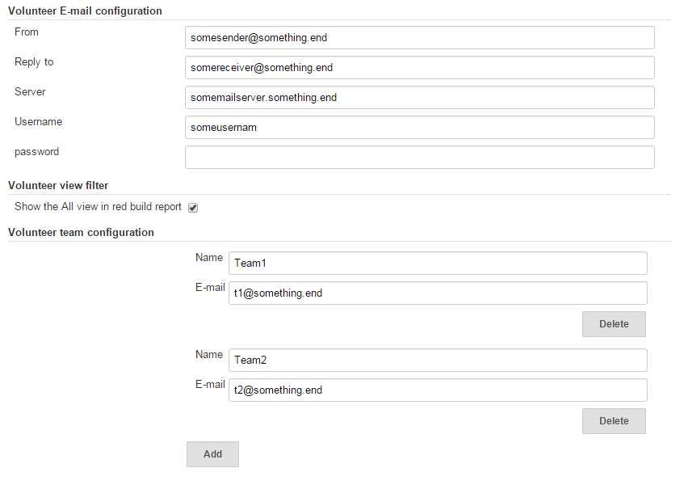
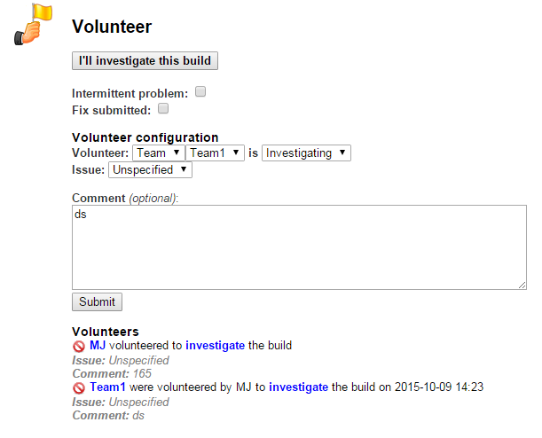
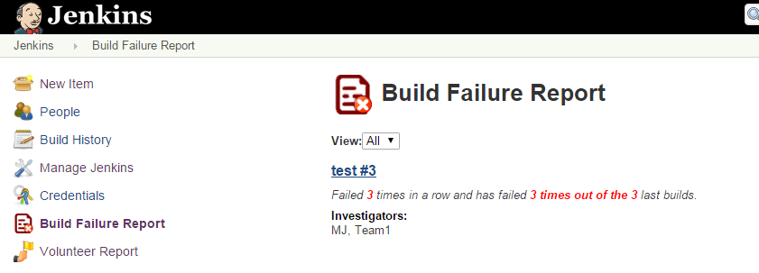
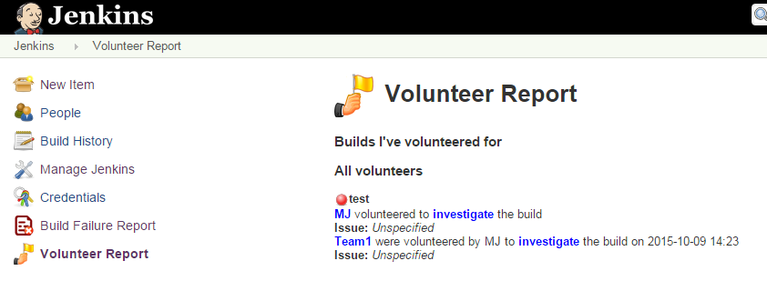

[[Attention-plugin-Description]]
== Description

A plugin to handle red builds in Jenkins. The plugin allows users to
volunteer to investigate/fix red builds. It also creates a report with
all volunteers and a summary report of all the current red builds in a
view. For develops it's possible to extend the attention plugin to
create your own build failure detection to populete the issue list.

[[Attention-plugin-Configuration]]
== Configuration

 After installing the plugin you need to setup the plugin for sending
mail and also adding the teams. Go to Manage Jenkins -> Configure
System.  +
[.confluence-embedded-file-wrapper]## +
This plugin will also require that you enable user security and the
users need to login before they can volunteer.

[[Attention-plugin-Volunteertofix/investigatebuild]]
== Volunteer to fix/investigate build

When a build goes red there will be a volunteer section on the build
page where the users can volunteer them self or another user/team. The
one volunteered will be notified via mail (if different from the logged
in user). +
[.confluence-embedded-file-wrapper]##

[[Attention-plugin-BuildFailureReport]]
== Build Failure Report

The Build Failure report will list all the failed builds in the current
view. Information such as number of failures and who broke the build
initially will be displayed. +
[.confluence-embedded-file-wrapper]## +
Volunteer Report

The volunteer report lists the builds that contains volunteers. At the
beginning of the page the builds that the current user has volunteered
for will be shown. +
[.confluence-embedded-file-wrapper]##

[[Attention-plugin-Extensionpoint]]
== *Extension point*

If you are a developer and want to add your own issue detection you can
write a class to your own plugin that extends the
AttentionExtension class

[[Attention-plugin-Mavendependency]]
=== Maven dependency

[source,syntaxhighlighter-pre]
----
<dependency>
    <groupId>org.jenkins-ci.plugins</groupId>
    <artifactId>attention</artifactId>
        <version>X.X</version>
        <optional>true</optional>
</dependency>
----

[[Attention-plugin-Example]]
=== *Example*

[source,syntaxhighlighter-pre]
----
@Extension
public class JunitAttentionExtension extends AttentionExtension {

    @Override
    public List<DetectedIssue> getIssues(Run<?, ?> run) {
        List<TestResultAction> actions = run.getActions(TestResultAction.class);
        List<DetectedIssue> issues = new LinkedList<DetectedIssue>();

        for (TestResultAction action : actions) {
            List<CaseResult> failedTests = action.getFailedTests();
            for (CaseResult result : failedTests) {
                DetectedIssue issue = new DetectedIssue(TestResultAction.class.getName());
                issue.setupTestFailure(result.getTitle(), result.getErrorDetails(), result.getFailedSince(),
                        result.getFailCount());
                issues.add(issue);
            }
        }

        return issues;
    }

}
----

[[Attention-plugin-Versions]]
== *Versions*

[[Attention-plugin-Version1.1(relasedOctober10,2015)]]
=== *Version 1.1 (relased October 10, 2015)*

* *Made the dependency to junit optional*
* *Fixed a bug that would print the smtp password when configuring
Jenkins*

[[Attention-plugin-Version1.0(releasedOctober09,2015)]]
=== Version 1.0 (released October 09, 2015)

* The attention plugin was released to the public.
