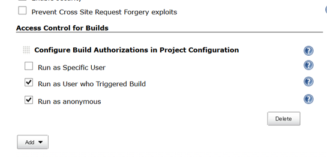
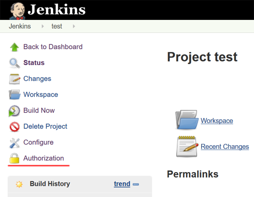
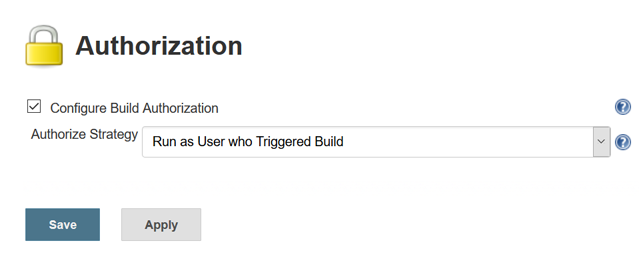
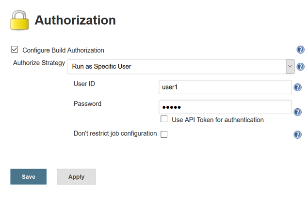
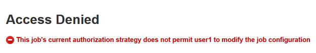

Configure projects to run with specified authorization.

[[AuthorizeProjectplugin-What'sthis?]]
== What's this?

This plugin provides following features:

* You can configure projects to have their builds run with specified
authorization.
** This is an implementation for
http://javadoc.jenkins-ci.org/jenkins/security/QueueItemAuthenticator.html[QueueItemAuthenticator].
* Provides following ways to specify authorization.
** Run as the user who triggered the build.
*** Does not work for scheduled, or polled builds.
*** Configuring projects are allowed only to users with the BUILD
permission.
** Run as anonymous.
** Run as the specified user.
*** You are requested to enter the password of the specified user except
following cases:
**** You are an administrator.
**** You are the specified user.
**** The specified user is not changed from the last configuration, and
"No need for re-authentication" is checked.
***** This can threaten your Jenkins security. Be careful to use.
*** Configuring projects are allowed only to administrators and the user
configured as the authorization.
**** "Don't restrict job configuration" allows other users (with the
CONFIGURE permission) to configure the project. Ensure that only
appropriate users have CONFIGURE permission for that project.
** Run as SYSTEM
*** This is provided only to cancel the global configuration. SYSTEM
authorization is often considered as "unconfigured", features provided
by plugins may treat it as anonymous.
* Provides an extension point to add new ways to specify authorization.

[[AuthorizeProjectplugin-Screenshots]]
== Screenshots

* After installed Authorize Project plugin, you will find "Access
Control for Builds" in "Manage Jenkins" > "Configure Global Security".
Adding "Configure Build Authorizations in Project Configuration" enables
Authorize Project plugin. +
[.confluence-embedded-file-wrapper .image-center-wrapper]##
** You can also disable specific strategies in this page. Disabled
strategies are never used for authorization.
* A new side bar menu "Authorization" will appear in project pages. +
[.confluence-embedded-file-wrapper .image-center-wrapper]##
* You can select how to authorize builds of the project in the
"Authorization" page. +
[.confluence-embedded-file-wrapper .image-center-wrapper]##
* When selecting "Run as Specific User", you can enter User ID with
whose authorization builds will run. If you enter a user ID except
yourself and have no administrative privilege, you are required to enter
the password of that user. +
[.confluence-embedded-file-wrapper .image-center-wrapper]##
** You can also use API token, especially for non password-based
security realms.
* Configuring project settings by unauthorized users are forbidden when
you configure the authorization for the project. See
https://wiki.jenkins-ci.org/display/JENKINS/Authorize+Project+plugin#AuthorizeProjectplugin-What%27sthis?[#What's
this?] for details. +
[.confluence-embedded-file-wrapper .image-center-wrapper]##

[[AuthorizeProjectplugin-Extensionpoint]]
== Extension point

A new way to authorize projects can be added with extending
`+org.jenkinsci.plugins.authorizeproject.AuthorizeProjectStrategy+`,
overriding the following method:

[source,syntaxhighlighter-pre]
----
public abstract Authentication authenticate(hudson.model.AbstractProject<?, ?> project, hudson.model.Queue.Item item);
----

Use `+AuthorizeProjectStrategyDescriptor+` for `+Descriptor+`. +
If you want to provide global configuration properties, do as following:

* `+global-security.jelly+` is displayed in "Configure Global Security"
page.
* Override
`+AuthorizeProjectStrategyDescriptor#configureFromGlobalSecurity+` to
save configuration.

[[AuthorizeProjectplugin-Issues]]
== Issues

To report a bug or request an enhancement to this plugin please create a
ticket in JIRA (you need to login or to sign up for an account). Also
have a look on
https://wiki.jenkins-ci.org/display/JENKINS/How+to+report+an+issue[How
to report an issue]

* https://issues.jenkins-ci.org/secure/CreateIssueDetails!init.jspa?pid=10172&issuetype=1&components=18155&priority=4&assignee=ikedam[Bug
report]
* https://issues.jenkins-ci.org/secure/CreateIssueDetails!init.jspa?pid=10172&issuetype=4&components=18155&priority=4[Request
or propose an improvement of existing feature]
* https://issues.jenkins-ci.org/secure/CreateIssueDetails!init.jspa?pid=10172&issuetype=2&components=18155&priority=4[Request
or propose a new feature]

[[refresh-module--56682902]]
[[refresh--56682902]][[jira-issues--56682902]]
Key

T

P

Summary

[.refresh-action-group]# #

[[refresh-issues-loading--56682902]]
[.aui-icon .aui-icon-wait]#Loading...#

[#refresh-issues-button--56682902]##
[#refresh-issues-link--56682902]#Refresh#
[#error-message--56682902 .error-message .hidden]# #

[[AuthorizeProjectplugin-ChangeLog]]
== Change Log

[[AuthorizeProjectplugin-Version1.3.0(Feb12,2017)]]
=== Version 1.3.0 (Feb 12, 2017)

* Split the configuration of authentication into a separate screen
(https://issues.jenkins-ci.org/browse/JENKINS-35081[JENKINS-35081])
** See
https://wiki.jenkins-ci.org/display/JENKINS/Authorize+Project+plugin#AuthorizeProjectplugin-Screenshots[#Screenshots]
for details.

[[AuthorizeProjectplugin-Version1.2.2(May28,2016)]]
=== Version 1.2.2 (May 28, 2016)

* Fixed: Builds aren't start when security realm fail to find the user
for authorization (e.g. Bind DN is not set for Active Directory plugin)
(https://issues.jenkins-ci.org/browse/JENKINS-34279[JENKINS-34279])

[[AuthorizeProjectplugin-Version1.2.1(Apr03,2016)]]
=== Version 1.2.1 (Apr 03, 2016)

* Fixed: password / api token fields for "Run as Specific User" are
broken https://issues.jenkins-ci.org/browse/JENKINS-33897[JENKINS-33897]

[[AuthorizeProjectplugin-Version1.2.0(Mar27,2016)]]
=== Version 1.2.0 (Mar 27, 2016)

* *Targets Jenkins 1.625*
* SECURITY FIX: Reject unauthenticated configurations via REST / CLI
(https://issues.jenkins-ci.org/browse/JENKINS-28298[JENKINS-28298])
** See
https://wiki.jenkins-ci.org/display/JENKINS/JENKINS-28298[JENKINS-28298]
for details.
* Support global default authorization strategy
(https://issues.jenkins-ci.org/browse/JENKINS-30574[JENKINS-30574])
* Displays an error when a built-in user is used for "Run as Specific
User"
(https://issues.jenkins-ci.org/browse/JENKINS-32769[JENKINS-32769])
* Added "Run as SYSTEM"
(https://issues.jenkins-ci.org/browse/JENKINS-32770[JENKINS-32770])
** Disabled by default for projects. You have to enable it in the global
security configuration page.

[[AuthorizeProjectplugin-Version1.1.0(Aug9,2015)]]
=== Version 1.1.0 (Aug 9, 2015)

* Added a feature to enable / disable strategies.
(https://issues.jenkins-ci.org/browse/JENKINS-28298[JENKINS-28298])
** *"Run as Specific User" is disabled by default. You need to enable it
after upgrading from a prior version if you use it.*
* Supports workflow
(https://issues.jenkins-ci.org/browse/JENKINS-26670[JENKINS-26670])
* Supports apitoken for authentication.
(https://issues.jenkins-ci.org/browse/JENKINS-22470[JENKINS-22470])
* Add support for upcoming $class annotation change
(https://issues.jenkins-ci.org/browse/JENKINS-25403[JENKINS-25403])

[[AuthorizeProjectplugin-Version1.0.3(Apr14,2014)]]
=== Version 1.0.3 (Apr 14, 2014)

* *SECURITY FIX*: Authentication of "Run as Specific User" is easily
bypassed by REST/CLIadded (Fixed
https://issues.jenkins-ci.org/browse/JENKINS-22469[JENKINS-22469])
* Replaced radio buttons to dropdown selecting authorization strategies
(Fixed
https://issues.jenkins-ci.org/browse/JENKINS-20786[JENKINS-20786])

[[AuthorizeProjectplugin-Version1.0.2(Feb22,2014)]]
=== Version 1.0.2 (Feb 22, 2014)

* added `+AuthorizeProjectStrategyDescriptor+`
https://issues.jenkins-ci.org/browse/JENKINS-20812[JENKINS-20812]
* Not to send the password value to test whether password is required.

[[AuthorizeProjectplugin-Version1.0.1(Nov30,2013)]]
=== Version 1.0.1 (Nov 30, 2013)

* Fix a problem that a new user created if you authenticate with
non-existent user (Fix
https://issues.jenkins-ci.org/browse/JENKINS-20784[JENKINS-20784])
* Works with MatrixProject (Fix
https://issues.jenkins-ci.org/browse/JENKINS-20785[JENKINS-20785])

[[AuthorizeProjectplugin-Version1.0.0(Nov24,2013)]]
=== Version 1.0.0 (Nov 24, 2013)

* Initial release.
