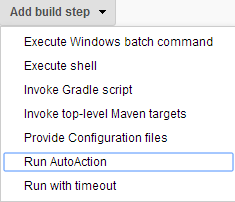
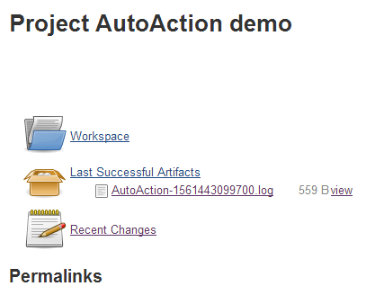
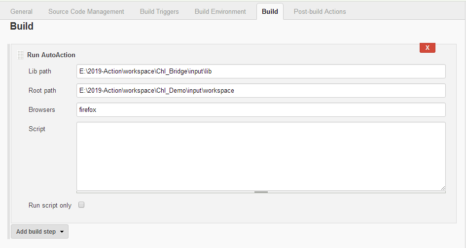

_Run the auto actions from "flat lines" scripts based on Selenium
WebDriver_

This plugin is used to simplify the usage of Selenium WebDriver which is
main tool for Automate testing and other tasks.

For example, to complete below form:

[.confluence-embedded-file-wrapper .confluence-embedded-manual-size]##

We just need few lines as below:

*Script content*

[source,syntaxhighlighter-pre]
----
Open https://accounts.google.com/SignUp?lp=1&hl=en
Input Auto First Name
Input Action Last Name
Input autoaction2019 Username
Input autoaction123 Password
Input autoaction123 Confirm
Click Next
----

instead of complex coding by Java, or Python ...

[[AutoActionStepPlugin-Prerequisites]]
== Prerequisites

*image:docs/images/warning.svg[(warning)] T_o
avoid some issues with Windows security,_ _please start JENKINS server
from WAR file (not from Window service mode)_*

*Install browser* ( in case the browser is installed at different
machine, please refer to
https://www.seleniumhq.org/docs/07_selenium_grid.jsp[Selenium
Grid] and https://developers.perfectomobile.com/pages/viewpage.action?pageId=21435360[Selenium
Grid config samples] and skip this step)

AutoAction plugin will open real browser and execute the actions, so the
browser is required to be installed at the machine hosting Jenkins
server +
[.Apple-tab-span]# #

* Firefox browser: http://getfirefox.com/
* Chrome browser
* Edge browser

*Download browser driver*

* Firefox driver: get it from
https://github.com/mozilla/geckodriver/releases +
(For *Window Vista/Windows 8*, there are issues with the few recent
versions, please get the version 0.17.0
https://github.com/mozilla/geckodriver/releases/tag/v0.17.0 )
* For other drivers please refer to:
https://www.seleniumhq.org/download/ +
[.Apple-tab-span]# #

*Download required libs*

The plugin requires the libs(*.jar)  in for executing the AutoAction
scripts

* Please get libs from
repository https://github.com/vochithanh/autoaction-lib.git

*Download the workspace*

The plugin requires the workspace folder for the cofigurations

* Please get workspace folder from
repository https://github.com/vochithanh/autoaction-workspace.git +
[.Apple-tab-span]# #

[[AutoActionStepPlugin-Preparing]]
== Preparing

* Copy above required libs to a folder
* Copy above worksapce to a folder
* Copy above Firefox driver (*geckodriver.exe*) file to folder *drivers*
under *workspace folder*

[[AutoActionStepPlugin-YourfirstAutoActionrunning]]
== Your first AutoAction running

Below steps will help you run the auto action script via Jenkins job

* Create new project (Freestyle project is prefered)
* Open Configuration
* Go to Build
* Add build step: "*Run AutoAction*"

[.confluence-embedded-file-wrapper .confluence-embedded-manual-size]##

* Filling values (as below): Lib path, Root path, Browsers, Scripts, Run
script only

[.confluence-embedded-file-wrapper .confluence-embedded-manual-size]#image:docs/images/image2019-6-25_13-18-20.png[image,height=400]#

*Script content*

[source,syntaxhighlighter-pre]
----
Open https://accounts.google.com/SignUp?lp=1&hl=en
Input Auto First Name
Input Action Last Name
Input autoaction2019 Username
Input autoaction123 Password
Input autoaction123 Confirm
Click Next
----

 +

* Click Save and Click "Build Now" to run the job
* After few seconds, a browser window would be openned and go to Google
account site up page, filling the values to the form and go to the next
page
* View the statuses of steps

[.confluence-embedded-file-wrapper .confluence-embedded-manual-size]##

 +

[[AutoActionStepPlugin-SampleAutoActionscriptsfromworkspace]]
== Sample AutoAction scripts from workspace

For complex cases (e.g. auto testing purpose), multiple test cases need
to be run. Please put the content of test cases to files with extension
is "*chl*" and copy them to anywhere in workspace folder. When running,
the plugin will find them and run the script content from them.

* Change the configuration of above Jenkin project as below (clear
content of *Script* text area and uncheck "*Run script only*" checkbox)

[.confluence-embedded-file-wrapper .confluence-embedded-manual-size]## +
[.Apple-tab-span]# #

* Click Save and Click "Build Now" to run the job
* Now, system will find 2 files in workspace: *creategoogleaccount.chl*
and *createmicrosoftaccount.chl* and run the script content of them.

 +

[[AutoActionStepPlugin-Configbrowsersfield]]
== Config browsers field

The value for "Browsers" field could be:

* firefox → Firefox browser
* chrome → Chrome browser
* edge → Edge browser
* http://[hub-ip]:[port]/wd/hub,[browser] for Selenium Grid case,
e.g. http://hub:4441/wd/hub,firefox

[[AutoActionStepPlugin-AutoActionsyntax]]
== AutoAction syntax

Each line in script is an action. Currently, below list is the supported
acions:

[cols=",,,",options="header",]
|===
|Action |Params |Explain |Sample
|*Open* |url |Open the url
|**Open **https://accounts.google.com/SignUp?lp=1&hl=en

|*Click* |guide_word(s) a|
Using guide_word(s) to find the an element and click it.

"Guide keywords" could be id, class, display text of HTML element which
help system find the target HTML element).

a|
*Click* Next

*Click* Next button

|*Verify* |expeted_textt_in_html_document |Return status "PASSED" if the
expected text is found in current html document |*Verify* this phone
number format

|*Wait* |number_of_seconds |Wait in second(s). After some actions, we
need to wait before run the next actions. |*Wait * 3

|*Input* |value guide_word(s) a|
"Guide_words" could be id, class, display text of HTML element which
help system find the target HTML element).

"value" is the value to fill in input element.

a|
*Input* Action Last Name

In above line, Action is the "value", and the rest Last Name is
"guide_word(s)"

|===

Please refer to sample scripts from *creategoogleaccount.chl*
and *createmicrosoftaccount.chl*

*_System would skip all lines which contains unsupported actions._*

To make the script more readable, the complex text (e.g. url, value with
spaces) can be put in *dictionary files* (any file with extension
*.*dic*) with format: key = value. Please refer to sample dictionaries
files under workspace folder: *form.dic* and *url.dic*
