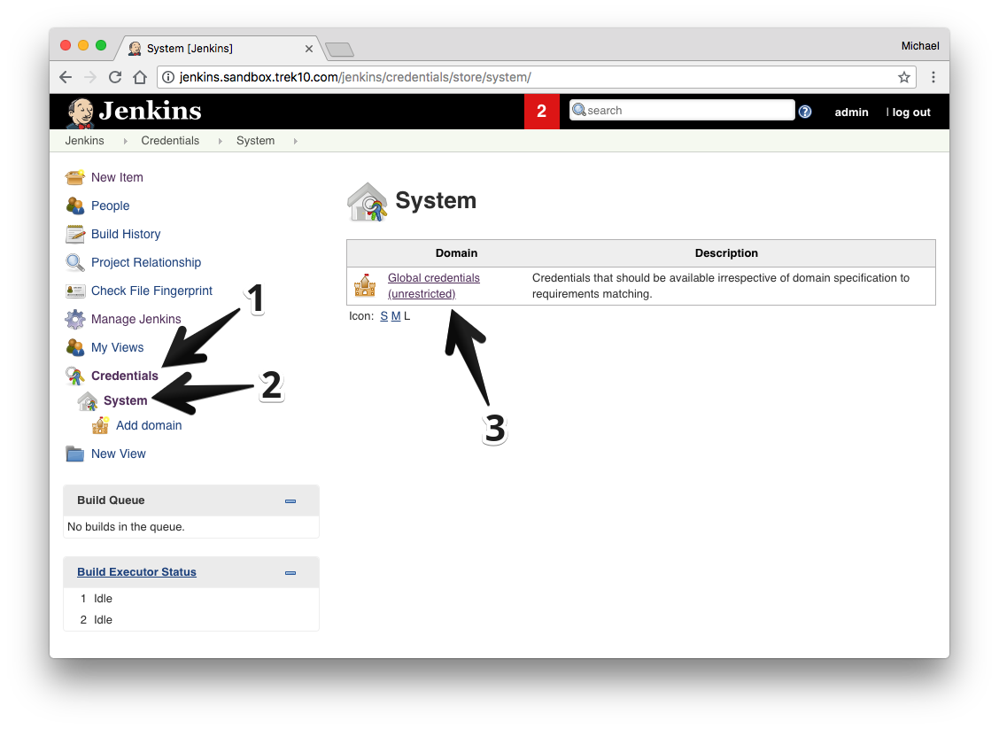
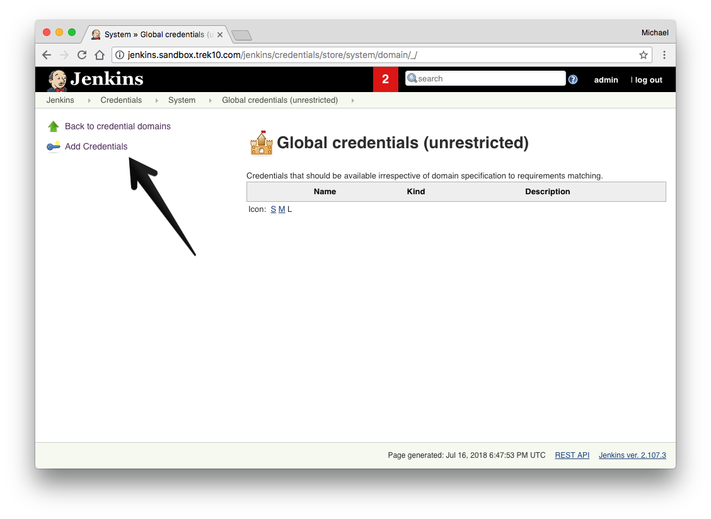
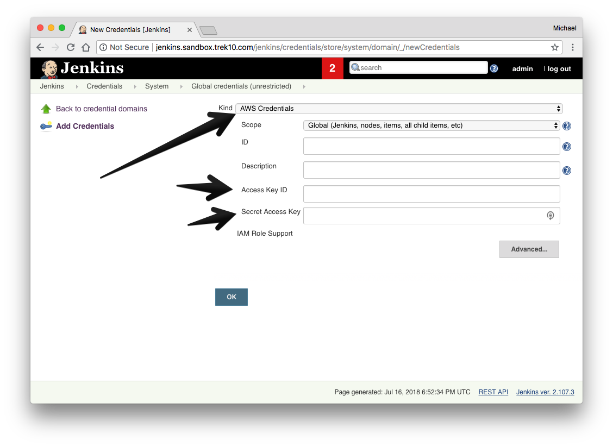
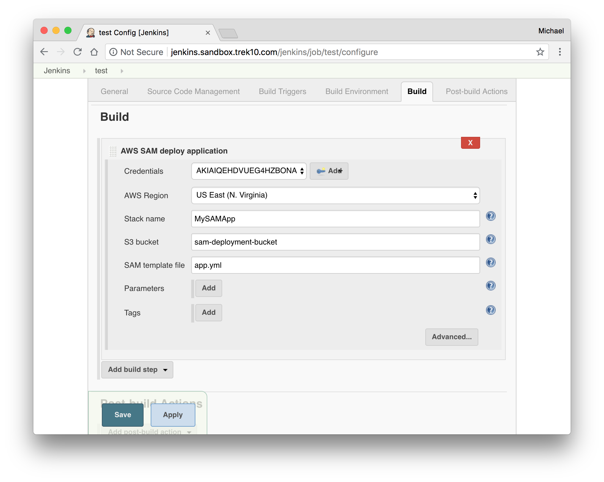
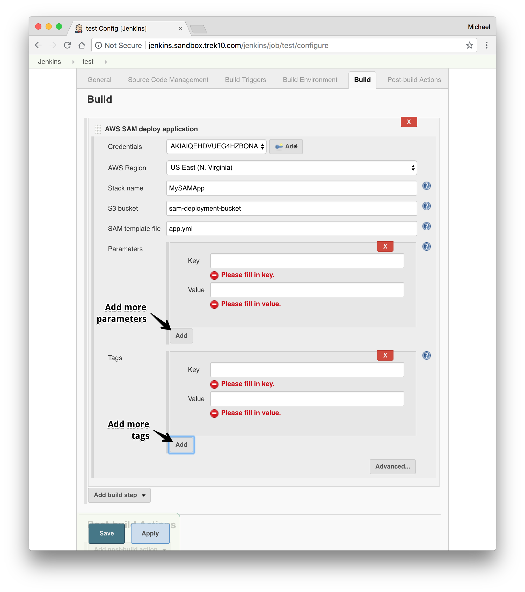
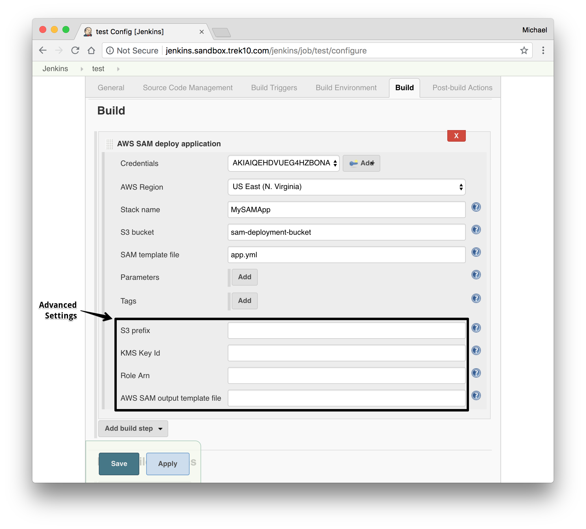

[[AWSSAMPlugin-AWSSAM]]
== AWS SAM

The AWS Serverless Application Model
(https://docs.aws.amazon.com/serverless-application-model/latest/developerguide/what-is-sam.html[SAM])
is an open-source framework you can use to build serverless applications
on AWS.

This plugin helps you automate the deployments of your applications that
are defined using SAM.

[[AWSSAMPlugin-Features]]
== Features

* Custom build step
* Deploy SAM projects to AWS
* Package SAM projects to a S3
** Use specific or auto-generated S3 bucket (if not given, a bucket will
be automatically generated in your account for you)
* Template parameter support
* Template tags support
* Deploy to specific region
* Use an S3 prefix for packaged artifacts to have fine-grained control
of where artifacts are uploaded
* Use a specific KMS key for encrypting packaged artifacts at rest in S3
* Configurable deployment role

[[AWSSAMPlugin-Requirements]]
== Requirements

[[AWSSAMPlugin-AWSAccount]]
=== AWS Account

In order to deploy to AWS you must have an AWS account.
Visit https://aws.amazon.com/[https://aws.amazon.com] if you do not have
one.

[[AWSSAMPlugin-AWSCredentialConfiguration]]
=== AWS Credential Configuration

Before you can start building, you _must_ have your AWS credentials set
up in Jenkins. +
To do this:

. From the main page of your jenkins server go to "Credentials" >
"System" and then click on "Global Credentials." +
 +
[.confluence-embedded-file-wrapper .confluence-embedded-manual-size]##
. Click "Add Credentials." +
 +
[.confluence-embedded-file-wrapper .confluence-embedded-manual-size]##
. Select from the "Kind" dropdown "AWS Credentials."
. Finish the form with your AWS access keys and click "OK." +
 +
[.confluence-embedded-file-wrapper .confluence-embedded-manual-size]##

[[AWSSAMPlugin-ProjectConfiguration]]
== Project Configuration

There are a few steps to configuring your build.

. In your project configuration, scroll down to build steps.
. Add the "AWS SAM deploy application" build step.

[[AWSSAMPlugin-ConfiguringtheBuildStep]]
=== Configuring the Build Step

. Select your AWS Credentials from the dropdown.
. Select the target region to deploy to.
. Give the build step a stack name.
. __OPTIONAL: __Enter an S3 bucket name to package the artifacts to. +
.. If you leave this blank, the S3 bucket will be auto-generated.
. Give the path to the SAM template file. +
 +
[.confluence-embedded-file-wrapper .confluence-embedded-manual-size]##
. __Optional: __If your template has parameters, add parameters where
necessary.
. __Optional: __Add any tags to the stack you'd like. +
 +
[.confluence-embedded-file-wrapper .confluence-embedded-manual-size]##
. _Optional:_ Finish the "Advanced" configuration +
.. Give an S3 prefix to package the artifacts in the bucket under.
.. Give a KMS Key ID to encrypt the packaged artifacts.
.. Give a Role Arn that will be assumed by CloudFormation when executing
the changeset.
. Select an output template file for the package step to output to. +
[.confluence-embedded-file-wrapper .confluence-embedded-manual-size]##

 +
 +

 +
