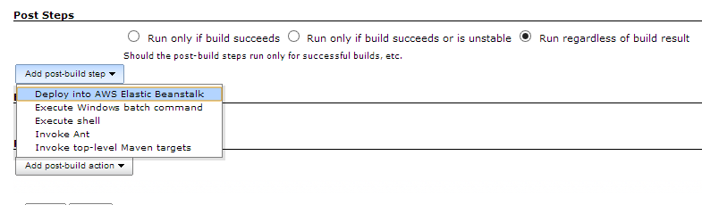

 +
[.conf-macro .output-inline]#This plugin allows you to deploy into
http://aws.amazon.com/elasticbeanstalk/[AWS Elastic Beanstalk] by
Packaging, Creating a new Application Version, and Updating an
Environment#

[[AWSEBDeploymentPlugin-OverviewandInstallation]]
== Overview and Installation

Install it (manually or from the Plugin manager) and you're set. It will
add a magic button labeled "Deploy into AWS Elastic Beanstalk" on your
Job Configuration Page (under "Post-Build Steps"):
[.confluence-embedded-file-wrapper]##

In order to understand how this plugin works, you need to understand how
AWS Elastic Beanstalk works. In a nutshell:

{empty}1. You package a zip file with the contents of your app (or the
plugin creates you one) +
2. This zip file is uploaded as a new S3 Object in a bucket you
control +
3. The CreateApplicationVersion API call is done in your application,
pointing to the file created in the previous step +
4. You call the UpdateEnvironment call with the versionLabel from the
previous step, triggering an update

The Git Endpoints AWS Publishes automate steps 1-3 and optionally 4.
Unfortunately, this is undocumented and AWS so far hasn't released its
inner workings despite our attempts to call for help.

This plugin does steps 1-3 and if an environment name is specified and
its active, it also does the UpdateEnvironment API call. If you enable
the "Zero Deployment" Flag, it creates a parallel environment and
deploys into it.We've written this in order to allow more streamlined
deployments from Jenkins, specially for non-Maven builds with minimal
tweaking

(for Maven builds, we advise you to look at our
http://beanstalker.ingenieux.com.br/beanstalk-maven-plugin/[ingenieux
Beanstalker], our Maven Plugin. You'll love it!)

[[AWSEBDeploymentPlugin-SettingupyourJobs]]
=== Setting up your Jobs

Once installed, the plugin will allow you to add a new Build Step in
Jenkins. You have two options:

{empty}a. Build a Zip / WAR file yourself. In this case, just mention
"Root Object" as the path to the generated file.

The values for includes/excludes are unnecessary. As for Version Label
Format, see
https://wiki.jenkins-ci.org/display/JENKINS/Building+a+software+project#Buildingasoftwareproject-below[some
available variables on this url]. 

{empty}b. You want us to build your zip file. The plugin allows you to
do it, by specifying include/exclude globs, as long as you define a
directory (which, in this case, is the Root Object). Example on a
Node.js project:

* Root Object: . (the base directory)
* Includes: **/*
* Excludes: **/.git/,/node_modules/**

Once your build is finished, the plugin does the rest.

[[AWSEBDeploymentPlugin-EnvironmentUpdate]]
=== Environment Update

If there's a valid environment name defined and active, the plugin will
call UpdateEnvironment until the API Call Passes. It tries 15 times,
with a 90s interval between calls.

If you turn on "Zero Deployment", the plugin does instead:

* CreateConfigurationTemplate on the existing environment
* CreateEnvironment using the generated template and newer
ApplicationVersion
* Waits for Environment getting both Green (Health) and Ready (Status)
* SwapEnvironmentCName among those two environments
* Terminates the original Environment

[[AWSEBDeploymentPlugin-Troubleshooting]]
=== Troubleshooting

Use the beanstalker-users mailing list on google groups
(https://groups.google.com/forum/#!forum/beanstalker-users[link]) if you
have questions. Of course, there's the github issues
(https://github.com/ingenieux/awseb-deployment-plugin/issueshttps://github.com/ingenieux/awseb-deployment-plugin/issues[ingenieux/awseb-deployment-plugin]) 

[[AWSEBDeploymentPlugin-Credits]]
=== Credits

This is a logical step from our
http://docs.ingenieux.com.br/project/beanstalker/[ingenieux Beanstalker]
project, and we hope it helps you to get your stuff done. You can see
the full list of credits on
http://docs.ingenieux.com.br/project/beanstalker/[docs.ingenieux.com.br] (under
"Huge Thanks goes To")

And if you're reading this far,
http://beanstalker.ingenieux.com.br/donate.html[why not donate] to our
parent project, beanstalker?

[[AWSEBDeploymentPlugin-ChangeLog]]
== Change Log

[[AWSEBDeploymentPlugin-Version0.2(11/12/13)]]
=== Version 0.2 (11/12/13)

* First Public Release
* Updated Docs + Plugin Identifies Version to AWS
