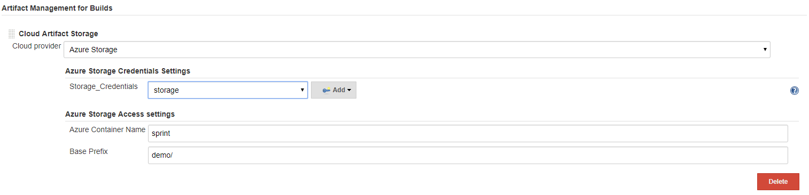
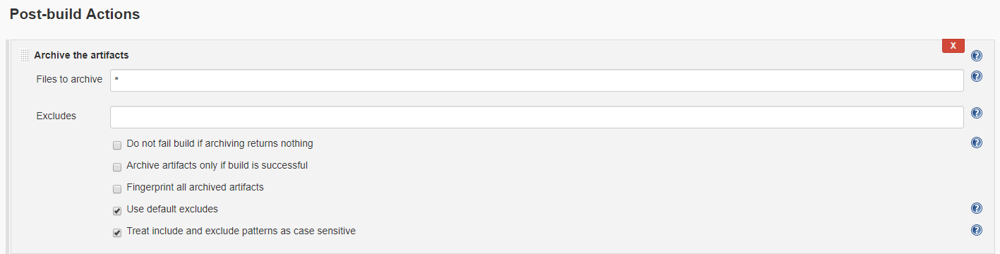

Azure Artifact Manager plugin is an Artifact Manager that allows you
store your artifacts into Azure Blob Storage. Azure Artifact Manager
plugin works transparently to Jenkins and your jobs, it is like the
default Artifact Manager.

 +

[[AzureArtifactManagerPlugin-Configuration]]
== Configuration

.  At least one Azure storage account must be configured in the global
configuration before the plugin can be used in build steps. To add a
storage account, go to Manage Jenkins | Configure System | Microsoft
Azure Storage Account Configuration and fill out the needed information.
.  In Manage Jenkins | Configure System | Artifact Management for
Builds, choose Azure Storage as the cloud provider. Choose the storage
Credentials created in step one, and choose your container name and
prefix. +
 +

[.confluence-embedded-file-wrapper .confluence-embedded-manual-size]##

 +

[[AzureArtifactManagerPlugin-Usage]]
== Usage

To use Azure Artifact Manager, you can use the artifact step to
archive/unarchive, and the stash/unstash step as you usually do.

[[AzureArtifactManagerPlugin-PipelineJob]]
=== Pipeline Job

Azure Artifact Manager plugin can be used in a pipeline job. You can use
`archiveArtifacts` step to archive artifacts into Azure Blob Storage.

[source,syntaxhighlighter-pre]
----
node() {
    //...
    stage('Archive') {
        archiveArtifacts "pattern"
    }
}
----

 +
To unarchive artifacts, you can use the `unarchive` step which will
retrieve the artifacts from Azure Blob Storage.

[source,syntaxhighlighter-pre]
----
node() {
    //...
    stage('Unarchive') {
        unarchive mapping: ["pattern": '.']
    }
}
----

 +

To save a set of files so that you can use them later in the same
build(generally on another node or workspace), you can use `stash` step
to store files into Azure Blob Storage for later use.

[source,syntaxhighlighter-pre]
----
node() {
    //...
    stash name: 'name', includes: '*'
}
----

You can use `unstash` step to retrieve the files saved with `stash` step
from Azure Blob Storage to the local workspace.

[source,syntaxhighlighter-pre]
----
node() {
    //...
    unstash 'name'
}
----

 +

[[AzureArtifactManagerPlugin-FreeStyleJob]]
=== FreeStyle Job

For FreeStyle jobs, you can archive artifacts by adding a `Post-build
Actions` of type `Archive the artifacts`, and this will use the Azure
Artifact Manager plugin to store the artifacts into Azure Blob Storage.

[.confluence-embedded-file-wrapper .confluence-embedded-manual-size]##

 +

[[AzureArtifactManagerPlugin-ChangeLog]]
== Change Log

[[AzureArtifactManagerPlugin-version0.1.42019-09-30]]
=== version 0.1.4 2019-09-30

* Bump Windows azure storage plugin 1.1.1

[[AzureArtifactManagerPlugin-version0.1.32019-06-21]]
=== version 0.1.3 2019-06-21

* Check for container name and prefix
* Fix encoded URL issue
* Make compatible with existing builds created before version 0.1.2

[[AzureArtifactManagerPlugin-version0.1.22019-04-22]]
=== version 0.1.2 2019-04-22

* Support environment variables for container name

[[AzureArtifactManagerPlugin-version0.1.12019-03-19]]
=== version 0.1.1 2019-03-19

* Change configuration displaying names

[[AzureArtifactManagerPlugin-version0.1.02019-02-19]]
=== version 0.1.0 2019-02-19

* Initial release

 +

 +
