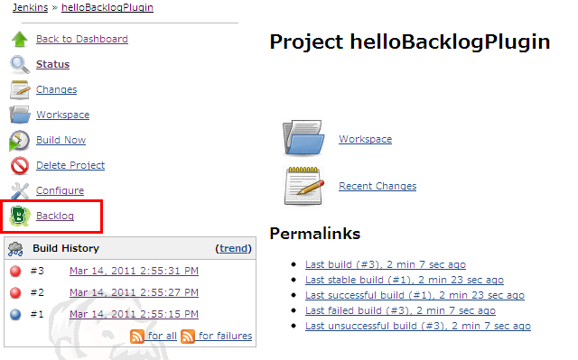
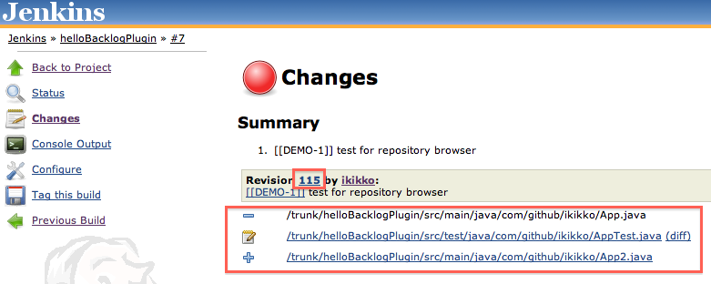
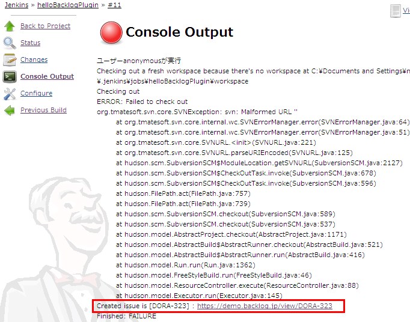
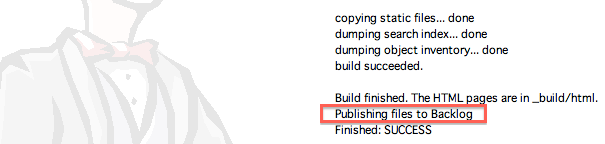
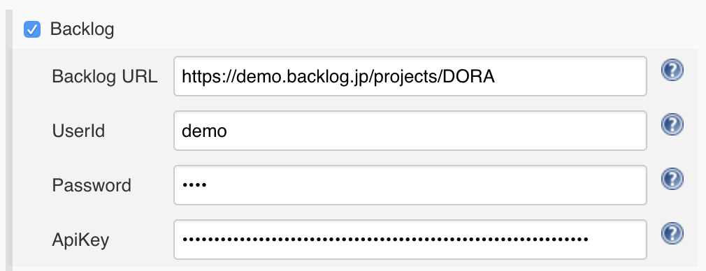
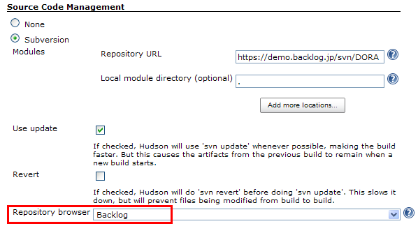
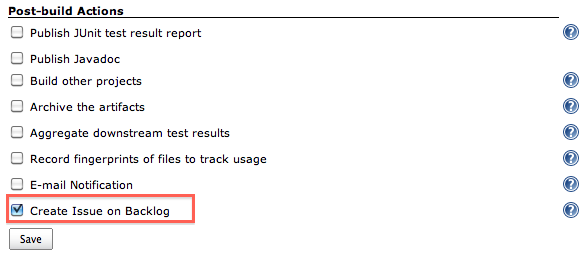
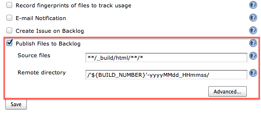
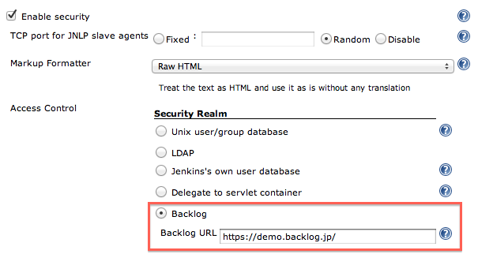
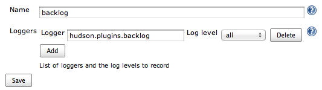

[.conf-macro .output-inline]##This plugin integrates
https://backlog.com/[Backlog] to Jenkins.##Backlog is an issue tracking
system provided by http://nulab-inc.com/[Nulab].

'''''

[[BacklogPlugin-Feature]]
== Feature

[[BacklogPlugin-LinktoBacklogspaceonnavigationmenu]]
=== Link to Backlog space on navigation menu

This plugin adds a link to your Backlog Space or project to navigation
menu on left side of Job page.

[.confluence-embedded-file-wrapper]##

[[BacklogPlugin-Convertissuenotationtolinkforanissue]]
=== Convert issue notation to link for an issue

In the "Changes" section, this plugin converts issue notation of Backlog
(like BLG-123, shown in the following example) found in your commit
message to link for an issue on your Backlog space.

....
Fixed Bug [[BLG-123]]
Fixed Another Bug ( BLG-123 )
....

[[BacklogPlugin-LinktoBacklogrepositorybrowser]]
=== Link to Backlog repository browser

This plugin adds changeset / diff links to "Summary" section on
"Changes" page. (now supporting Subversion and Git SCM)

[.confluence-embedded-file-wrapper]##

[[BacklogPlugin-CreateissueonBacklog]]
=== Create issue on Backlog

This plugin creates an issue on Backlog when build fails or becomes
unstable.

[.confluence-embedded-file-wrapper]##

[[BacklogPlugin-PublishfilestoBacklog]]
=== Publish files to Backlog

This plugin publishes build artifacts to
http://backlogtool.com/help/usersguide/file/userguide234/[Backlog File]
which is shared storage for Backlog users.

[.confluence-embedded-file-wrapper]##

Refer to the following blog entries for more details.

* For English readers,
https://nulab-inc.com/blog/backlog/transfer-jenkins-to-backlog/[How to
transfer artifacts built on Jenkins to Backlog]
* For Japanese readers,
https://nulab-inc.com/ja/blog/backlog/jenkins-backlog/[Jenkinsで生成したファイルをBacklogのファイル共有に転送する]

[[BacklogPlugin-NotifybuildresulttoBacklogpullrequest]]
=== Notify build result to Backlog pull request

This plugin notifies a build result to
http://backlogtool.com/help/usersguide/git/userguide2609/[Backlog pull
request]. Refer to the following blog entries.

* For Japanese
readers, https://nulab-inc.com/ja/blog/backlog/jenkins-to-pull-request/[Jenkins
Backlog Pluginで、ビルド結果をプルリクエストに通知！]

[[BacklogPlugin-MultibranchpipelineforBacklogpullrequest]]
=== Multibranch pipeline for Backlog pull request

This plugin support multibranch for Backlog pull request ( like
https://go.cloudbees.com/docs/cloudbees-documentation/cje-user-guide/index.html#github-branch-source[GitHub
Branch Source Plugin] ). You can see each pipeline according to each
pull request.

[.confluence-embedded-file-wrapper .confluence-embedded-manual-size]#image:https://cacoo.com/diagrams/pzUOdM3hBHaT1G3J-8E7A8.png[image,width=500]#

Refer to the following blog entries for more details.

* For Japanese
readers, https://nulab-inc.com/ja/blog/backlog/jenkins-backlog-plugin-in-pipeline/[Jenkins
Backlog Plugin in Pipeline – 自動でプルリクのジョブを作っちゃうんだ♪ –]

[[BacklogPlugin-AddsecurityrealmbyBackloguser]]
=== Add security realm by Backlog user

This plugin enables you to login to your Jenkins through authentication
by Backlog user.

'''''

[[BacklogPlugin-Configuration]]
== Configuration

[[BacklogPlugin-Jobconfiguration]]
=== Job configuration

. Navigate to the Configuration page for your job.
. In the top section, you can find setting for "Backlog".
.. "Backlog URL" : enter URL of your Backlog Space ( eg.
https://demo.backlogtool.com/[https://demo.backlogtool.com] or
https://demo.backlog.jp/ ) or Backlog project ( eg.
https://demo.backlogtool.com/projects/DORA or
https://demo.backlog.jp/projects/DORA ).
.. "User ID" / "Password / API key" : enter User ID, Password or API
key. They are used to connect Backlog API in some features like creating
an issue when build fails. +
[.confluence-embedded-file-wrapper .confluence-embedded-manual-size]##
. In "Source Code Management" section, check "Subversion" or "Git", and
select "Backlog" in "Repository browser" field. When you select "Git",
you have to enter repository name. +
[.confluence-embedded-file-wrapper]## +
When you want to select other project, click "advanced..." button and
enter URL of the project explicitly.
. In "Post-build Actions" section, check "Create Issue on Backlog". +
[.confluence-embedded-file-wrapper]##
. In "Post-build Actions" section, check "Publish Files to Backlog".
.. "Source files" : enter build files to be published. You can use Ant
glob syntax to specify files.
.. "Remote directory" : enter directory name on Backlog File to save
artifacts. You can use environment variables defined in Jenkins here. +
[.confluence-embedded-file-wrapper]## +
You can modify directory name to include timestamp by clicking
"advanced..." option on this setting screen. For more details, refer the
help available on that page.
. Save your changes.

[[BacklogPlugin-Globalconfiguration]]
=== Global configuration

. Navigate to the Configuration page for your Jenkins.
. In the top section, you can find the setting for "Enable security".
.. In "Access Control" > "Security Realm" section, select "Backlog".
.. "Backlog URL" : enter URL of your Backlog Space ( eg.
https://demo.backlogtool.com/ or https://demo.backlog.jp/ ). +
[.confluence-embedded-file-wrapper]##
. Save your changes.

'''''

[[BacklogPlugin-TroubleShooting]]
== Trouble Shooting

When you have an unexpected result, refer to log. Add
"hudson.plugins.backlog" logger, and you can see.

[.confluence-embedded-file-wrapper]##

'''''

[[BacklogPlugin-History]]
== History

[[BacklogPlugin-Version2.4(Oct7,2018)]]
=== Version 2.4 (Oct 7, 2018)

* [.s1]#Scan max count of pull requests ( default 20 → 100 )#

[[BacklogPlugin-Version2.3(Aug2,2018)]]
=== Version 2.3 (Aug 2, 2018)

* [.jira-issue .conf-macro .output-block]#
https://issues.jenkins-ci.org/browse/JENKINS-49396[[.aui-icon .aui-icon-wait .issue-placeholder]##
##JENKINS-49396] - [.summary]#Getting issue details...#
[.aui-lozenge .aui-lozenge-subtle .aui-lozenge-default .issue-placeholder]#STATUS#
#

[[BacklogPlugin-Version2.2(May31,2018)]]
=== Version 2.2 (May 31, 2018)

* Avoid unneeded serialization
( https://jenkins.io/blog/2018/01/13/jep-200/[JEP-200] )
* Suppress error log related with a repository browser in a config page
* Replace Backlog API v1(xml-rpc) to v2 ( see
https://backlog.com/ja/blog/backlog-old-api-2018-05-15/[this blog] )
+
[.aui-icon .aui-icon-small .aui-iconfont-warning .confluence-information-macro-icon]#
#

Input your API key instead of user / pass when creating issue on Backlog

[[BacklogPlugin-Version2.1(Jun20,2017)]]
=== Version 2.1 (Jun 20, 2017)

* Add a link to Backlog for pipeline
* Update emoji ( see
https://nulab-inc.com/blog/backlog/backlog-gets-fresh-updated-emojis/[this
blog] )

[[BacklogPlugin-Version2.0(May28,2017)]]
=== Version 2.0 (May 28, 2017)

* Support pipeline
* Support multibranch pipeline for Backlog pull request.

[[BacklogPlugin-Version1.11(Oct04,2015)]]
=== Version 1.11 (Oct 04, 2015)

* Notify build result to Backlog pull request.

[[BacklogPlugin-Version1.10(May06,2014)]]
=== Version 1.10 (May 06, 2014)

* Allow '@' and '.' in the UserId field.

[[BacklogPlugin-Version1.9(Jan12,2013)]]
=== Version 1.9 (Jan 12, 2013)

* pull https://github.com/jenkinsci/backlog-plugin/pull/1[#1] : Fix the
issue key pattern (thanks @emanon001).
* Replace Backlog icon.
* Store a encrypted value for password.
+
[.aui-icon .aui-icon-small .aui-iconfont-warning .confluence-information-macro-icon]#
#

If "Createing Backlog Issue" and/or "Publishing artifacts to Backlog
File" becomes failed after version up, re-enter the password.

[[BacklogPlugin-Version1.8(Sep06,2012)]]
=== Version 1.8 (Sep 06, 2012)

* Add repository browser for Git.

[[BacklogPlugin-Version1.7(Mar09,2012)]]
=== Version 1.7 (Mar 09, 2012)

* Add publishing built artifacts to Backlog File.

[[BacklogPlugin-Version1.6(Oct10,2011)]]
=== Version 1.6 (Oct 10, 2011)

* Add selecting other project when specifying repository browser

[[BacklogPlugin-Version1.5(Aug17,2011)]]
=== Version 1.5 (Aug 17, 2011)

* Add security realm

[[BacklogPlugin-Version1.4(May31,2011)]]
=== Version 1.4 (May 31, 2011)

* Add link to SCM repository browser
* Arrange properties like UserId/Password (Sorry for being incompatible
previous version, so properties are initialized. Please retry setting.)

[[BacklogPlugin-Version1.3(Mar14,2011)]]
=== Version 1.3 (Mar 14, 2011)

* Add validation on "Create Issue on Backlog" fields

[[BacklogPlugin-Version1.2(Jan09,2011)]]
=== Version 1.2 (Jan 09, 2011)

* Create Backlog issue on error build
* Enabled input project url
* Localize Japanese

[[BacklogPlugin-Version1.1(Jan28,2010)]]
=== Version 1.1 (Jan 28, 2010)

* Update code for more recent Hudson

[[BacklogPlugin-Version1.0(May26,2009)]]
=== Version 1.0 (May 26, 2009)

* First release

https://github.com/jenkinsci/backlog-plugin/commit/0d5b59177570f351e477da16615056689ef659ce[JEP-200
Avoid unneeded serialization]
