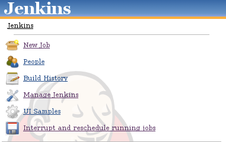

Interrupt sheduled job and scheduled again. It is useful in case that
administrator want restart jenkins but there is a lot of jobs which is
running. So he prepare jenkins for restart and plugin interupt the
running jobs and put them into queue again.

[.confluence-embedded-file-wrapper]##
