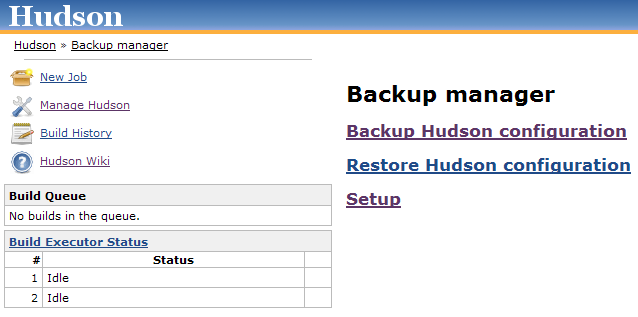
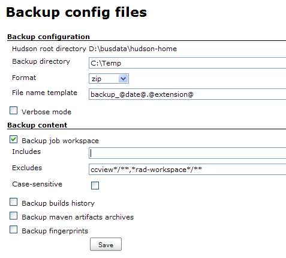

[.conf-macro .output-inline]# #

[.aui-icon .aui-icon-small .aui-iconfont-warning .confluence-information-macro-icon]##

*This plugin is up for adoption.* Want to help improve this plugin?
https://wiki.jenkins-ci.org/display/JENKINS/Adopt+a+Plugin[Click here to
learn more]!

Backup plugin allows archiving and restoring your Jenkins (and Hudson)
home directory.

This plugin is searching for a new maintainer!

[.aui-icon .aui-icon-small .aui-iconfont-warning .confluence-information-macro-icon]#
#

Unfortunately, the current maintainer has no more time to work on this
plugin, but there are still
http://issues.jenkins-ci.org/secure/IssueNavigator.jspa?mode=hide&reset=true&jqlQuery=project+%3D+JENKINS+AND+status+in+%28Open%2C+%22In+Progress%22%2C+Reopened%29+AND+component+%3D+%27backup%27[some
important issues] to fix. +
If you want to take ownership of this plugin, just don't hesitate
(please mention that on the mailing list).

Want periodic backups?

[.aui-icon .aui-icon-small .aui-iconfont-warning .confluence-information-macro-icon]#
#

This plugin requires that you manually start it to back up your data.

For automated periodic backups, check out the
https://wiki.jenkins-ci.org/display/JENKINS/thinBackup[thinBackup]
plugin.

[[BackupPlugin-Description]]
== Description

The Backup plugin adds a new *Backup manager* item in the *Manage
Jenkins* page. This item allows (cf. screenshot below):

* Tweaking backup settings (using the *Setup* link)
* Backuping Jenkins's configuration (using the *Backup Jenkins
configuration* link)
* Restoring Jenkins's configuration from a previous backup (using the
*Restore Jenkins configuration* link)

[.confluence-embedded-file-wrapper .image-center-wrapper]##

Alternatives to this plugin

[.aui-icon .aui-icon-small .aui-iconfont-warning .confluence-information-macro-icon]#
#

There are two other alternatives to this plugin:

* The
https://wiki.jenkins-ci.org/display/JENKINS/SCM+Sync+configuration+plugin[SCM
Sync configuration plugin] allows automatically tracking changes brought
to the global configuration of Jenkins and to the jobs configuration
into a configuration management system (Subversion, etc.).
* The https://wiki.jenkins-ci.org/display/JENKINS/thinBackup[thinBackup]
plugin focuses on backuping Jenkins's global configuration and jobs
configuration. It also offers a scheduling feature (if you think the
efforts on this plugin and the Backup one should be merged, just notify
us!).

So pick the one which fits your needs
image:docs/images/smile.svg[(smile)]

[[BackupPlugin-Versionhistory]]
== Version history

[[BackupPlugin-Version1.6.1(08/04/2011)]]
=== Version 1.6.1 (08/04/2011)

* Fixed https://issues.jenkins-ci.org/browse/JENKINS-5968[JENKINS-5968]:
org.codehaus.plexus.archiver.ArchiverException: Failed to read
filesystem attributes

[[BackupPlugin-Version1.6(12/10/2010)]]
=== Version 1.6 (12/10/2010)

* Added a new *Configuration files (.xml) only* option to backup only
configuration files.
* Added a new *No shutdown* option to trigger backup without shutting
down Hudson.
* Added some icons in the *Backup manager* screen.
* Fixed http://issues.jenkins-ci.org/browse/JENKINS-7634[JENKINS-7634]:
Hudson backup deletes home directory and hangs.

[[BackupPlugin-Version1.5(07/01/2010)]]
=== Version 1.5 (07/01/2010)

* Implemented
http://issues.jenkins-ci.org/browse/JENKINS-6892[JENKINS-6892]: Allow
configuration of custom exclusions
* Implemented
http://issues.jenkins-ci.org/browse/JENKINS-5305[JENKINS-5305]: It is no
more possible to use `+tar.gz+` and `+tar.bz2+` compression formats from
Windows anymore.
* Fixed http://issues.jenkins-ci.org/browse/JENKINS-5929[JENKINS-5929]:
Some images were not displayed.

[[BackupPlugin-Version1.4.1(02/21/2010)]]
=== Version 1.4.1 (02/21/2010)

* Help messages fixed

[[BackupPlugin-Version1.4(02/11/2010)]]
=== Version 1.4 (02/11/2010)

* It is now possible to define which files/directories have to saved
from jobs' workspaces using a set of Ant includes/excludes patterns
(refer to the
http://ant.apache.org/manual/CoreTypes/fileset.html[@includes of Ant
fileset] for the exact format): +
[.confluence-embedded-file-wrapper .image-center-wrapper]##

[[BackupPlugin-Version1.3]]
=== Version 1.3

* Backup content is now configurable
* Only one backup in the same time is possible

[[BackupPlugin-Version1.2]]
=== Version 1.2

* Maintenance release to remove a redirection problem on settings form
submission when hudson is not the ROOT application (on
http://myserver/hudson urls)

[[BackupPlugin-Version1.1]]
=== Version 1.1

* Backup should run in the higher security privilege
(http://www.nabble.com/Minor-permission-error-with-Backup-plugin---unable-to-enter-shutdown-mode---security-enabled-td23664157.html[report])
* Tar formats supported
* Configuration section
* File to restore selection

[[BackupPlugin-Version1.0(04/10/2009)]]
=== Version 1.0 (04/10/2009)

* Initial realease including manual file selection and ZIP format
