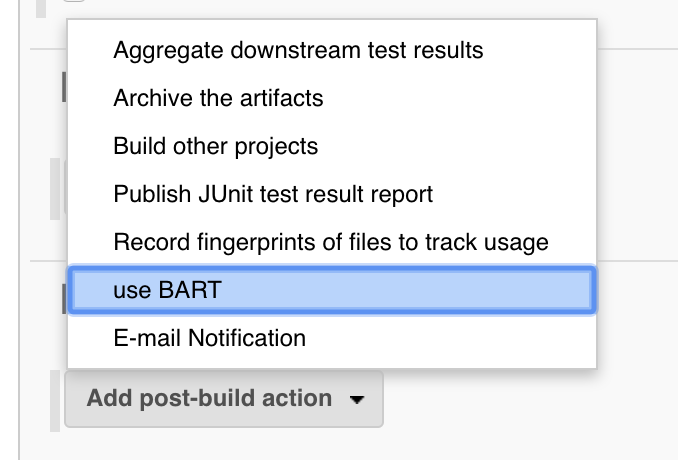
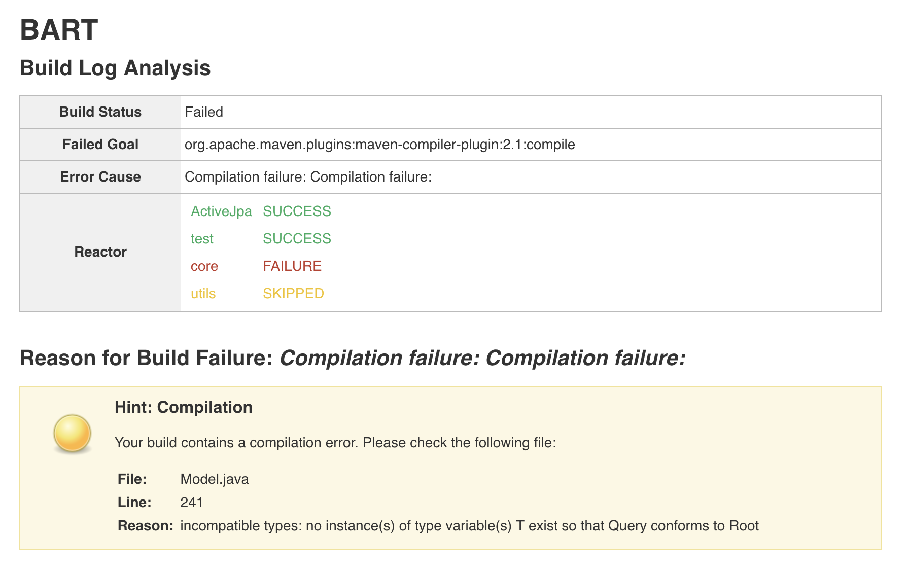

 +

[[BARTPlugin-Summary]]
== Summary

Bart is a tool for summarizing and providing solutions to build breaks
for maven projects. It is integrated into jenkins as "Add-Build-Step"
plugin. It parses the generated log, summarizes it and finally provides
hints to help resolve the build more quickly.

[[BARTPlugin-Installation]]
== Installation

In the project settings, add "BART" as a post-build action.

[.confluence-embedded-file-wrapper .confluence-embedded-manual-size]##

 +

[[BARTPlugin-ExampleofBuildSummary]]
== Example of Build Summary

[.confluence-embedded-file-wrapper .confluence-embedded-manual-size]##

[[BARTPlugin-Currentlimitations]]
== Current limitations

BART currently has the following limitations:

* The parser is limited to Java projects using maven
* The StackOverflow API limits the number of queries to 300 per day
without supplying API-Keys
