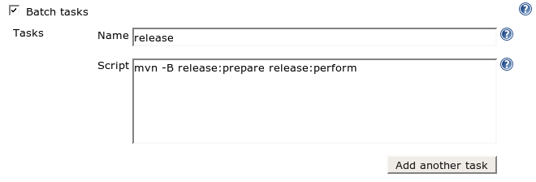
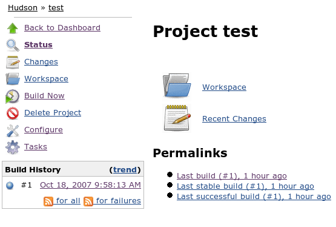
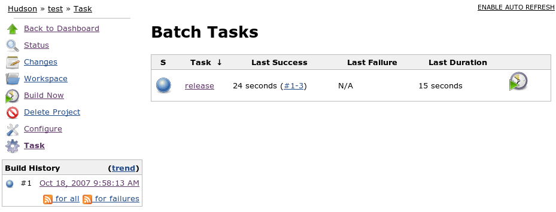
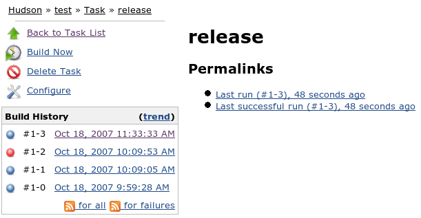

This plugin adds batch tasks that are not regularly executed to
projects, such as releases, integration, archiving, etc. In this way,
anyone in the project team can execute them in a way that leaves a
record.

[[BatchTaskPlugin-Usage]]
== Usage

When you install this plugin, your project configuration page gets
additional "batch tasks" option as illustrated below:

[.confluence-embedded-file-wrapper .image-center-wrapper]##

A batch task consists of a shell script and a name. When you execute a
build, the shell script gets run on the workspace, just like a build.
Batch tasks and builds "lock" the workspace, so when one of those
activities is in progress, all the others will block in the queue.

Once a task is configured, the project top page gets "task(s)" link, as
illustrated below:

[.confluence-embedded-file-wrapper]##

If you click that, you can see the status of all the tasks. You can
schedule the execution of a task from here, too. Task executions are
numbered like "123-456" where 123 portion refers to the latest build and
456 portion refers to the sequential number (so that you can execute a
task multiple times with the same build.) The build number portion is
significant because when a batch task runs, it sees the workspace as of
the result of this build.

[.confluence-embedded-file-wrapper]##

The details of the task execution and its console output are available
by further clicking a task of the interest, as below:

[.confluence-embedded-file-wrapper]##

[[BatchTaskPlugin-ChangeLog]]
== Change Log

[[BatchTaskPlugin-Version1.19(Jul.1,2016)]]
=== Version 1.19 (Jul. 1, 2016)

* Fix https://issues.jenkins-ci.org/browse/JENKINS-36184[JENKINS-36184]
- Batch task console is empty

[[BatchTaskPlugin-Version1.18(Jun.7,2016)]]
=== Version 1.18 (Jun. 7, 2016)

* Fix https://issues.jenkins-ci.org/browse/JENKINS-35411[JENKINS-35411]
- Migrate to pom-plugin
* Fix https://issues.jenkins-ci.org/browse/JENKINS-35188[JENKINS-35188]
- Improve User Experience

[[BatchTaskPlugin-Version1.17(Fev.24,2013)]]
=== Version 1.17 (Fev. 24, 2013)

* Fix reopened
https://issues.jenkins-ci.org/browse/JENKINS-13647[JENKINS-13647] -
Environment variables from EnvInject plugin are not inherited/parsed by
batch tasks

[[BatchTaskPlugin-Version1.16(May1,2012)]]
=== Version 1.16 (May 1, 2012)

* Fix https://issues.jenkins-ci.org/browse/JENKINS-13647[JENKINS-13647]
- Environment variables from EnvInject plugin are not inherited/parsed
by batch tasks

[[BatchTaskPlugin-Version1.15(Apr5,2012)]]
=== Version 1.15 (Apr 5, 2012)

* Refactored internally to
https://wiki.jenkins-ci.org/display/JENKINS/Hierarchical+projects+support[support
hierarchical project]

[[BatchTaskPlugin-Version1.14(Nov11,2010)-requiresHudson1.383+]]
=== Version 1.14 (Nov 11, 2010) - _requires Hudson 1.383+_

* Fixed an AbstractMethodError when running with Hudson 1.383+
(http://issues.jenkins-ci.org/browse/JENKINS-8033[issue #8033])

[[BatchTaskPlugin-Version1.13(Feb10,2010)]]
=== Version 1.13 (Feb 10, 2010)

* Use resizable text area for task script.
(https://issues.jenkins-ci.org/browse/JENKINS-5578[JENKINS-5578])
* Apply environment settings from
https://wiki.jenkins-ci.org/display/JENKINS/Setenv+Plugin[setenv] plugin
when running tasks.
(https://issues.jenkins-ci.org/browse/JENKINS-5580[JENKINS-5580])
* Show links to downstream tasks on project page.
(https://issues.jenkins-ci.org/browse/JENKINS-5582[JENKINS-5582])

[[BatchTaskPlugin-Version1.12(Feb5,2010)]]
=== Version 1.12 (Feb 5, 2010)

* Lock workspace during task run to prevent owner project or other tasks
from using the same workspace.
(https://issues.jenkins-ci.org/browse/JENKINS-5285[JENKINS-5285])
* Show animated ball icon for Tasks link in sidepanel when a task is
running.
(https://issues.jenkins-ci.org/browse/JENKINS-3372[JENKINS-3372])

[[BatchTaskPlugin-Version1.11(Jan3,2010)]]
=== Version 1.11 (Jan 3, 2010)

* Environment variable bug fix and enhancements
(https://issues.jenkins-ci.org/browse/JENKINS-5039[JENKINS-5039],
https://issues.jenkins-ci.org/browse/JENKINS-1628[JENKINS-1628],
https://issues.jenkins-ci.org/browse/JENKINS-1316[JENKINS-1316])

[[BatchTaskPlugin-Version1.10(Dec7,2009)]]
=== Version 1.10 (Dec 7, 2009)

* A few minor bug fixes.

[[BatchTaskPlugin-Version1.9(Nov5,2009)]]
=== Version 1.9 (Nov 5, 2009)

* Add "trigger even if build is unstable" selector for invoking tasks as
a post-build action. Previously the tasks were always invoked (even for
failed builds); now they will only run if the build result meets the
required threshold (and never for failed builds).
* Fix build number written to job log when task is invoked as a
post-build action (was off by one)
* Fix broken image for aborted task (grey ball)
* On task page, show only builds for this task in Build History (instead
of all tasks)
* Avoid error if try to run a task when there are no builds for the
project

[[BatchTaskPlugin-Version1.8(Aug28,2009)]]
=== Version 1.8 (Aug 28, 2009)

* Improved the error diagnosis and recovery when a build no longer has a
workspace
(http://www.nabble.com/NPE-with-batch-task-plugin-and-1.321-td25194567.html[report])
– requires Hudson 1.319 or higher.

[[BatchTaskPlugin-Version1.7(Mar31,2009)]]
=== Version 1.7 (Mar 31, 2009)

* Allow non-admin users ability to manage and execute tasks
(https://issues.jenkins-ci.org/browse/JENKINS-1198[JENKINS-1198])

[[BatchTaskPlugin-Version1.6(Feb27,2009)]]
=== Version 1.6 (Feb 27, 2009)

* Updated to work with recent versions of Hudson
(https://issues.jenkins-ci.org/browse/JENKINS-3173[JENKINS-3173])

[[BatchTaskPlugin-Version1.5(Jan27,2009)]]
=== Version 1.5 (Jan 27, 2009)

* Fixed a bug "batchtask in queue causes NPE at startup"
(https://issues.jenkins-ci.org/browse/JENKINS-2925[JENKINS-2925])

[[BatchTaskPlugin-Version1.3(Jan29,2008)]]
=== Version 1.3 (Jan 29, 2008)

* Updated to work with the latest version of Hudson, so that it won't
cause `+AbstractMethodError+`
(http://www.nabble.com/Hudson---Problems-with-white-spaces-in-URLs-pointing-to-build-artifacts--td15088015.html#a15088729[report])
* Last successful/failed builds were computed incorrectly
(https://issues.jenkins-ci.org/browse/JENKINS-1012[JENKINS-1012])
* Icon size in task list is now configurable
(https://issues.jenkins-ci.org/browse/JENKINS-1010[JENKINS-1010])

[[BatchTaskPlugin-Version1.2(Nov16,2007)]]
=== Version 1.2 (Nov 16, 2007)

* Task can be now individually deleted from the left menu
* Build number should start from 1
(https://issues.jenkins-ci.org/browse/JENKINS-991[JENKINS-991])
* Tasks now work on Windows
(https://issues.jenkins-ci.org/browse/JENKINS-985[JENKINS-985])
* Build icon in task list is not larger than the other icons
(https://issues.jenkins-ci.org/browse/JENKINS-1010[JENKINS-1010])

[[BatchTaskPlugin-Version1.0(Oct18,2007)]]
=== Version 1.0 (Oct 18, 2007)

* initial version
