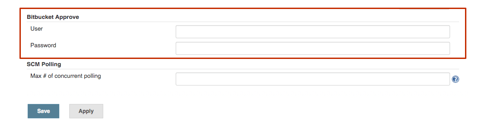
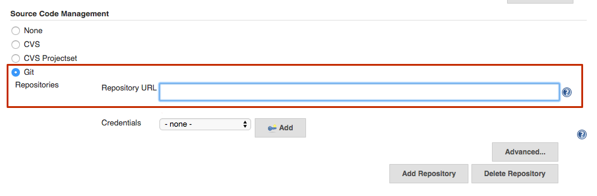
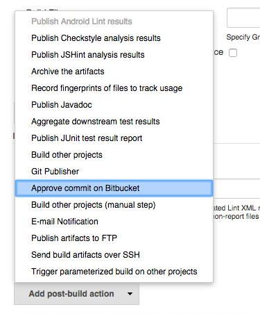
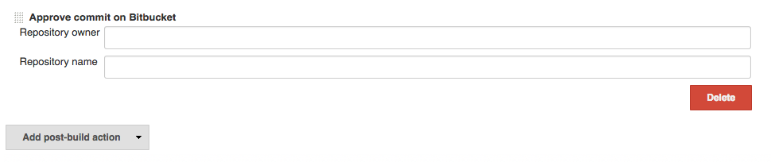

[.conf-macro .output-inline]# #

[.aui-icon .aui-icon-small .aui-iconfont-error .confluence-information-macro-icon]##

The current version of this plugin may not be safe to use. Please review
the following warnings before use:

* https://jenkins.io/security/advisory/2019-04-03/#SECURITY-965[Bitbucket
Approve Plugin stores credentials in plain text]

This Plugin enables Jenkins to approve commits on Bitbucket after
successful builds.

[[BitbucketApprovePlugin-Changelog]]
== Changelog

[[BitbucketApprovePlugin-1.0.3-2015-04-03]]
=== 1.0.3 - 2015-04-03

* Allow approval of unstable builds via checkbox #3
* Support variable substitution for repo owner and name - #2

[[BitbucketApprovePlugin-1.0.2-2015-03-23]]
=== 1.0.2 - 2015-03-23

* Skip approval for unstable builds

[[BitbucketApprovePlugin-1.0.1-2015-01-27]]
=== 1.0.1 - 2015-01-27

* Initial release

[[BitbucketApprovePlugin-GlobalConfiguration]]
== Global Configuration

This plugin needs a Bitbucket user account that has write access to your
repository. you can configure that user in the global Jenkins
configuration page:

[.confluence-embedded-file-wrapper]##

[[BitbucketApprovePlugin-JobConfiguration]]
== Job Configuration

Make sure your job uses a Bitbucket repository in the SCM section (you
may need to install the Git Client plugin to do that):

[.confluence-embedded-file-wrapper]##

Now, add the post-build action called *Approve commit on Bitbucket*:

[.confluence-embedded-file-wrapper]##

Configure that action to use the correct repository owner and repository
name:

[.confluence-embedded-file-wrapper]##
