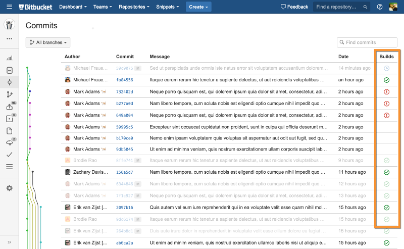

Every time you trigger a build, you don't have to log in to your build
server to see if it passed or failed. Now you will be able to know when
your build is passing right within the Bitbucket UI.  +

[.confluence-embedded-file-wrapper]##

[[BitbucketCloudBuildStatusNotifierPlugin-Features]]
== Features

Notify to Bitbucket Cloud for the following build events:

* Build start
* Build finish

 +

[.aui-icon .aui-icon-small .aui-iconfont-warning .confluence-information-macro-icon]#
#

This plugin aims at the Atlassian-hosted BitBucket Cloud solution, not
BitBucket Server (formerly known as Stash).

[[BitbucketCloudBuildStatusNotifierPlugin-Configuration]]
== Configuration

[[BitbucketCloudBuildStatusNotifierPlugin-CreateaOAuthConsumer]]
=== Create a OAuth Consumer

First you need to get a OAuth consumer key/secret from Bitbucket.

. Login into your Bitbucket account.
. Click your account name and then in *Settings* from the menu bar.
. Click *OAuth* from the menu bar.
. Press the *Add consumer* button.
. The system requests the following information:
.. Give a representative *name* to the consumer e.g. Jenkins build
status notifier.
.. Although is not used, a *Callback URL* must be set e.g.
ci.your-domain.com.
.. Leave blank the *URL* field.
.. Add *Read* and *Write* permissions to *Repositories*.
.. Click *Save* button and a *Key* and *Secret* will be automatically
generated.

[[BitbucketCloudBuildStatusNotifierPlugin-EnsureJenkinsURLisset]]
=== Ensure Jenkins URL is set

Second, ensure that Jenkins URL is properly set:

. Open Jenkins *Manage Jenkins* page.
. Click *Configure System* page.
. Go to the section *Jenkins Location*.
. Set the correct URL to *Jenkins URL*.
. Click *Save* button.

[[BitbucketCloudBuildStatusNotifierPlugin-AddOAuthCredentialstoJenkins]]
=== Add OAuth Credentials to Jenkins

Third, you need to add the Bitbucket OAuth Consumer credentials. You
have two ways to configure it globally or locally:

[[BitbucketCloudBuildStatusNotifierPlugin-Global]]
==== Global

. Open Jenkins *Manage Jenkins* page.
. Click *Configure System*.
. Go to the section *Bitbucket Build Status Notifier plugin*.
. If you still don't have stored the credentials click *Add*, otherwise
you can skip this step.
.. Select *Username with password*.
.. Set the the OAuth consumer *key* in *Username*.
.. Set the the OAuth consumer *secret* in *Password*.
.. Click *Add* button.
. Select the desired credentials.
. Click *Save* button.

[[BitbucketCloudBuildStatusNotifierPlugin-Local]]
==== Local

. Go to the Job you want notifies the builds to Bitbucket.
. Click *Configure*.
. Click *Add post-build action*.
. Select *Bitbucket notify build status*.
. Click *Advanced* button.
. If you still don't have stored the credentials click *Add*, otherwise
you can skip this step.
.. Select *Username with password*.
.. Set the the OAuth consumer *key* in *Username*.
.. Set the the OAuth consumer *secret* in *Password*.
.. Click *Add* button.
. Select the desired credentials.

[[BitbucketCloudBuildStatusNotifierPlugin-PipelineProjects]]
=== Pipeline Projects

Once you have configured the credential, you can notify BitBucket from
your Pipeline script through the bitbucketStatusNotify step.

[[BitbucketCloudBuildStatusNotifierPlugin-Usage]]
==== Usage

The bitbucketStatusNotify step notifies the status of a build identified
by a build key and build name to BitBucket (see all options under API).
If buildKey and buildName parameters are not provided, a standard name
will be assigned to the build (NameOfYourJob #numberOfBuild - eg.
MyProject #32).

[source,syntaxhighlighter-pre]
----
...

bitbucketStatusNotify(buildState: 'INPROGRESS')

try {
  // do your job logic
} catch (Exception e) {
  bitbucketStatusNotify(buildState: 'FAILED')
}

bitbucketStatusNotify(buildState: 'SUCCESSFUL')

...
----

[[BitbucketCloudBuildStatusNotifierPlugin-API]]
==== API

The bitbucketStatusNotifiy step allows the following parameters:

[cols=",,,",options="header",]
|===
|Name |Type |Optional |Description
|buildState |"INPROGRESS"|"SUCCESSFUL"|"FAILED" |no |The status of the
current build phase

|buildKey |String |yes |The unique key identifying the current build
phase

|buildName |String |yes |The build phase's name shown on BitBucket

|buildDescription |String |yes |The build phase's description shown on
BitBucket
|===

[[BitbucketCloudBuildStatusNotifierPlugin-FreestyleProjects]]
=== Freestyle Projects

Once you have configured the credentials, configure jenkins to notify
Bitbucket.

. Go to the Job you want notifies the builds to Bitbucket.
. Click *Configure*.
. Select *Bitbucket notify build status*.
. Choose whether you want to notify the build status on Jenkins to
Bitbucket.
. Choose whether given a same scm revision you want to notify a new
build status for every job build or to override the latest one.

[[BitbucketCloudBuildStatusNotifierPlugin-ChangeLog]]
== Change Log

[[BitbucketCloudBuildStatusNotifierPlugin-Version1.4.0(May29,2018)]]
=== Version 1.4.0 (May 29, 2018)

* image:docs/images/add.svg[(plus)] Add
optional parameters for the bitbucket repo slug and the commit id.
(https://github.com/jenkinsci/bitbucket-build-status-notifier-plugin/pull/37[PR
#37])

[[BitbucketCloudBuildStatusNotifierPlugin-Version1.3.3(Feb15,2017)]]
=== Version 1.3.3 (Feb 15, 2017)

* image:docs/images/error.svg[(error)]
 Fix bug on pipeline avoid exception whenever failure is notified.

[[BitbucketCloudBuildStatusNotifierPlugin-Version1.3.1(Dec20,2016)]]
=== Version 1.3.1 (Dec 20, 2016)

* image:docs/images/add.svg[(plus)]
Add documentation for overriding latest build status
* image:docs/images/add.svg[(plus)]
Folders/Multibranch support. Refactored all project.getFullDisplayName()
calls to project.getFullName() calls in order to support job inside
folders.
* image:docs/images/error.svg[(error)]
Fix for username same as repository name
* image:docs/images/add.svg[(plus)]
Use MercurialTagAction.class to retrive Mercurial revision

[[BitbucketCloudBuildStatusNotifierPlugin-Version1.3.0(Juli13,2016)]]
=== Version 1.3.0 (Juli 13, 2016)

* image:docs/images/add.svg[(plus)]
  Add support for pipeline plugin.
(https://issues.jenkins-ci.org/browse/JENKINS-33841[JENKINS-33841])
* image:docs/images/add.svg[(plus)]
  Add configuration for show only latest build status on Bitbucket.
(https://issues.jenkins-ci.org/browse/JENKINS-35083[JENKINS-35083])

[[BitbucketCloudBuildStatusNotifierPlugin-Version1.2.2(Juni16,2016)]]
=== Version 1.2.2 (Juni 16, 2016)

* image:docs/images/add.svg[(plus)]
  Improve documentation.
* image:docs/images/error.svg[(error)]
  Fix some issues related to plugin deployment.

[[BitbucketCloudBuildStatusNotifierPlugin-Version1.2.1(Juni1,2016)]]
=== Version 1.2.1 (Juni 1, 2016)

* image:docs/images/add.svg[(plus)]
  Add Junit test results to Bitbucket build status description.
(https://issues.jenkins-ci.org/browse/JENKINS-34619[JENKINS-34619])
* image:docs/images/error.svg[(error)]
  Fix minor issues.
(https://issues.jenkins-ci.org/browse/JENKINS-33901[JENKINS-33901])
* image:docs/images/add.svg[(plus)]
  Increase logging verbosity.
(https://issues.jenkins-ci.org/browse/JENKINS-34788[JENKINS-34788])

[[BitbucketCloudBuildStatusNotifierPlugin-Version1.2.0(April22,2016)]]
=== Version 1.2.0 (April 22, 2016)

* image:docs/images/add.svg[(plus)]
  Add support for parameterized repository URLs.
(https://issues.jenkins-ci.org/browse/JENKINS-33276[JENKINS-33276])
* image:docs/images/add.svg[(plus)]
  Add support for multi SCM.

[[BitbucketCloudBuildStatusNotifierPlugin-Version1.1.0(March13,2016)]]
=== Version 1.1.0 (March 13, 2016)

* image:docs/images/add.svg[(plus)]
 Add support for updating the Bitbucket build status for a previous
aborted build.
(https://issues.jenkins-ci.org/browse/JENKINS-32940[JENKINS-32940])
* image:docs/images/error.svg[(error)]
 Fix bug build abortion not notified.
(https://issues.jenkins-ci.org/browse/JENKINS-32940[JENKINS-32940])
* image:docs/images/add.svg[(plus)]
 Add support for single and global API credentials.
(https://issues.jenkins-ci.org/browse/JENKINS-32574[JENKINS-32574])
* image:docs/images/error.svg[(error)]
 Fix bug max Bitbucker key lenght.
(https://issues.jenkins-ci.org/browse/JENKINS-32781[JENKINS-32781])
* image:docs/images/add.svg[(plus)]
 Add support for mercurial repositories.
(https://issues.jenkins-ci.org/browse/JENKINS-32548[JENKINS-32548])

[[BitbucketCloudBuildStatusNotifierPlugin-Version1.0.3(Jan29,2016)]]
=== Version 1.0.3 (Jan 29, 2016)

* image:docs/images/error.svg[(error)]
 Fix bug parsing repository URI.
(https://issues.jenkins-ci.org/browse/JENKINS-32498[JENKINS-32498])
* image:docs/images/error.svg[(error)]
 Mark UNSTABLE builds as FAILED on Bitbucket.

[[BitbucketCloudBuildStatusNotifierPlugin-Version1.0.1(Jan22,2016)]]
=== Version 1.0.1 (Jan 22, 2016)

* image:docs/images/error.svg[(error)]
 Fix problem finding current revision.
(https://issues.jenkins-ci.org/browse/JENKINS-32519[JENKINS-32519])
* image:docs/images/add.svg[(plus)]
 Improve logging for exceptions in order to easy debugging.

[[BitbucketCloudBuildStatusNotifierPlugin-Version1.0(Jan15,2016)]]
=== Version 1.0 (Jan 15, 2016)
