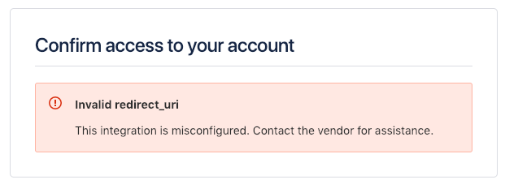
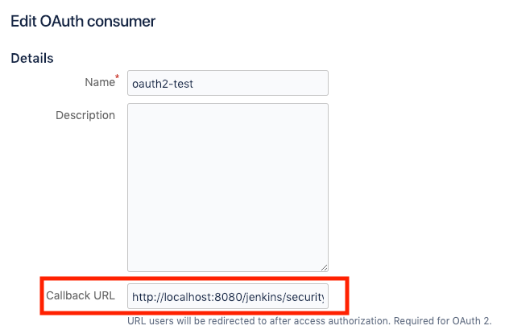
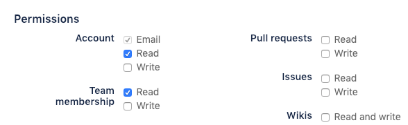
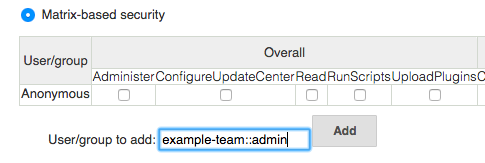

[.conf-macro .output-inline]##

[cols="",options="header",]
|===
|Plugin Information
|View Bitbucket OAuth https://plugins.jenkins.io/bitbucket-oauth[on the
plugin site] for more information.
|===

[.aui-icon .aui-icon-small .aui-iconfont-info .confluence-information-macro-icon]##

Older versions of this plugin may not be safe to use. Please review the
following warnings before using an older version:

* https://jenkins.io/security/advisory/2019-10-23/#SECURITY-1546[Credentials
stored in plain text]

[.conf-macro .output-inline]#This Jenkins plugin enables OAuth
authentication for https://bitbucket.org/[Bitbucket] users.#

[[BitbucketOAuthPlugin-Upgrading0.7to0.8]]
== *Upgrading 0.7 to 0.8*

bitbucket-oauth-plugin changed using OAuth version 1.0 to 2.0.

If you got *invalid redirect_uri* error in login, you hove to specify
Callback URL in Bitbucket OAuth setting page.

[.confluence-embedded-file-wrapper .confluence-embedded-manual-size]##

[.confluence-embedded-file-wrapper .confluence-embedded-manual-size]##

 +

bitbucket-oauth-plugin changed using Bitbucket API endpoint v1 to v2.

You have to change permissions: *Account > Read* and *Team membership >
Read*

*[.confluence-embedded-file-wrapper .confluence-embedded-manual-size]## +
*

[[BitbucketOAuthPlugin-Setup]]
== *Setup*

First you need to get consumer key/secret from Bitbucket.

. Log into your Bitbucket account.
. Click on your account avatar in the top right corner and select
*Bitbucket Settings*.
. If your are a member of an organization, ensure you are on Team
settings, not Account settings, from the drop down.
. Under ACCESS MANAGEMENT select *OAuth*.
. Under OAuth consumers, click *Add consumer*.
. The system requests the following information: *Name* is required.
Others are optional. +
* *Name* is required.
* *Callback URL* is required.
input [.nolink]##https://your.jenkins.root/securityRealm/finishLogi##n .
* Others are optional.
. Under Permissions, select *Account > Read* and *Team membership >
Read*(optional).
. Click *Save*. The system generates a key and a secret for you. Toggle
the consumer name to see the generated Key and Secret value for your
consumer.

Second, you need to configure your Jenkins.

. Open Jenkins *Configure System* page.
. Set correct URL to *Jenkins URL.*
. Click *Save* button.
. Open Jenkins *Configure Global Security* page.
. Check *Enable security*.
. Select *Bitbucket OAuth Plugin* in *Security Realm*.
. Input your Consumer Key to *Client ID*.
. Input your Consumer Secret to *Client Secret*.
. Click *Save* button.

[[BitbucketOAuthPlugin-BitbucketTeamaccessSupport]]
== Bitbucket Team access Support

Based on the teams that user has access to, this plugin automatically
creates groups of the form

*team::role*

Supported roles are *admin*, *contributor* and *member*

Examples

* team1::admin
* team2::contributor
* team3::member

These group names can be used in _Jenkins Matrix-based_ security to give
fine grained access control based on the users team access in Bitbucket.

[.confluence-embedded-file-wrapper]##

[[BitbucketOAuthPlugin-ConfigurepluginviaGroovyscript]]
== Configure plugin via Groovy script

Either automatically
upon https://wiki.jenkins.io/display/JENKINS/Post-initialization+script[Jenkins
post-initialization] or
through https://wiki.jenkins.io/display/JENKINS/Jenkins+Script+Console[Jenkins
script console], example:

[source,syntaxhighlighter-pre]
----
import hudson.security.AuthorizationStrategy
import hudson.security.SecurityRealm
import jenkins.model.Jenkins
import org.jenkinsci.plugins.BitbucketSecurityRealm

// parameters
def bitbucketSecurityRealmParameters = [
  clientID:     '012345678901234567',
  clientSecret: '012345678901234567012345678901'
]

// security realm configuration
SecurityRealm bitbucketSecurityRealm = new BitbucketSecurityRealm(
  bitbucketSecurityRealmParameters.clientID,
  bitbucketSecurityRealmParameters.clientSecret
)

// authorization strategy - full control when logged in
AuthorizationStrategy authorizationStrategy = new hudson.security.FullControlOnceLoggedInAuthorizationStrategy()

// authorization strategy - set anonymous read to false
authorizationStrategy.setAllowAnonymousRead(false)

// get Jenkins instance
Jenkins jenkins = Jenkins.getInstance()

// add configurations to Jenkins
jenkins.setSecurityRealm(bitbucketSecurityRealm)
jenkins.setAuthorizationStrategy(authorizationStrategy)

// save current Jenkins state to disk
jenkins.save()
----

[[BitbucketOAuthPlugin-VersionHistory]]
=== *Version History*

[[BitbucketOAuthPlugin-Version0.10(14Oct,2019)]]
==== Version 0.10 (14 Oct, 2019)

* [SECURITY-1546] Fixed client secret is saved in plain text (Notice: I
recommend that you re-save Jenkins security configuration.)

[[BitbucketOAuthPlugin-Version0.9(19Jan,2019)]]
==== Version 0.9 (19 Jan, 2019)

* Fixed infinite redirect loop on Jenkins 2.150.2
(related:  https://issues.jenkins-ci.org/browse/JENKINS-55668[JENKINS-55668]
)

[[BitbucketOAuthPlugin-Version0.8(3Jan,2019)]]
==== Version 0.8 (3 Jan, 2019)

* Changed Bitbucket OAuth 1.0 to OAuth 2.0 (Notice: *You have to specify
the Callback URL in Bitbucket OAuth setting page*)
* Changed Bitbucket API v1 to v2 (Notice: *You have to add Account Read
permission in Bitbucket OAuth setting page*)
* Changed secret key input field to password 

[[BitbucketOAuthPlugin-Version0.7(1May,2018)]]
==== Version 0.7 (1 May, 2018)

* Fixed Groovy example did not work

[[BitbucketOAuthPlugin-Version0.6(25Feb,2018)]]
==== Version 0.6 (25 Feb, 2018)

* Added Bitbucket API 2.0 support (Pluign requires *Account Read*
Permission only)
* Added spport for adding user authorities based on bitbucket team/role
(related:
https://github.com/mallowlabs/bitbucket-oauth-plugin/pull/11[Pull
Request #11])

[[BitbucketOAuthPlugin-Version0.5(5Jun,2016)]]
==== Version 0.5 (5 Jun, 2016)

* Fixed ClassCastException
(related: https://issues.jenkins-ci.org/browse/JENKINS-34792[JENKINS-34792] )

[[BitbucketOAuthPlugin-Version0.4(14May,2014)]]
==== Version 0.4 (14 May, 2014)

* Fixed broken api token access
(related: https://issues.jenkins-ci.org/browse/JENKINS-21882[JENKINS-21882] )

[[BitbucketOAuthPlugin-Version0.3(31Jul,2013)]]
==== Version 0.3 (31 Jul, 2013)

* Works on reverse proxy environments ( Use Jenkins URL configuration
instead of request URL )

[[BitbucketOAuthPlugin-Version0.1(29May,2013)]]
==== *Version 0.1 (29 May, 2013)*

* Initial release
