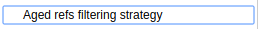
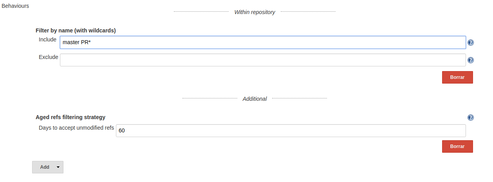
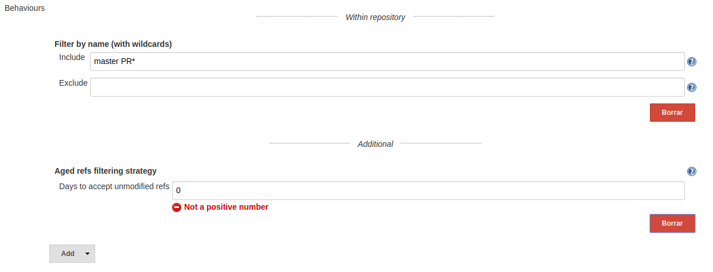

[[BitbucketAgedReferencesSCMFilterPlugin-Summary]]
== Summary

[[BitbucketAgedReferencesSCMFilterPlugin-Description]]
== Description

This plugin extends the filtering abilities of
the https://wiki.jenkins-ci.org/display/JENKINS/Bitbucket+Branch+Source+Plugin[Bitbucket
Branch Source Plugin].

This filter will ignore references (branches and pull requests) where
its last commit creation date is older than the defined threshold (in
days). Ignored references won't be added as Run sources or will be
disabled and tagged for deletion on the next full repository scan.

[[BitbucketAgedReferencesSCMFilterPlugin-Usage]]
== [.anchor]#Usage#

When defining a new Bitbucket Team/Project job job, include an
additional behaviour (placed under the additional separator). 

[.confluence-embedded-file-wrapper]##

This behaviour is configurable, being mandatory to specify the
acceptable threshold (positive days) for each reference:

[.confluence-embedded-file-wrapper .confluence-embedded-manual-size]##

In case of an invalid positive threshold, the form won't validate:

[.confluence-embedded-file-wrapper .confluence-embedded-manual-size]##
