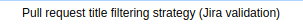
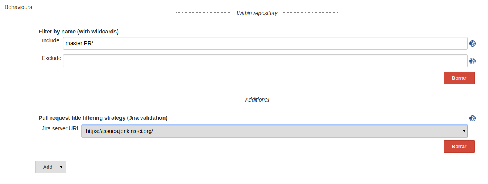
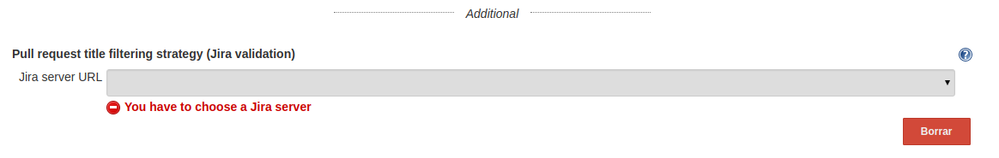

[[BitbucketJiraValidatorSCMFilterPlugin-Summary]]
== Summary

[[BitbucketJiraValidatorSCMFilterPlugin-Description]]
=== Description

This plugin extends the filtering abilities
of the https://wiki.jenkins-ci.org/display/JENKINS/Bitbucket+Branch+Source+Plugin[Bitbucket
Branch Source Plugin].

These filters will ignore pull requests if its title doesn't contain a
single valid and open Jira ticket.

[[BitbucketJiraValidatorSCMFilterPlugin-Usage]]
=== [.anchor]#Usage#

When defining a new Bitbucket Team/Project job, include an additional
behaviour (placed under the additional separator). 

[.confluence-embedded-file-wrapper]####[.confluence-embedded-file-wrapper]####

This behaviour is configurable, being mandatory to select a previously
(globally) configured Jira server:

[.confluence-embedded-file-wrapper .confluence-embedded-manual-size]##

In case of not selecting a Jira server, the form won't validate:

[.confluence-embedded-file-wrapper]##

[.confluence-embedded-file-wrapper .confluence-embedded-manual-size]##

In case of not selecting a Jira server, the form won't validate:

[.confluence-embedded-file-wrapper]##
