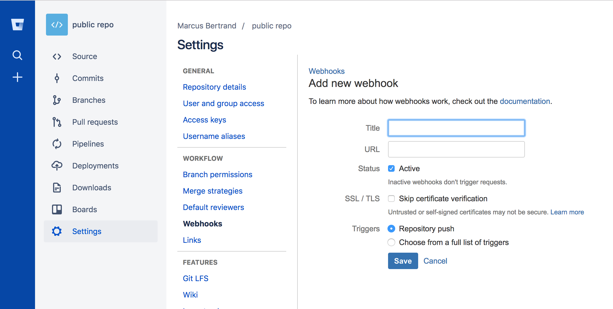
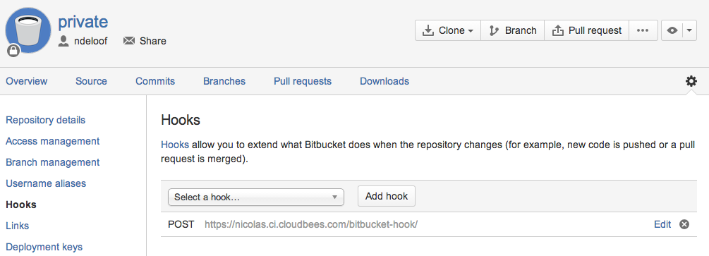
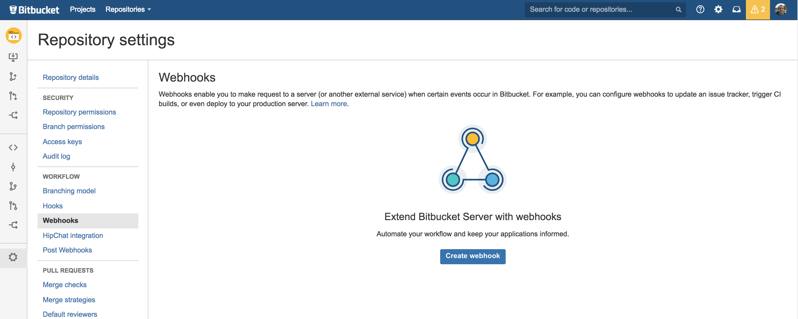
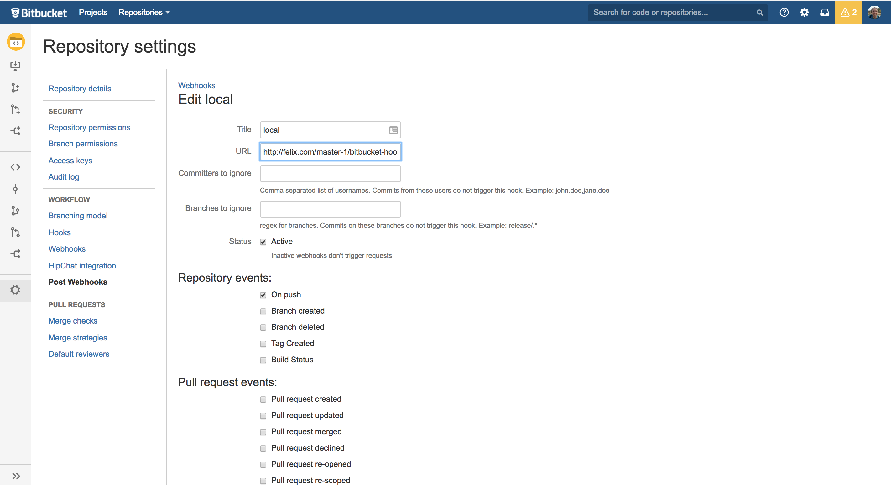

[.aui-icon .aui-icon-small .aui-iconfont-info .confluence-information-macro-icon]#
#

This plugin is currently looking for more maintainers.

 +

[[BitbucketPlugin-About]]
== About

Bitbucket plugin is designed to offer integration between Bitbucket and
Jenkins.

It exposes a single URI endpoint that you can add as a WebHook within
each Bitbucket project you wish to integrate with. This single endpoint
receives a full data payload from Bitbucket upon push (see their
documentation), triggering compatible jobs to build based on changed
repository/branch.

[#BitbucketPlugin-cloud .confluence-anchor-link .conf-macro .output-inline]#
#

Since 1.1.5 Bitbucket automatically injects the payload received by
Bitbucket into the build. You can catch the payload to process it
accordingly through the environmental variable $BITBUCKET_PAYLOAD.

 +

[[BitbucketPlugin-BitbucketCloudusage]]
== Bitbucket Cloud usage

Configure your Bitbucket repository with a
https://confluence.atlassian.com/bitbucket/manage-webhooks-735643732.html[Webhook],
using URL JENKINS_URL/bitbucket-hook/ (no need for credentials but do
remember the trailing slash).

[.confluence-embedded-file-wrapper .confluence-embedded-manual-size]##

 +

The older-style HTTP POSTs from Bitbucket are also supported but
deprecated.

[.confluence-embedded-file-wrapper]##

On each push, the plugin:

. Scans Jenkins for all jobs with "Build when a change is pushed to
Bitbucket" option enabled
. Each each job matched:
.. If the job's SCM (git) URL "loosely matches" that of the git
repository listed inside the Bitbucket-provided payload, AND
.. If the job's SCM (git) detects that the remote repository has
changes, THEN
.. A full build of the job will be queued

[#BitbucketPlugin-server .confluence-anchor-link .conf-macro .output-inline]#
#

The "loose matching" is based on the host name and paths of the projects
matching.

 +

[[BitbucketPlugin-Bitbucketserverusage]]
== Bitbucket server usage

Since the version 1.1.7 of the Bitbucket plugin works against Bitbucket
server. For this plugin to work against Bitbucket server you must: 

. Install https://marketplace.atlassian.com/plugins/nl.topicus.bitbucket.bitbucket-webhooks/server/overview[Post
Webhooks for Bitbucket] at Bitbucket side [the plugin is free]
. At repository level, delete the webhook in case it exists

[.confluence-embedded-file-wrapper .confluence-embedded-manual-size]##

     3. Create a Post-WebHook, which is different from WebHook and
enable on push.

[.confluence-embedded-file-wrapper .confluence-embedded-manual-size]##

 +

After this, you are all set-up

[[BitbucketPlugin-JobDSL]]
== Job DSL

The current supported dsl is as follows:

[source,syntaxhighlighter-pre]
----
freeStyleJob('test-job') {
  triggers{
    bitbucketPush()
  }
}
----

*Changelog*

[[BitbucketPlugin-1.1.11(27.August2019)]]
=== 1.1.11 (27. August 2019)

* Added possibility to process trigger from bitbucket server default
webhooks https://github.com/jenkinsci/bitbucket-plugin/pull/63[PR-63] 

[[BitbucketPlugin-1.1.10(4.July2019)]]
=== 1.1.10 (4. July 2019)

* Update job-dsl dependency to 1.66.
See https://github.com/jenkinsci/bitbucket-plugin/pull/58[PR-58] 

[[BitbucketPlugin-1.1.9(1.Jun2019)]]
=== 1.1.9 (1. Jun 2019)

* Address
https://developer.atlassian.com/cloud/bitbucket/bitbucket-api-changes-gdpr/?_ga=2.164415676.2088283489.1559219877-1322535506.1557927444[Bitbucket
API change]:  [.jira-issue .conf-macro .output-block]#
https://issues.jenkins-ci.org/browse/JENKINS-57787[[.aui-icon .aui-icon-wait .issue-placeholder]##
##JENKINS-57787] - [.summary]#Getting issue details...#
[.aui-lozenge .aui-lozenge-subtle .aui-lozenge-default .issue-placeholder]#STATUS#
#

[[BitbucketPlugin-1.1.7(6.Dec2017)]]
=== 1.1.7 (6. Dec 2017)

* Add Jenkins ci integration
* https://issues.jenkins-ci.org/browse/JENKINS-28877[JENKINS-28877] :
Add integration for Bitbucket server

 

[[BitbucketPlugin-1.1.6(2.Nov2017)]]
=== 1.1.6 (2. Nov 2017)

* fix https://issues.jenkins-ci.org/browse/JENKINS-44309[JENKINS-44309] Add
support for Symbol

[[BitbucketPlugin-1.1.5(26.Jan2016)]]
=== 1.1.5 (26. Jan 2016)

* fix https://issues.jenkins-ci.org/browse/JENKINS-32372[JENKINS-32372]
Inject the Payload into the build through $BITBUCKET_PAYLOAD

[[BitbucketPlugin-1.1.4(28.Dec2015)]]
=== 1.1.4 (28. Dec 2015)

* Add
https://issues.jenkins-ci.org/browse/JENKINS-31185[JENKINS-31185] hg
support
* Add https://github.com/jenkinsci/bitbucket-plugin/pull/24[Job DSL
extension]
* fix https://issues.jenkins-ci.org/browse/JENKINS-26234[JENKINS-26234]
CSRF support

[[BitbucketPlugin-1.1.3(16.Oct2015)]]
=== 1.1.3 (16. Oct 2015)

* fix https://issues.jenkins-ci.org/browse/JENKINS-29096[JENKINS-29096]
Advice users when they don't use the right hook url - last `/`
* fix https://issues.jenkins-ci.org/browse/JENKINS-30985[JENKINS-30985]
Jobs with the same git repository defined several times in the scm
should be triggered only once

[[BitbucketPlugin-1.1.2(4.August2015)]]
=== 1.1.2 (4. August 2015)

* fix https://issues.jenkins-ci.org/browse/JENKINS-28882[JENKINS-28882]
Workflow support for BitBucket trigger

[[BitbucketPlugin-1.1.1(9.July2015)]]
=== 1.1.1 (9. July 2015)

* Allow Webhooks 2.0

[[BitbucketPlugin-1.1.0(10.March2015)]]
=== 1.1.0 (10. March 2015)

* fix https://issues.jenkins-ci.org/browse/JENKINS-24999[JENKINS-24999]
Build triggered by SCM change without activating trigger in the job
configuration
* fix https://issues.jenkins-ci.org/browse/JENKINS-26413[JENKINS-26413]
BitBucket trigger doesn't need to InitializeLogFile
* fix https://issues.jenkins-ci.org/browse/JENKINS-26489[JENKINS-26489]
Action report for the bitbucket polling log on web UI
* fix https://issues.jenkins-ci.org/browse/JENKINS-26805[JENKINS-26805]
Job is not triggered after merging a branch

[[BitbucketPlugin-1.0]]
=== 1.0

* initial implementation

 +
