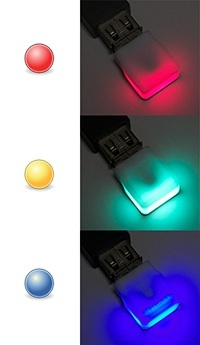

[.conf-macro .output-inline]#This plugin shows build results with
http://thingm.com/products/blink-1.html[blink(1)], a tiny full-color
status light.#

[.confluence-embedded-file-wrapper]##

This plugin uses the Local Web API of blink(1). Please input the URL of
the server including port number. For further information, please
read https://github.com/todbot/blink1/tree/master/docs[the documentation
of blink(1) Local Web API].
