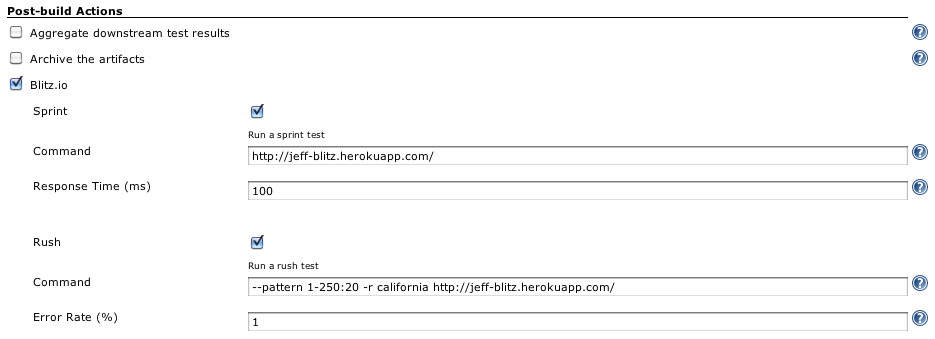
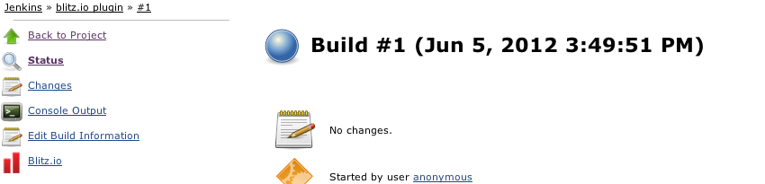
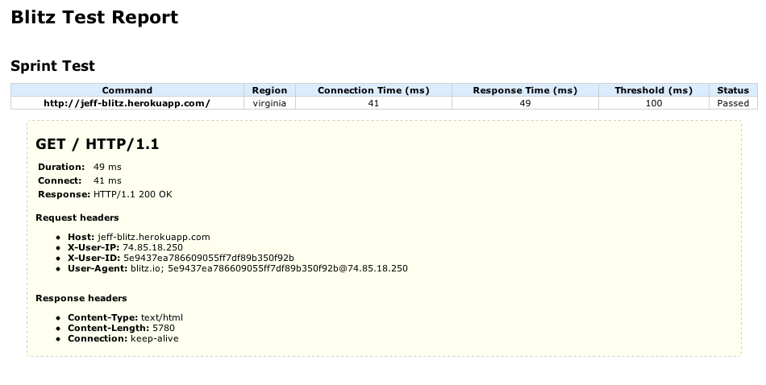
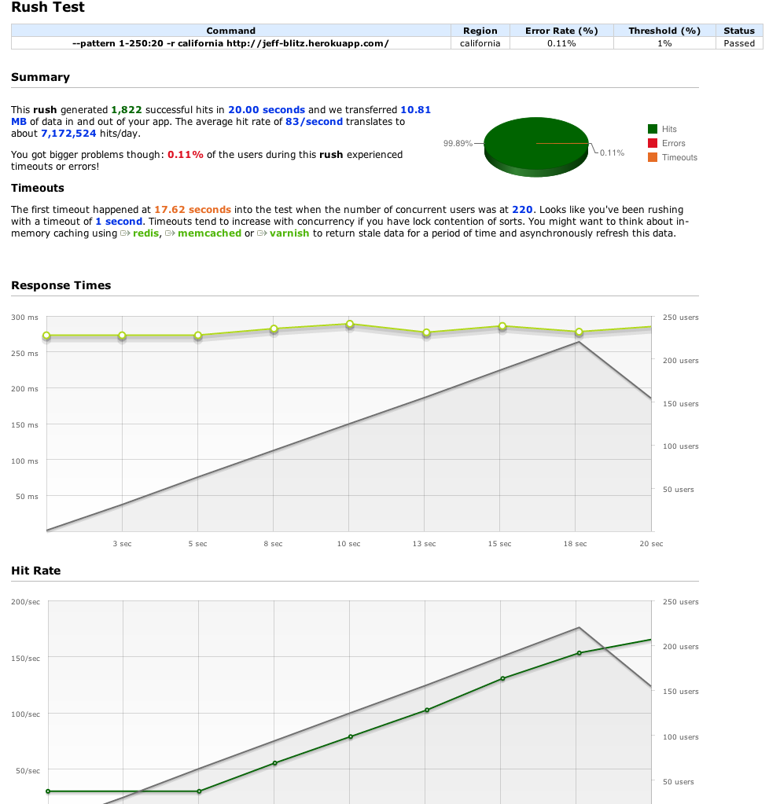

[[Blitz_io-Blitz.ioPlugin]]
== Blitz.io Plugin

This plugin allows you to run web load tests from the
cloud using http://blitz.io/[Blitz.io]. 

[[Blitz_io-Installation]]
== Installation

{empty}1. go to /pluginManager/advanced, hit 'check now' button to get
all the latest updates from update center.

{empty}2. go to /pluginManager/available, find the 'Blitz.io Plugin'
under 'External Site/Tool Integrations' section, then install it.
[.confluence-embedded-file-wrapper]## +
3. after installation is done, you should be able to see 'Blitz.io
Plugin' in /pluginManager/installed  (you may need to restart Jenkins if
necessary)
[.confluence-embedded-file-wrapper]##

[[Blitz_io-EnterBlitz.ioAccountInfo]]
== Enter Blitz.io Account Info

{empty}1. go to /configure,  find the Blitz.io section, then enter your
blitz.io account user ID and API key.  If you don't have a blitz.io
account yet, you can register
one https://secure.blitz.io/login/signup[here] ,  it's free!

[[Blitz_io-RunBlitz.ioTestsAfterBuild]]
== Run Blitz.io Tests After Build

{empty}1. go to your job's configure page, such
as /job/blitz.io%20plugin/configure, in the 'Post-build Actions', check
the 'Blitz.io' box.

{empty}2. if you want to run a
http://docs.blitz.io/sprinting/basics[sprint] test, check the 'Sprint'
box, then enter the command and the response time threshold.

{empty}3. if you want to run a
http://docs.blitz.io/rushing/basics[rush] test, check the 'Rush' box,
then enter the command and the error rate threshold.
[.confluence-embedded-file-wrapper]## +
4. hit the 'Save' button

Note: you may only blitz urls that are reachable from the public web, so
please don't enter "localhost", "intranet links" etc in the command
line.

[[Blitz_io-InterpretBlitz.ioTestResults]]
== Interpret Blitz.io Test Results

{empty}1. after your job's build is done, click into that build, you
will see a 'Blitz.io' link on the left hand side.
[.confluence-embedded-file-wrapper]## +
2. click the 'Blitz.io' section, you will see the Sprint or/and Rush
Results

[.confluence-embedded-file-wrapper]## +
[.confluence-embedded-file-wrapper]## +
3. your build will be marked as 'success' if all the tests passed,
otherwise it will be marked as 'failure'
