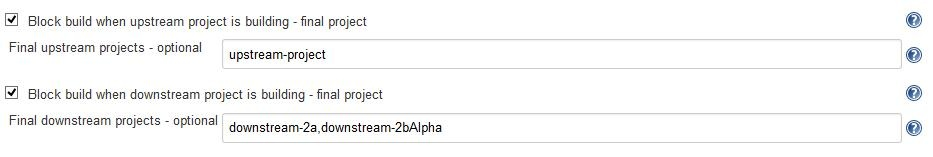

Block build when upstream/downstream project is building. Optional final
projects may be given.

[[BlockBuildFinalProjectPlugin-Summary]]
== Summary

This plug-in allows a project to block when upstream or downstream
projects are building. Jenkins already provides this functionality
built-in, but it blocks on the entire pipeline. This plug-in allows an
optional final project to be specified. This allows the project to block
on part of the pipeline instead of the entire pipeline.

When configuring a project, the following options are available when
this plugin is installed:

[.confluence-embedded-file-wrapper]##

[[BlockBuildFinalProjectPlugin-Example]]
== Example

For a detailed example on how to use this plugin, please visit
https://github.com/jenkinsci/block-build-final-project-plugin/blob/master/README.md[GitHub
README.md].

[[BlockBuildFinalProjectPlugin-Requirements]]
== Requirements

[[BlockBuildFinalProjectPlugin-Jenkins]]
=== Jenkins

Jenkins https://jenkins.io/changelog-stable#v1.625.3[version 1.625.3] or
newer is required.

[[BlockBuildFinalProjectPlugin-Versionhistory]]
== Version history

[[BlockBuildFinalProjectPlugin-Version1.0(2017-01-21)]]
=== Version 1.0 (2017-01-21)

* Initial release
