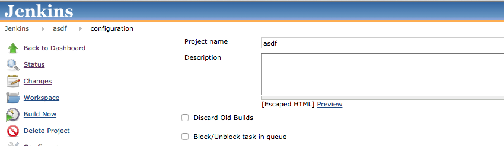
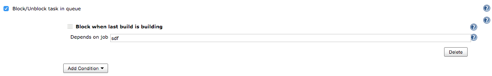

[[Blockqueuedjobplugin-Description]]
== Description

Plugin for blocking/unblocking job in queue by some conditions
configured in this job.

*Features*

Built in conditions:

* Block job when last build of defined target project is in building
status
* Block job when last build of defined target project has result

Note: conditions has *waterfall priority* so if "unblock" conditions get
matching first - job will be unblocked, if not - then next condition
will be verified.

Provides
https://wiki.jenkins-ci.org/display/JENKINS/Extension+points[@ExtensionPoint ]so
other plugins can provide other block/unblock features

[[Blockqueuedjobplugin-Changelog]]
== Changelog

https://github.com/jenkinsci/block-queued-job-plugin/blob/master/CHANGELOG.md[In
git repository]

[[Blockqueuedjobplugin-Configuration]]
== Configuration

[[Blockqueuedjobplugin-1.Enablejobproperty]]
=== 1. Enable job property

{empty}a) Open job configuration

[.confluence-embedded-file-wrapper]##

{empty}b) Press checkbox "Block/Unblock task in queue"

[.confluence-embedded-file-wrapper]##

[[Blockqueuedjobplugin-2.Addconditions]]
=== 2. Add conditions

[.confluence-embedded-file-wrapper]##

[[Blockqueuedjobplugin-3.Savejob]]
=== 3. Save job
