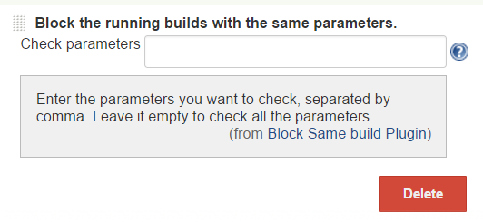
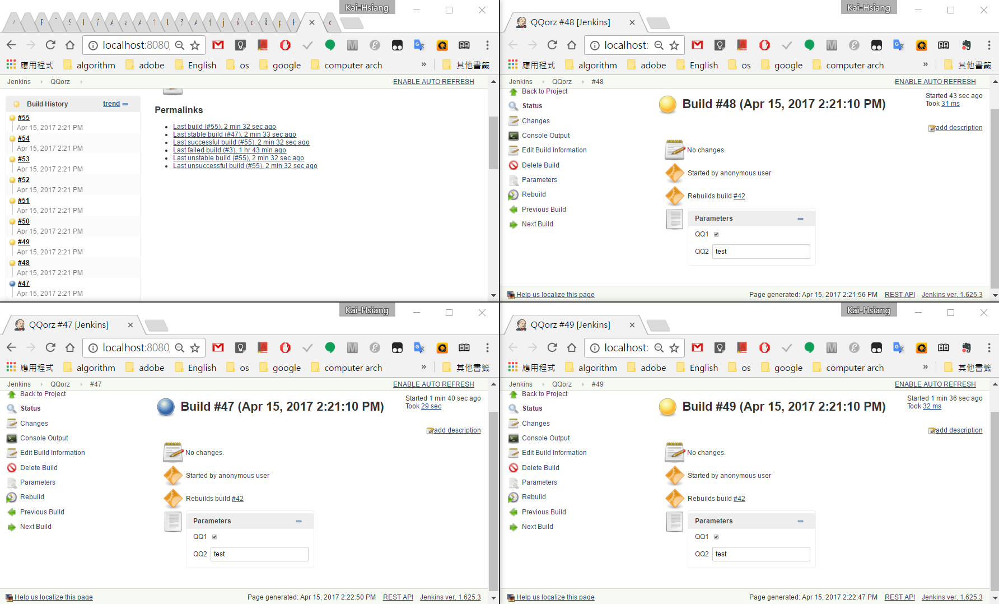

A plugin for Jenkins CI that blocks the running builds with the same
configured parameters.

*Screenshots*

Job configuration

[.confluence-embedded-file-wrapper]##

 +
How it works

[.confluence-embedded-file-wrapper .confluence-embedded-manual-size]##
