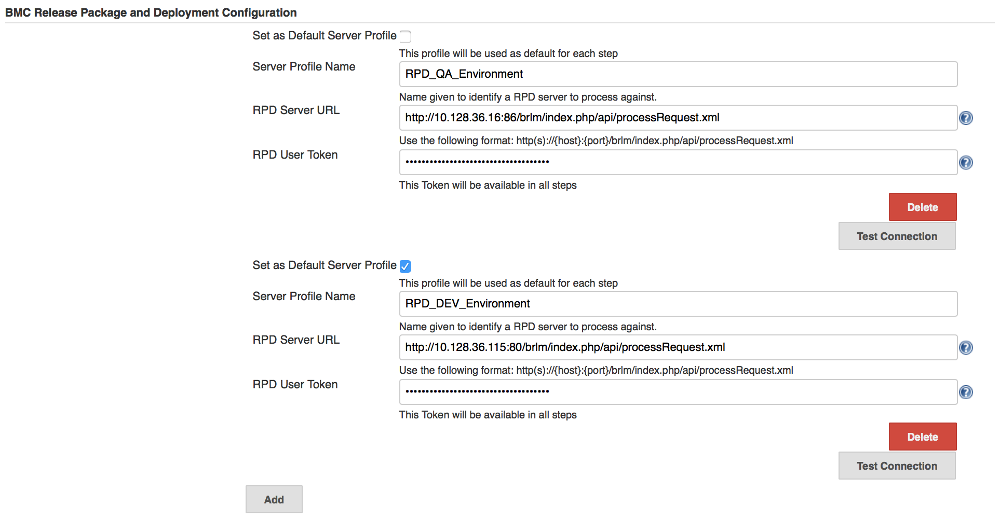
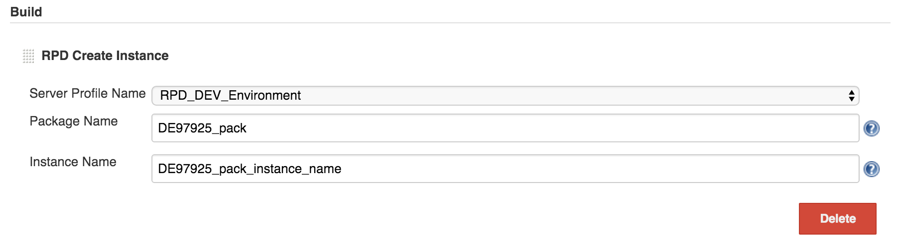
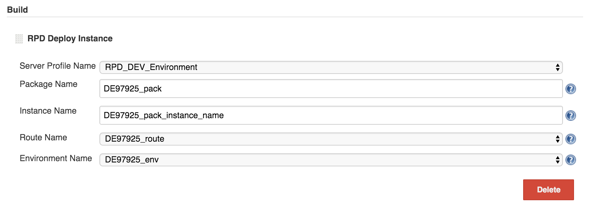
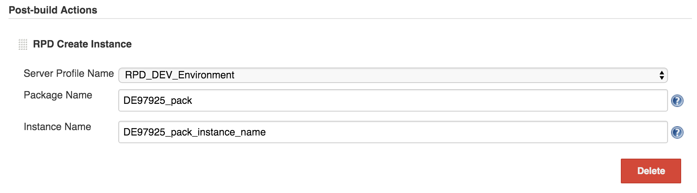
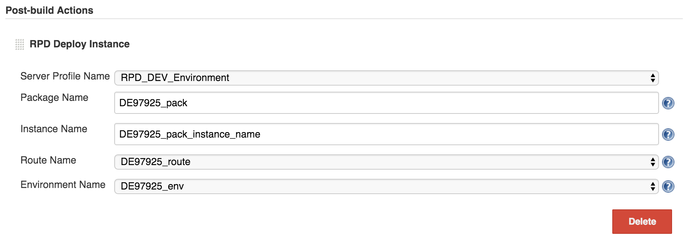

 +
The RPD Plugin integrates Jenkins with BMC Release Package and
Deployment (RPD) by adding two build and post-build actions to your
Jenkins build configuration, +
which can be executed separately or combined sequentially:

* Create an instance
* Deploy an instance

[[RPDPlugin-Requirements]]
== Requirements

* RPD 4.4.00 and later
* Jenkins 1.639 and later

[[RPDPlugin-Dependencies]]
=== Dependencies

* Apache Maven 3.0.5 or later

To build this plugin from the source code, in the project root
directory, run the following command:

[source,syntaxhighlighter-pre]
----
shell
mvn package
----

This command will generate the *.hpi* file for you.

[[RPDPlugin-Localinstallation]]
=== Local installation

. Run the *mvn package* command to generate */target/bmc-rpd.hpi*.
. Remove the previous *bmc-rpd.hpi* file from
*$user.home/.jenkins/plugins/* and copy a new one into the same
location.
. Restart Jenkins.

[[RPDPlugin-RPDPluginConfiguration]]
== RPD Plugin Configuration

[[RPDPlugin-ToconfiguretheRPDPlugin:]]
=== *To configure the RPD Plugin:*

. Go to *Manage Jenkins > Configure System*.
. In the *BMC Release Package and Deployment Configuration* section,
click *Add*, and provide the following information:
* *Set as Default Server Profile*: Select this option to set the
specified profile as the default one. +
If you do not select the default profile, the first one will be selected
by default.
* *Server Profile Name*: Custom name for the RPD server profile.
* *RPD Server URL*: The URL that identifies the RPD Server on which
processing will occur.
* *RPD User Token*: User token that will be used to authenticate against
RPD. For more information, +
see
https://docs.bmc.com/docs/display/rpd48/Creating+authentication+tokens.
. _(Optional)_ To verify connection to the RPD server, click *Test
Connection*.
. Click *Save*.

 
[.confluence-embedded-file-wrapper .confluence-embedded-manual-size]##

[[RPDPlugin-JobConfiguration]]
== Job Configuration

[[RPDPlugin-TocreateaRPDinstance:]]
=== *To create a RPD instance:*

. Click *New Item* to create a new job.
. In the *Build* section, from the *Add build step* list, select *RPD
Create Instance*.
. In the *RPD Create Instance* section, provide the following
information:
* *Server Profile Name*: Custom name for the RPD server profile.
* *Package Name*: Name of the package where you want to create the RPD
instance.
* *Instance Name*: _(Optional)_ Custom name for the RPD instance that
you want to create. +
If you do not specify an instance name, the name specified in RPD will
be used.
. Click *Save*.

 
[.confluence-embedded-file-wrapper .confluence-embedded-manual-size]##

[[RPDPlugin-TodeployaRPDinstance:]]
=== *To deploy a RPD instance:*

. Click *New Item* to create a new job.
. In the *Build* section, from the *Add build step* list, select *RPD
Deploy Instance*.
. In the *RPD Deploy Instance* section, provide the following
information:
* *Server Profile Name*: Custom name for the RPD server profile.
* *Package Name*: Name of the package where you want to deploy the RPD
instance.
* *Instance Name*: _(Optional)_ Custom name for the RPD instance that
you want to deploy. +
If you do not specify an instance name, the name specified in RPD will
be used.
* *Route Name*: Route where to deploy the RPD instance.
* *Environment Name*: Environment where to deploy the RPD instance.
. Click *Save*.

 
[.confluence-embedded-file-wrapper .confluence-embedded-manual-size]##

[[RPDPlugin-JobConfigurationasaPost-buildAction]]
== Job Configuration as a Post-build Action

[[RPDPlugin-TocreateaRPDinstance:.1]]
=== *To create a RPD instance:*

. Click *New Item* to create a new job.
. In the *Post-build* *Actions* section, from the *Add post-build
action* list, select *RPD Create Instance*.
. In the *RPD Create Instance* section, provide the following
information:
* *Server Profile Name*: Custom name for the RPD server profile.
* *Package Name*: Name of the package where you want to create the RPD
instance.
* *Instance Name*: _(Optional)_ Custom name for the RPD instance that
you want to create. +
If you do not specify an instance name, the name specified in RPD will
be used.
. Click *Save*.

 
[.confluence-embedded-file-wrapper .confluence-embedded-manual-size]##

[[RPDPlugin-TodeployaRPDinstance:.1]]
=== *To deploy a RPD instance:*

. Click *New Item* to create a new job.
. In the *Post-build Actions* section, from the *Add build step* list,
select *RPD Deploy Instance*.
. In the *RPD Deploy Instance* section, provide the following
information:
* *Server Profile Name*: Custom name for the RPD server profile.
* *Package Name*: Name of the package where you want to deploy the RPD
instance.
* *Instance Name*: _(Optional)_ Custom name for the RPD instance that
you want to deploy. +
If you do not specify an instance name, the name specified in RPD will
be used.
* *Route Name*: Route where to deploy the RPD instance.
* *Environment Name*: Environment where to deploy the RPD instance.
. Click *Save*.

Note

[.aui-icon .aui-icon-small .aui-iconfont-warning .confluence-information-macro-icon]#
#

For the post-build action, you can create and deploy only one instance.

 
[.confluence-embedded-file-wrapper .confluence-embedded-manual-size]##

[[RPDPlugin-Variables]]
== Variables

When creating an instance, use the following custom variables:

* RPD_<Package name>_instance_name – allows using an instance name for
the next deployment or in some kind of notifications.
* RPD_<Package name>_instance_id – allows using an instance name for the
next deployment or in some kind of notifications.

Notes

[.aui-icon .aui-icon-small .aui-iconfont-warning .confluence-information-macro-icon]#
#

• If you create an instance, deploy an instance, and specify the same
package name for both actions +
  but without a specified instance name, then the instance name will be
uploaded from RPD.

• If you create an instance with both package name and instance name
specified, deploy an instance with the same package name +
  but without a specified instance name, then RPD will deploy the
instance that you have just created.

You can also use standard Jenkins variables. To see the list of standard
variables, go
to https://wiki.jenkins-ci.org/display/JENKINS/Building+a+software+project#Buildingasoftwareproject-JenkinsSetEnvironmentVariables.[Jenkins
Set Environment Variables].

[[RPDPlugin-RPDInstanceLogs]]
== RPD Instance Logs

[[RPDPlugin-ToseetheRPDinstancecreateanddeploylogs:]]
=== *To see the* *RPD instance create and deploy* *logs:*

Click *Jenkins*, select the necessary job, and click *Console Output*.

[[RPDPlugin-RPDSecureConnection]]
== RPD Secure Connection

[[RPDPlugin-Toinstallthecertificateauthority(CA):]]
=== *To install the certificate authority (CA):*

. Go to the necessary URL, click the HTTPS certificate chain, and then
click *Certificate information*.
. On the *Details* tab, click *Copy to File…*
. Install the CA by running the following command: keytool -import
-alias example -keystore/path/to/cacerts -file example.der.

Note

[.aui-icon .aui-icon-small .aui-iconfont-warning .confluence-information-macro-icon]#
#

Ensure that you are installing the CA on the same computer where Jenkins
is installed.
