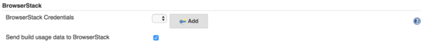
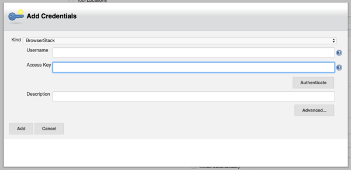
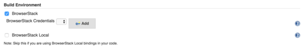
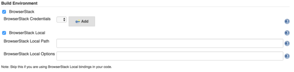
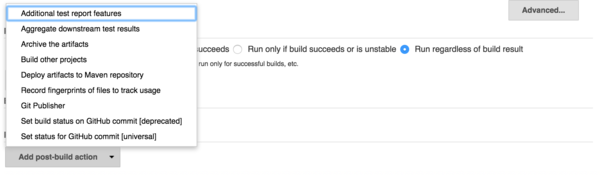
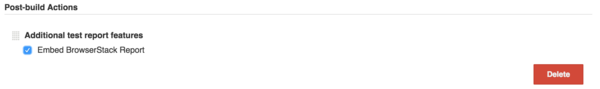
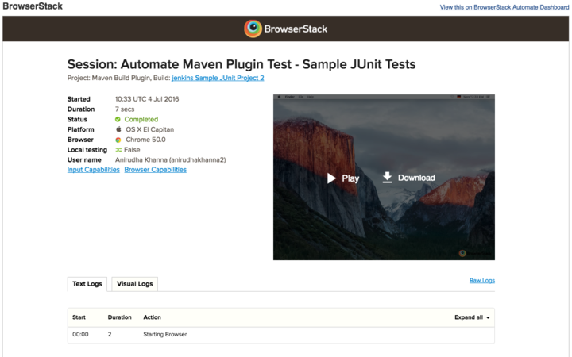

[.conf-macro .output-inline]#This plugin allows you to integrate with
https://www.browserstack.com/[BrowserStack].#

[[BrowserStackPlugin-Overview]]
== Overview

BrowserStack is the industry’s most reliable cloud web and mobile
testing platform, used by more than 2 million developers across 135
countries. BrowserStack gives instant access to 2000+ real mobile
devices and browsers that enables developers to test their websites and
mobile applications without requiring to install or maintain an internal
lab of virtual machines, devices or emulators. To start using
BrowserSack, https://www.browserstack.com/users/sign_up[signup for a
free trial] account. 

More than 25,000 global companies rely on BrowserStack,
including industry-leaders like Microsoft, ING, Mastercard, Dow Jones,
Garmin, National Geographic, Volvo, NRK, HubSpot, Walt
Disney and AngularJS, to name a few.  With offices in San Francisco,
Mumbai and Dublin, BrowserStack is privately held and backed by Accel.
Learn more at: http://www.browserstack.com/[www.browserstack.com]. 

[[BrowserStackPlugin-Features]]
== Features

. Manage your BrowserStack credentials globally or per build job.
. Set up and tear down
https://www.browserstack.com/local-testing[BrowserStack Local] for
testing internal, dev or staging environments.
. Embed BrowserStack https://www.browserstack.com/automate[Automate] or
BrowserStack https://www.browserstack.com/app-automate[App Automate]
reports in your Jenkins job results.

[[BrowserStackPlugin-Requirements]]
== Requirements

. Minimum Jenkins version supported is 1.653+
. If you are using Java, we support all versions of Java up to Java 9
. For viewing BrowserStack Automate report in your Jenkins test
results. +
.. Jenkin's https://wiki.jenkins-ci.org/display/JENKINS/JUnit+Plugin[JUnit
plugin] must be installed.
.. We support Java with JUnit and TestNG
.. We support Node with Protractor and WebdriverIO

[[BrowserStackPlugin-Configuringtests]]
== *Configuring tests*

This step is required for viewing the BrowserStack Report in your
Jenkins job results.

[[BrowserStackPlugin-Java-TestNGandJUnit]]
=== Java - TestNG and JUnit

Java projects must be built with Maven and use either TestNG or JUnit.
Add the following dependencies to your pom.xml file:

[source,syntaxhighlighter-pre]
----
<dependency>
    <groupId>com.browserstack</groupId>
    <artifactId>automate-testassist</artifactId>
    <version>1.0.0-SNAPSHOT</version>
</dependency>
----

Add the following repositories to your pom.xml file:

[source,syntaxhighlighter-pre]
----
<repositories>
  <repository>
    <id>sonatype-nexus-snapshots</id>
    <url>https://oss.sonatype.org/content/repositories/snapshots</url>
  </repository>
</repositories>

<pluginRepositories>
  <pluginRepository>
   <id>sonatype-nexus-snapshots</id>
      <url>https://oss.sonatype.org/content/repositories/snapshots</url>
  </pluginRepository>
</pluginRepositories>
----

Add the following plugin to your pom.xml file:

[source,syntaxhighlighter-pre]
----
<build>
    <plugins>
      <plugin>
        <groupId>com.browserstack</groupId>
        <artifactId>automate-maven-plugin</artifactId>
        <version>1.0.0-SNAPSHOT</version>
        <configuration>
            <source>${jdk.source.version}</source>
            <target>${jdk.target.version}</target>
            <complianceLevel>${jdk.source.version}</complianceLevel>
        </configuration>
        <executions>
          <execution>
            <goals>
              <goal>test-compile</goal>
            </goals>
          </execution>
        </executions>
      </plugin>
    </plugins>
</build>
----

You must define the maven properties, *jdk.source.version* and
*jdk.target.version* to match the Java versions of your project.

[[BrowserStackPlugin-WebdriverIO]]
=== WebdriverIO

 +

To configure your project:

Add wdio-browserstack-reporter as a dependency in
your package.json file.

*package.json*

[source,syntaxhighlighter-pre]
----
{
  "dependencies": {
    "wdio-browserstack-reporter": "~1.0.0"
  }
}
----

Add browserstack as a reporter in your conf file.

*conf.js*

[source,syntaxhighlighter-pre]
----
// wdio.conf.js
module.exports = {
    // ...
    reporters: ['browserstack'],
    reporterOptions: {
        browserstack: {
            outputDir: './'
        }
    },
    // ...
};
----

outputDir (optional): defines a directory location for storing
browserstack report files.

https://github.com/browserstack/wdio-browserstack-reporter[Here] is the
link for the GitHub repository.

Please note that WebdriverIO support works with Automate and not with
App-Automate right now.

[[BrowserStackPlugin-Protractor]]
=== Protractor

To configure your project:

Add protractor-browserstack-reporter as a dependency in
your package.json file.

*package.json*

[source,syntaxhighlighter-pre]
----
{
  "dependencies": {
    "protractor-browserstack-reporter": "~1.0.0"
  }
}
----

Add browserstack as a plugin in your conf file.

*conf.js*

[source,syntaxhighlighter-pre]
----
// conf.js
'plugins': [{
  'package': "browserstack-protractor-reporter"
}]
----

outputDir (optional): defines a directory location for storing
browserstack report files.

https://github.com/browserstack/protractor-browserstack-reporter[Here] is
the link for the GitHub repository.

Please note that Protractor support works with Automate and not with
App-Automate right now.

 +

*Following environment variables are set by this Jenkins plugin:*

[source,syntaxhighlighter-pre]
----
BROWSERSTACK_USER
BROWSERSTACK_ACCESSKEY
BROWSERSTACK_LOCAL
BROWSERSTACK_LOCAL_IDENTIFIER
----

You can use these environment variables to set DesiredCapabilities in
your test. For e.g:

[source,syntaxhighlighter-pre]
----
String username = System.getenv("BROWSERSTACK_USER");
String accessKey = System.getenv("BROWSERSTACK_ACCESSKEY");
String browserstackLocal = System.getenv("BROWSERSTACK_LOCAL");
String browserstackLocalIdentifier = System.getenv("BROWSERSTACK_LOCAL_IDENTIFIER");

DesiredCapabilities capabilities = new DesiredCapabilities();
capabilities.setCapability("os", "Windows");
capabilities.setCapability("browser", "chrome");
capabilities.setCapability("browserstack.local", browserstackLocal);
capabilities.setCapability("browserstack.localIdentifier", browserstackLocalIdentifier);
driver = new RemoteWebDriver(new URL("https://" + username + ":" + accessKey + "@hub.browserstack.com/wd/hub"), capabilities);
----

[[BrowserStackPlugin-GlobalConfiguration]]
== *Global Configuration*

[[BrowserStackPlugin-BrowserStackCredentials]]
=== BrowserStack Credentials

To configure BrowserStack credentials globally follow these steps,

. Go to *Manage Jenkins* > *Configure System*.
. Under the *BrowserStack* section click on the *Add* button next to
*BrowserStack Credentials*.
.. In the global section, there is an additional option, that if checked
allows the plugin to collect anonymous usage data. +
[.confluence-embedded-file-wrapper]##
. Enter your BrowserStack username and access key which you can find on
your BrowserStack https://www.browserstack.com/accounts/settings[Account
Settings] page.  +
[.confluence-embedded-file-wrapper]##
. Save your changes.

[[BrowserStackPlugin-JobConfiguration]]
== Job Configuration

Create a new Jenkins job or edit the configuration of an existing one.
Before you can edit/add job configuration you will need to ensure that
you have the necessary privileges on your Jenkins instance to add/modify
jobs.

[[BrowserStackPlugin-BrowserStackCredentials.1]]
=== BrowserStack Credentials

. Under the *Build Environment* section check the box next to
BrowserStack. +
[.confluence-embedded-file-wrapper]##
. If you have previously saved any global credentials these will be
automatically selected.
. If you have not previously saved any global credentials or wish to
override credentials for this job you can do so by clicking on Add.
. The *BrowserStack Credentials* screen will show up again where you can
enter your BrowserStack username and access key.

[[BrowserStackPlugin-BrowserStackLocal]]
=== BrowserStack Local

https://www.browserstack.com/local-testing[BrowserStack Local
Testing] allows you to test your private and internal servers, alongside
public URLs, using the BrowserStack cloud, which has support for
firewalls, proxies and Active Directory. The plugin is responsible for
downloading the binary for the platform that the build job is running on
and starting and tearing down the secure tunnel.

BrowserStack Local can only be configured per job and not via the global
configuration.

To enable BrowserStack Local follow these steps,

. Under the *Build Environment* section check the box next to
*BrowserStack Local*. +
[.confluence-embedded-file-wrapper]##
. If the binary is externally downloaded then set the path to the binary
in the config path, *BrowserStack Local Path*.
. Downloading the binary is not necessary and if this option is left
empty the plugin will automatically download the binary. This is
recommended especially if you are using Jenkin's in master-slave
configurations, since the plugin will download the appropriate binary
for the build agent OS.
. You can set additional options for the binary in the
https://www.browserstack.com/local-testing#modifiers[BrowserStack Local
Options].

[[BrowserStackPlugin-EmbeddedTestReports]]
=== Embedded Test Reports

To have BrowserStack Automate reports show up right next to the
JUnit/TestNG reports in Jenkins you must follow these steps,

. Click on *Add post-build Action* under the Post-build Actions
section. +
[.confluence-embedded-file-wrapper]#image:docs/images/post-build-action-1-resized.png[image]#
. Click on *Additional test report features*. +
[.confluence-embedded-file-wrapper]##
. Check the box next to *Embed BrowserStack Report*. +
[.confluence-embedded-file-wrapper]##

DONE! This will ensure that once the build runs, the BrowserStack
Automate report will show up right next to the stack trace of a failed
unit test. +
[.confluence-embedded-file-wrapper]##

[[BrowserStackPlugin-AppAutomatesupport]]
== *App Automate support*

With the plugin version 1.1.0 rollout we have added support for App
Automate in Jenkins plugin. In addition to all the above configurations,
you will now be able to add a build step to configure and upload your
app on the BrowserStack servers. Refer to the
https://www.browserstack.com/app-automate/appium/jenkins[App Automate
Jenkins] document for details on configuring your test suite for
automation app testing. Visit
https://www.browserstack.com/app-automate/appium-java[App Automate Get
Started] document for more details on getting started with the
automation app testing on BrowserStack.

*Change Log*

[[BrowserStackPlugin-Version1.1.0(May092018)]]
=== Version 1.1.0 (May 09 2018)

* App Automate support.
* Version upgrades for automate-testassist and automate-maven-plugin to
1.0.0-SNAPSHOT to fix critical bugs.
** Support for Java 9 in automate-maven-plugin
** Fixes for bug in capturing report when using @Parameters or
@Dataprovider annotations in JUnit or TestNG

[[BrowserStackPlugin-Version1.0.7(Nov032016)]]
=== Version 1.0.7 (Nov 03 2016)

* Fixed security bug.

[[BrowserStackPlugin-Version1.0.3(Jul292016)]]
=== Version 1.0.3 (Jul 29 2016)

* Minor fix to analytics.

[[BrowserStackPlugin-Version1.0.2(Jul142016)]]
=== Version 1.0.2 (Jul 14 2016)

* Fixed broken url in pom.xml for plugin wiki.

[[BrowserStackPlugin-Version1.0.1(Jul132016)]]
=== Version 1.0.1 (Jul 13 2016)

* Fixed typos and pom.xml.

[[BrowserStackPlugin-Version1.0.0(Jul122016)]]
=== Version 1.0.0 (Jul 12 2016)

* Initial release of plugin.
