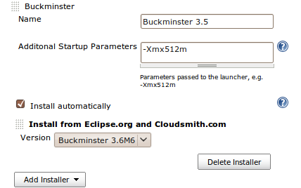
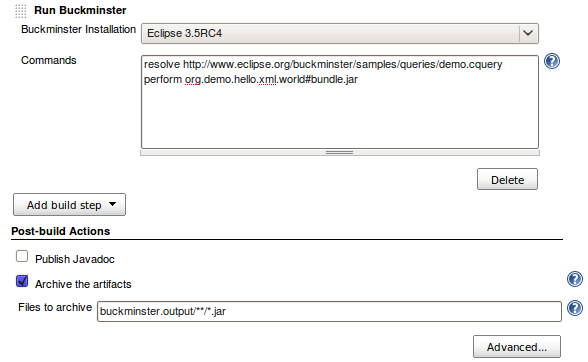
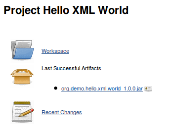
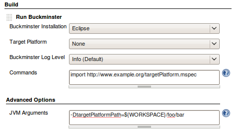
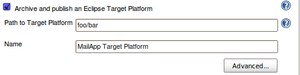
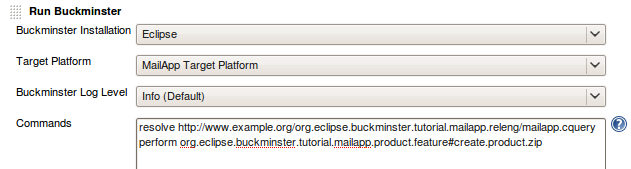

[.conf-macro .output-inline]#This PlugIn integrates
http://www.eclipse.org/buckminster[Eclipse Buckminster] as a new build
step into Jenkins.# +

[[BuckminsterPlugIn-Usage]]
== Usage

To use buckminster you need to configure at least one Buckminster
installation. This is done in the Jenkins configuration. The easiest way
to do this, is to use the 'Install automatically' feature. Enter a name
for the Buckminster installation, select a version from the dropdown box
and buckminster will be installed as needed when you run a buckminster
build step. The installed buckminster will contain every feature from
the respective headless update-site on eclipse.org as well as the
'subclipse' feature from cloudsmith.com.

If you activate the 'update automatically' checkbox, a check for updates
will be performed before a build gets executed. If features have been
updated or new features get available, they will automatically
provisioned into the buckminster installation. +
 
[.confluence-embedded-file-wrapper]## +
If you have extended buckminster, simply want another feature
configuration, or download from other repositories, you can customize
the installation. Currently there is the following options available:

. Deactivate 'Install automatically' and enter the home path to an
existing buckminster installation (usually a buckminster folder that
contains a plugins/ and a features/ directory)
. Execute a shell script to fetch and configure buckminster
. Extract a preconfigred buckminster from an archive
. place a 'buckminster.json' file under
JENKINS_HOME/userContent/buckminster to override the default installer
configuration. The file must list all available buckminster versions,
the URL to the p2 director application, the IU of the product to be
provisioned as well as the p2 repositories and the features to install
from these repositories. The file structure is defined as following:
+
....
 {"buckminsters":[
        {"id":"3.5",
          "name":"Buckminster 3.5",
          "url":"http://example.org/p2_director.zip",
          "iu":"org.eclipse.buckminster.cmdline.product",
          "repositoryURL":"http://example.org/p2Repository",
          "repositories":[
                {
                    "url":"http://example.org/p2Repository",
                    "features":[
                        {"id"="feature.one"},
                        {"id"="feature.two"}
                   ]
               }
          ]
      }
   ]
}
....
+
Once the instance is configured it can be used as a build step +
  +
[.confluence-embedded-file-wrapper]##

Those screenshot show the setup for the Buckminster
http://wiki.eclipse.org/Hello_XML_World_Example_(Buckminster)[Hello XML
World Example]. Running it will produce the following result: +
  +
[.confluence-embedded-file-wrapper]##

[[BuckminsterPlugIn-TargetPlatformPublisher(Experimental)]]
=== Target Platform Publisher (Experimental)

The Target Platform Publisher can be used to share a definition of an
eclipse target platform between different projects that build eclipse
plugins with buckminster. To make use of these capabilities you need to
create a new job that creates a target platform first. This can be done
for example with one or more MSPECs (detailed information on when and
how to use MSPECs can be found in the
http://www.eclipse.org/downloads/download.php?file=/tools/buckminster/doc/BuckyBook.pdf[Buckminster
Book]), or simply by downloading/copying an update-site or eclipse
package to the workspace. +
[.confluence-embedded-file-wrapper]## +
 Once the build is set for the target platform, you need to publish the
created artifact. To do so, activate the Target Platform Publisher,
enter the directory where your target platform can be found and give the
artifact a name. +
[.confluence-embedded-file-wrapper]## +
This will archive the target platform produced by the build and makes it
available to other projects under the name 'MailApp Target Platform'.
All other jobs that have a Buckminster build step may now choose from
all published Target Platforms in the build-step configuration.

[.confluence-embedded-file-wrapper]##

This will also introduce the project that creates the target platform as
an upstream project of the job that depends on the target platform:

!UpstreamProject.png! 

[[BuckminsterPlugIn-Remarks]]
== Remarks

 +

* If a _perform_ command is executed, the PlugIn sets the property
buckminster.output.root to _JOB_WORKSPACE/buckminster.output_ to make
all artifacts appear in the actual job workspace.
* The working and data directory of buckminster is set to the directory
of the job workspace. This is especially useful if you want your code to
be checked out with Jenkins and only do a local resolution of the
already checked-out source code from within buckminster. +

[[BuckminsterPlugIn-KnownLimitations]]
== Known Limitations

* So far the Buckminster PlugIn works only for freestyle and matrix
projects.
* When using the Target Platform Publisher you need to make sure that
the job that's exporting the Target Platform runs on the same node as
the jobs that make use of it.

[[BuckminsterPlugIn-Changelog]]
== Changelog

[[BuckminsterPlugIn-Version1.1.1(17.02.2013)]]
=== Version 1.1.1 (17.02.2013)

* fixed
https://issues.jenkins-ci.org/browse/JENKINS-13218[JENKINS-13218] -
Can't add build step on current Jenkins
* fixed
https://issues.jenkins-ci.org/browse/JENKINS-10089[JENKINS-10089] -
Recent versions of Buckminster (3.7 and 4.2) can now be installed in
Jenkins configuration
* help contents is visible when Jenkins is installed on Tomcat

[[BuckminsterPlugIn-Version1.0.8(15.01.2011)]]
=== Version 1.0.8 (15.01.2011)

* fixed http://issues.jenkins-ci.org/browse/JENKINS-8186[JENKINS-8186] -
Version Property not available in Buckminster Plugin  1.0.5
* fixed http://issues.jenkins-ci.org/browse/JENKINS-8459[JENKINS-8459] -
Add way of passing arbitrary options to the equinox launchers

[[BuckminsterPlugIn-Version1.0.4(09.10.2010)]]
=== Version 1.0.4 (09.10.2010)

* fixed http://issues.jenkins-ci.org/browse/JENKINS-7118[JENKINS-7118] -
Add a field where the path to a global property file can be specified
* fixed http://issues.jenkins-ci.org/browse/JENKINS-7037[JENKINS-7037] -
Check if Buckmister_3.x/directory is available
* fixed http://issues.jenkins-ci.org/browse/JENKINS-7672[JENKINS-7672] -
Missing help text for "Path to Target Platform"

[[BuckminsterPlugIn-Version1.0.3(11.05.2010)]]
=== Version 1.0.3 (11.05.2010)

* Fixed http://issues.jenkins-ci.org/browse/JENKINS-6488[JENKINS-6488]
(Buckminster doesn't inherit environment variables)

[[BuckminsterPlugIn-Version1.0.2(06.04.2010)]]
=== Version 1.0.2 (06.04.2010)

* Fix for Buckminster invocation (see
https://bugs.eclipse.org/bugs/show_bug.cgi?id=287575[Bug#287575] for
details)

[[BuckminsterPlugIn-Version1.0.1(02.04.2010)]]
=== Version 1.0.1 (02.04.2010)

* Several fixes for Distributed Builds and Windows Nodes
* Fixed a NullPointerException during Form validation

[[BuckminsterPlugIn-Version1.0.0(27.03.2010)]]
=== Version 1.0.0 (27.03.2010)

* Distributed Builds (Master/Slave) are now supported
* Buckminster Installations can now be updated automatically every time
you run a build. See
http://issues.jenkins-ci.org/browse/JENKINS-6065[JENKINS-6065] for
details.

[[BuckminsterPlugIn-Version0.9.5(24.03.2010)]]
=== Version 0.9.5 (24.03.2010)

* it's now possible to configure the buckminster workspace,
buckminster.temp.root and buckminster.output.root
http://issues.jenkins-ci.org/browse/JENKINS-6040[JENKINS-6040]
* Instead of entering commands in the text area you can now also specify
a script file in the workspace
http://issues.jenkins-ci.org/browse/JENKINS-6038[JENKINS-6038]
* fixed http://issues.jenkins-ci.org/browse/JENKINS-6039[JENKINS-6039] 
* fixed http://issues.jenkins-ci.org/browse/JENKINS-5971[JENKINS-5971]

[[BuckminsterPlugIn-Version0.9.4(22.03.2010)]]
=== Version 0.9.4 (22.03.2010)

* Support for automatic Tool installation from
Eclipse.org/Cloudsmith.com
* Support for automatic Tool installation from custom sources or custom
feature configurations

[[BuckminsterPlugIn-Version0.9.3(10.12.2009)]]
=== Version 0.9.3 (10.12.2009)

* fixed http://issues.jenkins-ci.org/browse/JENKINS-5004[JENKINS-5004] -
Plugin relies on 'java' being in the system path

[[BuckminsterPlugIn-Version0.9.2(25.11.2009)]]
=== Version 0.9.2 (25.11.2009)

* fixed http://issues.jenkins-ci.org/browse/JENKINS-4947[JENKINS-4947] -
WORKSPACE variable not working on windows systems

[[BuckminsterPlugIn-Version0.9.1(06.08.2009)]]
=== Version 0.9.1 (06.08.2009)

* fixed https://hudson.dev.java.net/issues/show_bug.cgi?id=4171[Issue
4171] - Target Platform Publisher fails for Matrix Projects

[[BuckminsterPlugIn-Version0.9(03.08.2009)]]
=== Version 0.9 (03.08.2009)

* added a target platform publisher (experimental)
* canceling builds should now work properly 

[[BuckminsterPlugIn-Version0.8.4(23.07.2009)]]
=== Version 0.8.4 (23.07.2009)

* Set buckminster.temp.root to $workspace/buckminster.temp
* Property expansion for additional properties of each eclipse
installation (hudson configuration)

[[BuckminsterPlugIn-Version0.8.3(17.07.2009)]]
=== Version 0.8.3 (17.07.2009)

* Support for Matrix Jobs (thanks to Carsten Reckord)

[[BuckminsterPlugIn-Version0.7.1(11.07.2009)]]
=== Version 0.7.1 (11.07.2009)

* The build step configuration contains a new advanced section to add
additional JVM parameters
* Ant-style property expansion works now in commands and JVM parameters
(Hudson environment variables can be used that way)

[[BuckminsterPlugIn-Version0.6(19.06.2009)]]
=== Version 0.6 (19.06.2009)

Initial release
