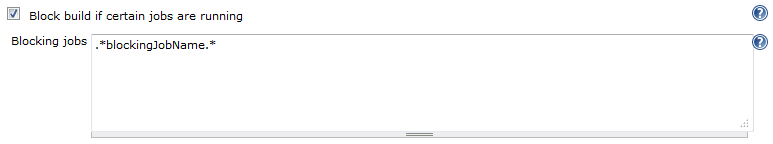

This plugin keeps the actual job in the queue if at least one name of
currently running jobs is matching with one of the given regular
expressions.

[[BuildBlockerPlugin-General]]
== General

This plugin is similar to the
https://wiki.jenkins-ci.org/display/JENKINS/Locks+and+Latches+plugin[locks
and latches plugin]. The main difference is, that it uses regular
expressions to find potentially blocking jobs by their names in the list
of currently running builds. It uses the
https://wiki.jenkins-ci.org/display/JENKINS/Extension+points#Extensionpoints-hudson.model.queue.QueueTaskDispatcher[QueueTaskDispatcher]
to check if the actual job may be build. The dispatcher uses the list of
regular expressions configured in the job. If one of the currently
running jobs matches with one of the regular expressions, the job stays
in the queue.

[[BuildBlockerPlugin-Howtouse]]
== How to use

After installing the plugin, the job configuration page has a new
property "Block build if certain jobs are running" in the upper section.

[.confluence-embedded-file-wrapper]##

Insert one regular expression per line into the textarea. Each
expression is used to detect currently running jobs that match with
their names. The first matching job name will block the build and the
job will stay in the queue until all expression are evaluated without
match.

Other than the locks and latches plugin where both, the job to be build
and the blocking job, need to have the same lock configured, this plugin
allows to just configure to job to be build. No jenkins system
configuration is needed.

[[BuildBlockerPlugin-Versionhistory]]
== Version history

[[BuildBlockerPlugin-1.1(June24,2012)]]
=== 1.1 (June 24, 2012)

* Initial commit.

[[BuildBlockerPlugin-1.2(June25,2012)]]
=== 1.2 (June 25, 2012)

* Added wiki url to pom.

[[BuildBlockerPlugin-1.3(January8,2013)]]
=== 1.3 (January 8, 2013)

Merged pull request of bramtassyns
(https://github.com/jenkinsci/build-blocker-plugin/pull/1) - Thanks for
the great work!:

* FIX to work with matrix jobs
* jobs running and - new - in queue with matching names block the
current job's start

[[BuildBlockerPlugin-1.4.1(June28,2013)]]
=== 1.4.1 (June 28, 2013)

* added "executors.addAll(computer.getOneOffExecutors());" to get a
build blocked by all Multi-Configuration-Job executions. Now a blocked
build starts AFTER the whole blocking matrix build and not in the middle
of it. ATTENTION: With Jenkins version 1.447 the blocked job got stuck
in the queue. Now the plugin requires Jenkins version 1.466 to run.

[[BuildBlockerPlugin-1.5(March13,2015)]]
=== 1.5 (March 13, 2015)

* Merged Pull Requests #2 (Added support for the Folders plugin) and #3
(Regex validation JENKINS-27402)

[[BuildBlockerPlugin-1.6(March13,2015)]]
=== 1.6 (March 13, 2015)

* Merged Pull Request #4 (Add form validation
https://wiki.jenkins-ci.org/display/JENKINS/JENKINS-27411[JENKINS-27411])

[[BuildBlockerPlugin-1.7(July1,2015)]]
=== 1.7 (July 1, 2015)

* Merge Pull Request #5 and #6 (avoid NPE and extended to block on node
level and to scan the queue for builds in all states)

[[BuildBlockerPlugin-1.7.1(July3,2015)]]
=== 1.7.1 (July 3, 2015)

* Fixed NPE when using existing build blocker config not having the new
properties.

[[BuildBlockerPlugin-1.7.2(November24,2015)]]
=== 1.7.2 (November 24, 2015)

* merged Pull Request # 7
https://wiki.jenkins-ci.org/display/JENKINS/FIXED+JENKINS-29924[FIXED
JENKINS-29924] Items with non-AbstractProjects tasks block the build
queue

[[BuildBlockerPlugin-1.7.3(December14,2015)]]
=== 1.7.3 (December 14, 2015)

* merged Pull Request # 8
https://wiki.jenkins-ci.org/display/JENKINS/FIXED+JENKINS-29924[FIXED
JENKINS-29924] Transform AbstractProject into Job for Workflow
compatibility

The blocking behaviour can be configured to either block builds

from running on the same node +
from running at all +
Additionally, the blocking behaviour can be configured to consider
planned, but not yet running builds in the decision to block a build.
Either

buildable builds can stop another build from running (for instance
builds that are waiting for an available executor) +
all planned builds can stop another build from running (blocked builds,
pending builds waiting builds and buildable builds)

[[BuildBlockerPlugin-TODOs]]
=== TODOs

* Block a build by all sub-execution of a matrix job build, not only the
first one.
* Make blocking by items im Queue optional (default on). There may be
situations, where regarding the items in the Queue that are not yet in
execution may lead in a dead lock.
* Add information of duration blocked to comment in Queue.
* Add optional functionality to Keep only the last item of a job in
queue.
* Add Slicer for Configuration Slicing Plugin
* Add Parameter for Job LastSuccessfu(false)
