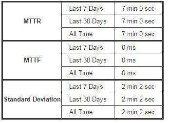

This plugin calculates the following metrics for all of your builds once
installed:

* Mean Time To Failure (MTTF)
* Mean Time To Recovery (MTTR)
* Standard Deviation of Build Times

The calculated metrics are displayed in a table on each jobs page
showing the metric for the last 7 days, last 30 days and all time.  The
table looks something like this: +
[.confluence-embedded-file-wrapper]## +

[[BuildHistoryMetricsPlugin-Changelog]]
== Changelog

[[BuildHistoryMetricsPlugin-1.2]]
=== 1.2

* Standard deviation for build times is now calculated and displayed
* Some styling changes for the table to make it look a bit better

[[BuildHistoryMetricsPlugin-1.1]]
=== 1.1

* First stable release that is a fork of an old plugin, refactored with
more tests and extended to include both MTTF and MTTR metrics
