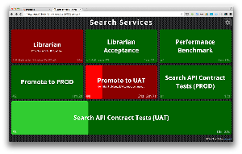

[.conf-macro .output-inline]# #

Build Monitor Plugin provides a highly visible view of the status of
selected Jenkins jobs.

It easily accommodates different computer screen sizes and is ideal as
an Extreme Feedback Device to be displayed on a screen on your office
wall. +
(Inspired by the no longer maintained RadiatorView plugin).

https://smartcode-opensource.ci.cloudbees.com/job/build-monitor/[[.confluence-embedded-file-wrapper]#image:https://smartcode-opensource.ci.cloudbees.com/job/build-monitor/badge/icon[image]#]

Getting the latest version

[.aui-icon .aui-icon-small .aui-iconfont-info .confluence-information-macro-icon]#
#

If the plugin doesn't appear in your Jenkins Update Centre, visit Manage
Plugins / Advanced and click the "Check now" button to make Jenkins
retrieve the latest update-center.json data.

[[BuildMonitorPlugin-Features]]
== Features

I'd like to keep the plugin as simple as possible, yet useful and
effective.

Current functionality of the Build Monitor plugin:

. Displays the status and progress of selected jobs, the view is updated
automatically every couple of seconds using AJAX. No "Enable Auto
Refresh" needed.
. Displays the names of people who might be responsible for "breaking
the build".
. Supports the
https://wiki.jenkins-ci.org/display/JENKINS/Claim+plugin[Claim plugin],
so that you can see who's fixing a broken build
. Supports
https://wiki.jenkins-ci.org/display/JENKINS/View+Job+Filters[View Job
Filters], so that you can easily create Build Monitors for "slow
builds", "only failing", etc.
. Supports
https://wiki.jenkins-ci.org/display/JENKINS/Build+Failure+Analyzer[Build
Failure Analyzer], so that you know not only _who_, but also _what_
broke the build; more http://bit.ly/JBMBuild102[here]
. Supports
https://wiki.jenkins-ci.org/display/JENKINS/CloudBees+Folders+Plugin[CloudBees
Folders Plugin], so that you can have project- and team-specific nested
Build Monitors; more http://bit.ly/JBMBuild117[here]
. The number of columns and size of the font used is easily
customisable, making it trivial to accommodate screens of different
sizes.
. UI configuration is stored in a cookie, making it possible to display
different number of columns and using different font size on each of the
screens at your office.
. Can work in a colour-blind-friendly mode

[[BuildMonitorPlugin-DoyoufindBuildMonitoruseful?Supportitsdevelopment]]
== Do you find Build Monitor useful? Support its development 

Like Build Monitor it? Give it a
https://github.com/jan-molak/jenkins-build-monitor-plugin[star on
github]! ★

Have an idea for a new awesome feature? http://bit.ly/JBMDevGuide[Start
here]

Have feedback? Let me know on twitter:
https://twitter.com/JanMolak[@JanMolak]

You can also
https://www.bountysource.com/teams/jenkins-build-monitor-plugin/issues[sponsor
a feature on bountysource]!

https://flattr.com/submit/auto?user_id=JanMolak&url=https%3A%2F%2Fgithub.com%2Fjan-molak%2Fjenkins-build-monitor-plugin[[.confluence-embedded-file-wrapper]#image:https://api.flattr.com/button/button-static-50x60.png[image]#]

[[BuildMonitorPlugin-Settingup]]
== Setting up

To create a new Build Monitor View, click on the "New View" tab, select
"Build Monitor View" and select jobs you wish to display on the monitor.

[.confluence-embedded-file-wrapper]##

You can have as many Build Monitor Views as you wish - the most popular
approach is to have one per team or one per project.

[[BuildMonitorPlugin-Apictureisworthathousandwords]]
== A picture is worth a thousand words

[.confluence-embedded-file-wrapper]##
[.confluence-embedded-file-wrapper]##
[.confluence-embedded-file-wrapper]##
[.confluence-embedded-file-wrapper]##
[.confluence-embedded-file-wrapper]##

*Please note* that you can change the number of columns and the size of
the font using the gear icon in the top right corner.

[[BuildMonitorPlugin-TDD]]
== TDD

If you'd like to understand more about the logic behind the Build
Monitor Plugin, feel free to have a look at the
https://bit.ly/JBMSerenity[tests that drove the design].

[[BuildMonitorPlugin-Foundanissue?]]
== Found an issue?

Please report it
https://github.com/jan-molak/jenkins-build-monitor-plugin/issues[on
Github]. +
If you also know how to fix it and have a spare moment - I always
welcome pull requests

Check out the http://bit.ly/JBMDevGuide[mini development guide] before
you start, as it might be helpful.

[[BuildMonitorPlugin-Changelog]]
== Change log

Want to know about new releases early?
https://twitter.com/JanMolak[Follow me on twitter]

You can find the http://bit.ly/JBMReleases[high-level overview of all
releases] on Github, and a detailed change log below:

* *1.11+build.201701152243*
http://bit.ly/JBMDiffB20161104-B20170115[Changelog]
http://bit.ly/JBMBuild20170115[Release notes]
* *1.10+build.201611041949*
http://bit.ly/JBMDiffB20160803-B20161104[Changelog]
http://bit.ly/JBMBuild20161104[Release notes]
* *1.10+build.201608030223*
http://bit.ly/JBMDiffB20160613-B20160803[Changelog]
http://bit.ly/JBMBuild20160803[Release notes]
* *1.9+build.201606131328*
http://bit.ly/JBMDiffB20160605-B20160613[Changelog]
http://bit.ly/JBMBuild20160613[Release notes]
* *1.9+build.2016060523​39*
http://bit.ly/JBMDiffB20160502-B20160605[Changelog]
http://bit.ly/JBMBuild20160605[Release notes]
* *1.9+build.201605021413*
http://bit.ly/JBMDiffB20160111-B20160502[Changelog]
http://bit.ly/JBMBuild20160502[Release notes]
* *1.8+build.201601112328*
http://bit.ly/JBMDiffB20160105-B20160111[Changelog]
http://bit.ly/JBMBuild20160111[Release notes]
* *1.8+build.2016010520​13*
http://bit.ly/JBMDiffB172-B20160105[Changelog]
http://bit.ly/JBMBuild20160105[Release notes]
* *1.7+build.172* (Nov 29, 2015)
http://bit.ly/JBMDiffB164-B172[Changelog]
http://bit.ly/JBMBuild172[Release notes]
* *1.6+build.164* (Nov 08, 2015) http://bit.ly/JBMBuild164[Release
notes]
* *1.6+build.163* (Nov 07, 2015) http://bit.ly/JBMBuild163[Release
notes]
* *1.6+build.162* (Nov 05, 2015)
http://bit.ly/JBMDiffB159-B162[Changelog]
http://bit.ly/JBMBuild162[Release notes]
* *1.6+build.142* (Apr 05, 2015)
http://bit.ly/JBMDiffB140-B142[Changelog]
http://bit.ly/JBMBuild142[Release notes]
* *1.6+build.140* (Feb 09, 2015)
http://bit.ly/JBMDiffB138-B140[Changelog]
http://bit.ly/JBMBuild140[Release notes]
* *1.6+build.138* (Jan 24, 2015)
http://bit.ly/JBMDiffB135-B138[Changelog]
http://bit.ly/JBMBuild138[Release notes]
* *1.6+build.135* (Jan 6, 2015)
http://bit.ly/JBMDiffB123-B135[Changelog]
http://bit.ly/JBMBuild135[Release notes]
* *1.6+build.132* (Oct 12, 2014)
http://bit.ly/JBMDiffB123-B132[Changelog]
http://bit.ly/JBMBuild132[Release notes]
* *1.5+build.123* (Aug 19, 2014)
http://bit.ly/JBMDiffB120-B123[Changelog]
http://bit.ly/JBMBuild123[Release notes]
* *1.5+build.120* (Aug 14, 2014)
http://bit.ly/JBMDiffB119-B120[Changelog]
http://bit.ly/JBMBuild120[Release notes]
* *1.5+build.119* (Jul 27, 2014)
http://bit.ly/JBMDiffB118-B119[Changelog]
http://bit.ly/JBMBuild119[Release notes]
* *1.5+build.118* (Jul 14, 2014)
http://bit.ly/JBMDiffB117-B118[Changelog]
http://bit.ly/JBMBuild118[Release notes]
* *1.5+build.117* (Jun 29, 2014)
http://bit.ly/JBMDiffB102-B117[Changelog]
http://bit.ly/JBMBuild117[Release notes]
* *1.4+build.102* (Jun 07, 2014)
http://bit.ly/JBMDiffB72-B102[Changelog]
* *1.3+build.72* (Mar 01, 2014) http://bit.ly/JBMDiffB71-B72[Changelog]
* *1.3+build.71* (Feb 26, 2014) http://bit.ly/JBMDiffB70-B71[Changelog]
* *1.3+build.70* (Feb 23, 2014) http://bit.ly/JBMDiffB68-B70[Changelog]
* *1.3+build.68* (Jan 02, 2014) http://bit.ly/JBMDiffB64-B68[Changelog]
* *1.2+build.64* (Nov 13, 2013) http://bit.ly/JBMDiffB59-B64[Changelog]
* *1.1+build.59* (Oct 20, 2013) http://bit.ly/JBMDiffB53-B59[Changelog]
* *1.0+build.53* (Oct 09, 2013) http://bit.ly/JBMDiffB51-B53[Changelog]
* *1.0+build.51* (Oct 06, 2013) http://bit.ly/JBMDiffB33-B51[Changelog]
* *1.0+build.33* (Aug 17, 2013) http://bit.ly/JBMDiffB30-B33[Changelog]
* *1.0+build.30* (Aug 13, 2013) http://bit.ly/JBMDiffB20-B30[Changelog]
* *1.0+build.20* (Aug 10, 2013) http://bit.ly/JBMDiffB14-B20[Changelog]
* *1.0+build.14* (Jul 21, 2013) http://bit.ly/JBMDiffB10-B14[Changelog]
* *1.0+build.10* (Jul 13, 2013) First public release of the plugin

[[BuildMonitorPlugin-TheMITLicense]]
== The MIT License

Copyright (c) 2013-2017, Jan Molak, SmartCode Ltd
http://smartcodeltd.co.uk/[http://smartcodeltd.co.uk]

Permission is hereby granted, free of charge, to any person obtaining a
copy of this software and associated documentation files (the
"Software"), to deal in the Software without restriction, including
without limitation the rights to use, copy, modify, merge, publish,
distribute, sublicense, and/or sell copies of the Software, and to
permit persons to whom the Software is furnished to do so, subject to
the following conditions:

The above copyright notice and this permission notice shall be included
in all copies or substantial portions of the Software.

THE SOFTWARE IS PROVIDED "AS IS", WITHOUT WARRANTY OF ANY KIND, EXPRESS
OR IMPLIED, INCLUDING BUT NOT LIMITED TO THE WARRANTIES OF
MERCHANTABILITY, FITNESS FOR A PARTICULAR PURPOSE AND NON-INFRINGEMENT.
IN NO EVENT SHALL THE AUTHORS OR COPYRIGHT HOLDERS BE LIABLE FOR ANY
CLAIM, DAMAGES OR OTHER LIABILITY, WHETHER IN AN ACTION OF CONTRACT,
TORT OR OTHERWISE, ARISING FROM, OUT OF OR IN CONNECTION WITH THE
SOFTWARE OR THE USE OR OTHER DEALINGS IN THE SOFTWARE.
