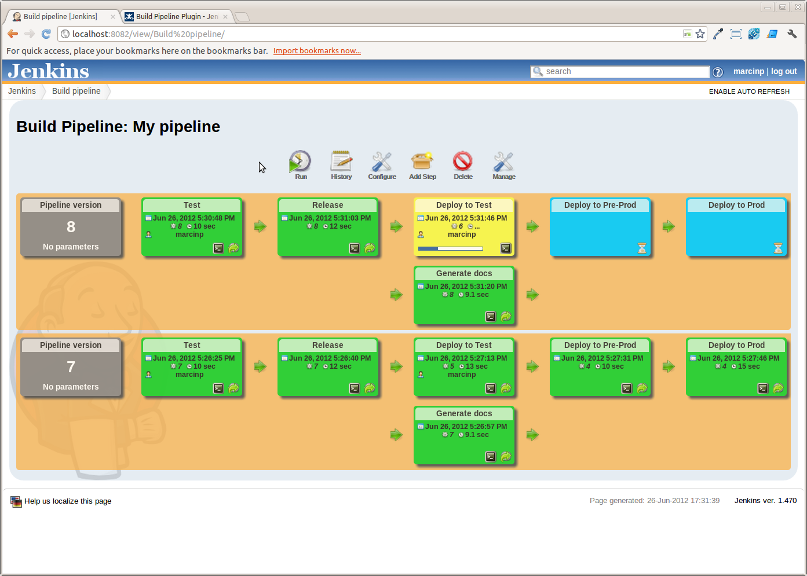
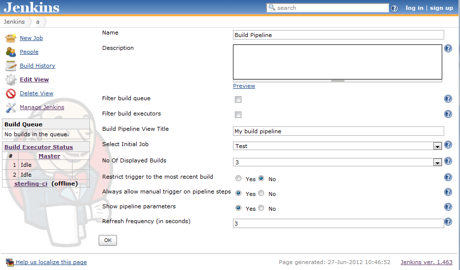
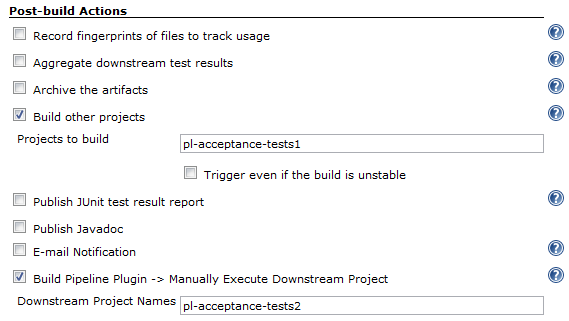

[[BuildPipelinePlugin-Summary]]
== Summary 

[.conf-macro .output-inline]##This plugin provides a _Build Pipeline
View_ of upstream and downstream connected jobs that typically form a
build pipeline.  In addition, it offers the ability to define manual
triggers for jobs that require intervention prior to execution, e.g. an
approval process outside of Jenkins.##[.conf-macro .output-inline]####

[cols="",options="header",]
|===
|Plugin Information
|View Build Pipeline https://plugins.jenkins.io/build-pipeline-plugin[on
the plugin site] for more information.
|===

[.aui-icon .aui-icon-small .aui-iconfont-error .confluence-information-macro-icon]##

The current version of this plugin may not be safe to use. Please review
the following warnings before use:

* https://jenkins.io/security/advisory/2019-08-07/#SECURITY-879[Stored
XSS vulnerability]

[[BuildPipelinePlugin-ReleaseNotes]]
=== Release Notes

1.5.8

* image:docs/images/forbidden.svg[(minus)] Address
boundary case of
https://issues.jenkins-ci.org/browse/JENKINS-23532[JENKINS-23532] where
relative paths would not retrigger

https://github.com/jenkinsci/build-pipeline-plugin/releases/tag/build-pipeline-plugin-1.5.7.1[1.5.7.1]

* (-) https://issues.jenkins-ci.org/browse/JENKINS-45137[JENKINS-45137]
Fix stack trace for pipelines created / edited in v 1.5.6

https://github.com/jenkinsci/build-pipeline-plugin/releases/tag/build-pipeline-plugin-1.5.7[1.5.7]

* (-) https://issues.jenkins-ci.org/browse/JENKINS-23532[JENKINS-23532] Manual
trigger execution causes TriggerException
* (-) https://issues.jenkins-ci.org/browse/JENKINS-44324[JENKINS-44324] NullPointerException upgrading
from very old versions of plugin +
* (-) Fix issue with dashboard view not loading
* (+)Added support for extensible BuildCard

https://github.com/jenkinsci/build-pipeline-plugin/releases/tag/build-pipeline-plugin-1.5.6[1.5.6]

* image:docs/images/forbidden.svg[(minus)]
https://issues.jenkins-ci.org/browse/JENKINS-34722[Issues #34722]
(https://github.com/jenkinsci/build-pipeline-plugin/pull/88[Pull #88])
Performance fix when determining view permissions
* image:docs/images/add.svg[(plus)]
https://issues.jenkins-ci.org/browse/JENKINS-14591[Issues #14591]
(https://github.com/jenkinsci/build-pipeline-plugin/pull/96[Pull #96]
and https://github.com/jenkinsci/build-pipeline-plugin/pull/106[Pull
#106]) Add the ability to choose which parameters build will be
displayed

https://github.com/jenkinsci/build-pipeline-plugin/releases/tag/build-pipeline-plugin-1.5.5[1.5.5]

* image:docs/images/forbidden.svg[(minus)]
Eaten by https://issues.jenkins-ci.org/browse/JENKINS-31088[INFRA-588]

https://github.com/jenkinsci/build-pipeline-plugin/releases/tag/build-pipeline-plugin-1.5.4[1.5.4]

* image:docs/images/forbidden.svg[(minus)]
https://github.com/jenkinsci/build-pipeline-plugin/pull/105[Pull #105]
Keep git-plugin RevisionParameterAction on rerun of a build
* image:docs/images/add.svg[(plus)]
https://issues.jenkins-ci.org/browse/JENKINS-31088[Issues #31088] show
displayName by default

https://github.com/jenkinsci/build-pipeline-plugin/releases/tag/build-pipeline-plugin-1.5.3.1[1.5.3.1]

* image:docs/images/forbidden.svg[(minus)]
https://issues.jenkins-ci.org/browse/JENKINS-33935[Issue #33935] Fix
re-running a build - broken in Jenkins > 1.653, LTS > 1.651.1
* image:docs/images/forbidden.svg[(minus)]
https://issues.jenkins-ci.org/browse/JENKINS-34722[Issue #34722]
Performance fix - limit the number of downstream projects iterated over

https://github.com/jenkinsci/build-pipeline-plugin/releases/tag/build-pipeline-plugin-1.5.2[1.5.2]

* image:docs/images/forbidden.svg[(minus)]
https://issues.jenkins-ci.org/browse/JENKINS-33591[Issue #33591] Fix
manual trigger breaking in Jenkins >1.653

https://github.com/jenkinsci/build-pipeline-plugin/releases/tag/build-pipeline-plugin-1.5.1[1.5.1]

* image:docs/images/forbidden.svg[(minus)]
https://issues.jenkins-ci.org/browse/JENKINS-31746[Issue #31746] Fix
issues in layout, UI updates

https://github.com/jenkinsci/build-pipeline-plugin/releases/tag/build-pipeline-plugin-1.4.9[1.4.9]

* image:docs/images/forbidden.svg[(minus)]
(https://issues.jenkins-ci.org/browse/JENKINS-30801[issue #30801])
Re-triggering a failed build copies the Actions from previous builds
* image:docs/images/forbidden.svg[(minus)]
(https://issues.jenkins-ci.org/browse/JENKINS-28068[issue #28068]) Build
Pipeline Dashboard View destroys layout of jenkins
* image:docs/images/forbidden.svg[(minus)]
(https://issues.jenkins-ci.org/browse/JENKINS-29477[issue #29477]) View
bad for Build Pipeline Plugin

https://github.com/jenkinsci/build-pipeline-plugin/compare/build-pipeline-plugin-1.4.7...build-pipeline-plugin-1.4.8[1.4.8]

* image:docs/images/forbidden.svg[(minus)]
 (https://issues.jenkins-ci.org/browse/JENKINS-28180[issue
#28180]) Build Pipeline background layout does not extend full width of
pipeline

https://github.com/jenkinsci/build-pipeline-plugin/compare/build-pipeline-plugin-1.4.6...build-pipeline-plugin-1.4.7[1.4.7]

* image:docs/images/forbidden.svg[(minus)]
(https://issues.jenkins-ci.org/browse/JENKINS-25666[JENKINS-25666])
Fixed left-side indentation for new jenkins versions

https://github.com/jenkinsci/build-pipeline-plugin/compare/build-pipeline-plugin-1.4.5...build-pipeline-plugin-1.4.6[1.4.6]

* image:docs/images/forbidden.svg[(minus)]
(https://issues.jenkins-ci.org/browse/JENKINS-20499[JENKINS-20499]) Null
cause brokes Cause entry and job
* image:docs/images/forbidden.svg[(minus)]
(https://issues.jenkins-ci.org/browse/JENKINS-22665[JENKINS-22665])
(https://issues.jenkins-ci.org/browse/JENKINS-19755[JENKINS-19755])
Don't store whole user object for cause
* image:docs/images/add.svg[(plus)]
Fixed UI tests
* image:docs/images/add.svg[(plus)]
Removed test libs from final package

https://github.com/jenkinsci/build-pipeline-plugin/compare/build-pipeline-plugin-1.4.4...build-pipeline-plugin-1.4.5[1.4.5]

* image:docs/images/forbidden.svg[(minus)]
Support cloudbees-folder-plugin
(https://issues.jenkins-ci.org/browse/JENKINS-14565[JENKINS-14565])
(https://issues.jenkins-ci.org/browse/JENKINS-20841[JENKINS-20841])
* image:docs/images/forbidden.svg[(minus)]
Start build with parameters for parametrized builds
(https://issues.jenkins-ci.org/browse/JENKINS-25427[JENKINS-25427])
(https://issues.jenkins-ci.org/browse/JENKINS-19121[JENKINS-19121])
* image:docs/images/forbidden.svg[(minus)]
Clicking on "console" icon doesn't work
(https://issues.jenkins-ci.org/browse/JENKINS-25430[JENKINS-25430])

https://github.com/jenkinsci/build-pipeline-plugin/compare/build-pipeline-plugin-1.4.3...build-pipeline-plugin-1.4.4[1.4.4]

http://code.google.com/p/build-pipeline-plugin/issues/list?can=1&q=label%3AMilestone-Release1.3.3&colspec=ID+Type+Status+Priority+Milestone+Owner+Summary&cells=tiles[1.3.3] +
http://code.google.com/p/build-pipeline-plugin/issues/list?can=1&q=label%3AMilestone-Release1.3.1&colspec=ID+Type+Status+Priority+Milestone+Owner+Summary&cells=tiles[1.3.1] +
http://www.centrumsystems.com.au/2012/07/build-pipeline-plugin-1-3-0-release/[1.3.0]
- Also see the
https://wiki.jenkins-ci.org/display/JENKINS/Build+Pipeline+Plugin+-+Roadmap[roadmap]
for details. +
http://code.google.com/p/build-pipeline-plugin/issues/list?can=1&q=label%3AMilestone-Release1.2.4&colspec=ID+Type+Status+Priority+Milestone+Owner+Summary&cells=tiles[1.2.4]
- Also see the
https://wiki.jenkins-ci.org/display/JENKINS/Build+Pipeline+Plugin+-+Roadmap[roadmap]
for details. +
http://www.centrumsystems.com.au/blog/?p=325[1.2.2] +
http://www.centrumsystems.com.au/blog/?p=287[1.2.1] +
http://www.centrumsystems.com.au/blog/?p=281[1.2] +
http://www.centrumsystems.com.au/blog/?p=200[1.1.2] +
http://www.centrumsystems.com.au/blog/?p=165[1.1.1] +
http://www.centrumsystems.com.au/blog/?p=121[1.0.0]

[[BuildPipelinePlugin-Overview]]
== Overview

Continuous Integration has become a widely adopted practice in modern
software development. Jenkins & Hudson are great tools for supporting
Continuous Integration.

*Taking it to the next level:* Continuous integration can become the
centerpiece of your
http://www.informit.com/articles/article.aspx?p=1621865[deployment
pipeline], orchestrating the promotion of a version of software through
quality gates and into production. By extending the concepts of CI you
can create a chain of jobs each one subjecting your build to quality
assurance steps. These QA steps may be a combination of manual and
automated steps. Once a build has passed all these, it can be
automatically deployed into production.

In order to better support this process, we have developed the Build
Pipeline Plugin. This gives the ability to form a chain of jobs based on
their upstream\downstream dependencies. Downstream jobs may, as per the
default behaviours, be triggered automatically ,or by a suitable
authorised user manually triggering it.

You can also see a history of pipelines in a view, the current status
and where each version got to in the chain based on its revision number
in VCS.

[[BuildPipelinePlugin-Screenshots]]
=== Screenshots

[[BuildPipelinePlugin-ThePipelineView]]
==== The Pipeline View

[.confluence-embedded-file-wrapper .confluence-embedded-manual-size]##

[[BuildPipelinePlugin-Configuration]]
== Configuration

[[BuildPipelinePlugin-ViewConfiguration]]
=== View Configuration

. Install the plugin using the Hudson\Jenkins Plugin Manager and
restart.
. Create a view of the new type _Build Pipeline View_. +
You will then be redirected directly to the configuration page.
. The table below outlines what each interesting parameter controls:
+
[width="100%",cols="50%,50%",]
|===
|Name |The name of the Build Pipeline View

|Description |This message will be displayed on the view page. Useful
for describing what this view is about, or linking to relevant
resources. Can contain HTML tags.

|Build Pipeline View Title |Gives a title to the page that displays the
view

|Select Initial Job |This is the first job in the build pipeline. It
will traverse through the downstream jobs to build up the entire build
pipeline. +
Select from a drop-down list of jobs.

|No of Displayed Builds |The number of historical builds to be displayed
on a page.

|Restrict triggers to most recent successful builds |Select this option
to restrict the display of a Trigger button to only the most recent
successful build pipelines. +
_Yes:_ Only the most recent successful builds displayed on the view will
have a manual trigger button for the next build in the pipeline. +
_No:_ All successful builds displayed on the view will have a manual
trigger button for the next build in the pipeline.

|Always allow manual trigger on pipeline steps |Select this option if
you want to manually execute or re-execute any step of the pipeline at
any time.

|Show pipeline parameters |Select this option if you want to display the
parameters used to run the first job in the pipeline.
|===

[.confluence-embedded-file-wrapper]##

[[BuildPipelinePlugin-JobConfiguration]]
=== Job Configuration

. Navigate to the Job configuration page.
. Scroll down to the _Post-build Actions_ section.
.. For an *Automated* downstream build step; +
To add a build step that will trigger automatically upon the successful
completion of the previous one:
... Select the _Build other projects_ check-box
... Enter the name(s) of the downstream projects in the _Projects to
build_ field. (n.b. Multiple projects can be specified by using comma,
like "abc, def".)
.. For a *Manually Triggered* downstream build step: +
To add a build step that will wait for a manual trigger:
... Select the _Build Pipeline Plugin -> Manually Execute Downstream
Project_ check-box
... Enter the name(s) of the downstream projects in the _Downstream
Project Names_ field. (n.b. Multiple projects can be specified by using
comma, like "abc, def".)
. Click _Save_

Automatic & Manual downstream build steps

[.aui-icon .aui-icon-small .aui-iconfont-approve .confluence-information-macro-icon]#
#

The Build Pipeline Plugin handles the creation of multiple automatic
and/or manually triggered downstream build steps on the same project.

[.confluence-embedded-file-wrapper]##

[[BuildPipelinePlugin-UpgradingfromRelease1.0.0]]
=== Upgrading from Release 1.0.0

When upgrading from 1.0.0 to 1.1.x some of the previous view and job
configuration fields have been removed. You may notice some errors of
the following errors appearing in the Hudson/Jenkins log.

....
WARNING: Skipping a non-existent field downstreamProjectName
com.thoughtworks.xstream.converters.reflection.NonExistentFieldException: No such field
au.com.centrumsystems.hudson.plugin.buildpipeline.trigger.BuildPipelineTrigger.downstreamProjectName
....

This is because the configuration files refer to old fields that may no
longer exist. +
In order to correct these issues go to the Job configuration page,
confirm that all of the details are correct and click on the _Save_
button.

[[BuildPipelinePlugin-MoreonPipelines]]
== More on Pipelines

The canonical reference for pipelines is the book
http://www.amazon.com/gp/product/B003YMNVC0/[Continuous Delivery].

Chapter 5 of the book, which describes how deployment pipelines work, is
available for free
http://www.informit.com/articles/article.aspx?p=1621865[here].
