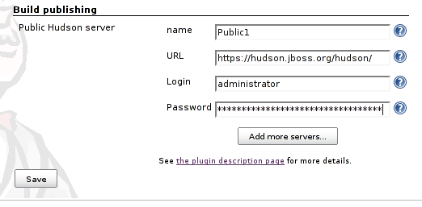
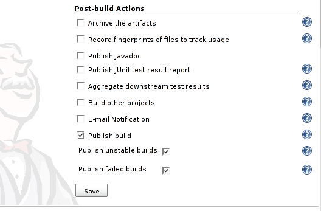
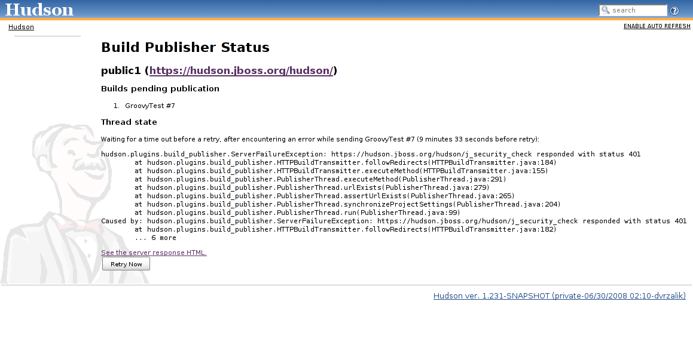

[.conf-macro .output-inline]##

[cols="",options="header",]
|===
|Plugin Information
|View Build-Publisher https://plugins.jenkins.io/build-publisher[on the
plugin site] for more information.
|===

[.aui-icon .aui-icon-small .aui-iconfont-info .confluence-information-macro-icon]##

Older versions of this plugin may not be safe to use. Please review the
following warnings before using an older version:

* https://jenkins.io/security/advisory/2017-10-23/[Insecure credential
storage and transmission]

[[BuildPublisherPlugin-Whatdoesitdo?]]
== What does it do?

 This plugin allows records from one Jenkins to be published on another
Jenkins.The typical use case is for you to run builds within the
firewall, then send the results to another Jenkins which is facing the
outside world.

[[BuildPublisherPlugin-Howitworks?]]
== How it works?

For the convention, let's call the Jenkins that's doing builds *private
Jenkins*, and let's call the Jenkins that's just broadcasting build
results as *public Jenkins*. The following pieces are involved to make
this work:

* Both private and public Jenkins need to have the build-publisher
plugin installed. This plugin makes Jenkins capable of sending records
to public Jenkins.
* Private Jenkins is configured with information about public Jenkins
instance(s) that it wants to send data to.
* Jobs on private Jenkins need to opt-in to the publication (through the
job configuration.)

Once this is set up, build records from private Jenkins is sent to
public Jenkins, through HTTP. If a corresponding job does not exist, it
will be automatically created on the public Jenkins and kept in sync
with the private Jenkins.

[.aui-icon .aui-icon-small .aui-iconfont-info .confluence-information-macro-icon]#
#

For this arrangement to work correctly, two Jenkins need to have more or
less the same version of plugins.

[[BuildPublisherPlugin-Configurationandusage]]
== Configuration and usage

Public Jenkins instance is configured on the global configuration page.
You have to specify name, URL, administrator username and password, as
shown on the following screenshot.

 +
[.confluence-embedded-file-wrapper]##

Check "Publish build" on the job configuration page int the "Post-build
Actions" section to mark the project for publishing:

 +
[.confluence-embedded-file-wrapper]##

To check the status of publishing go to "Dashboard" -> "Manage Jenkins"
-> "Build publishing status". In case of any problem during build
transmission, you can restart the publishing thread or reschedule
interrupted transmission (otherwise the thread waits for 10 minutes and
tries again).

 +
[.confluence-embedded-file-wrapper]##

[[BuildPublisherPlugin-Proxy]]
=== Proxy

Proxy support is available since ver. 1.12. Proxy settings is loaded
from Update center setup. If you do any changed to proxy setup, you need
to reload proxy setup in Build publisher section global Jenkins
configuration page in order to Build publisher reflect the changes (or
restart Jenkins:-).

[[BuildPublisherPlugin-Missingfeaturesandknownbugs]]
=== Missing features and known bugs

* Views don't get synchronized automatically
* The plugin isn't able to deal with matrix projects whose
configurations (axis) have changed (I had problems reproducing this
lately)

[[BuildPublisherPlugin-ChangeLog]]
=== Change Log

[[BuildPublisherPlugin-Upcomingchanges]]
==== Upcoming changes

[[BuildPublisherPlugin-Version1.22(2017/10/23)]]
==== Version 1.22 (2017/10/23)

* https://jenkins.io/security/advisory/2017-10-23/[Fix security
vulnerability]

[[BuildPublisherPlugin-Version1.20(2015/01/28)]]
==== Version 1.20 (2015/01/28)

* Doesn't use time zones and create symlinks any more, uses only
`+buiild-number+`, see
https://wiki.jenkins-ci.org/display/JENKINS/JENKINS-24380+Migration[JENKINS-24380
Migration] for details
(https://github.com/jenkinsci/build-publisher-plugin/pull/7[pull #7])

[[BuildPublisherPlugin-Version1.19(2014/05/10)]]
==== Version 1.19 (2014/05/10)

* Create and update symlinks on the disk
(https://issues.jenkins-ci.org/browse/JENKINS-18238[JENKINS-18238],
https://issues.jenkins-ci.org/browse/JENKINS-6096[JENKINS-6096])

[[BuildPublisherPlugin-Version1.18(2014/04/09)]]
==== Version 1.18 (2014/04/09)

* BuildPublisher reports "URL doesn't exist" after upgrade Remote
Jenkins to 1.535
(https://issues.jenkins-ci.org/browse/JENKINS-20067[JENKINS-20067])

[[BuildPublisherPlugin-Version1.17(2013/05/14)]]
==== Version 1.17 (2013/05/14)

* Fixed NPE when publishing a build
(https://issues.jenkins-ci.org/browse/JENKINS-17944[JENKINS-17944])

[[BuildPublisherPlugin-Version1.16(2013/04/30)]]
==== Version 1.16 (2013/04/30)

* Create matrix sub-job if doesn't exists
(https://github.com/jenkinsci/build-publisher-plugin/pull/2[pull #2])
* Proper encoding of URLs of jobs
(https://github.com/jenkinsci/build-publisher-plugin/pull/3[pull #3])

[[BuildPublisherPlugin-Version1.15(2013/02/28)]]
==== Version 1.15 (2013/02/28)

* Update for changes required by Jenkins core 1.503
(https://issues.jenkins-ci.org/browse/JENKINS-16993[JENKINS-16993])

[[BuildPublisherPlugin-Version1.14(2013/02/26)]]
==== Version 1.14 (2013/02/26)

* Handle error states when job was already deleted or matrix
configuration doesn't exists yet
(https://github.com/jenkinsci/build-publisher-plugin/pull/2[pull #2])
* Proper URL encoding
(https://github.com/jenkinsci/build-publisher-plugin/pull/1[pull #1])

[[BuildPublisherPlugin-Version1.13(2012/09/05)]]
==== Version 1.13 (2012/09/05)

* Update for changes required by Jenkins core 1.463
(https://issues.jenkins-ci.org/browse/JENKINS-13857[JENKINS-13857])
* Close output stream if some exception happens

[[BuildPublisherPlugin-Version1.12(2012/03/28)]]
==== Version 1.12 (2012/03/28)

* Proxy support
(https://issues.jenkins-ci.org/browse/JENKINS-8806[JENKINS-8806])
* Allow publishing into custom builds directory
(https://issues.jenkins-ci.org/browse/JENKINS-11692[JENKINS-11692])

[[BuildPublisherPlugin-Version1.11(2011/09/21)]]
==== Version 1.11 (2011/09/21)

* Fixed NPE
(https://issues.jenkins-ci.org/browse/JENKINS-11003[JENKINS-11003])

[[BuildPublisherPlugin-Version1.10(2010/09/08)]]
==== Version 1.10 (2010/09/08)

* Fix for JENKINS-7330

[[BuildPublisherPlugin-Version1.9(2010/08/05)]]
==== Version 1.9 (2010/08/05)

* Added option to disable triggers on public Hudson (JENKINS-3802)

[[BuildPublisherPlugin-Version1.8(2009/12/28)]]
==== Version 1.8 (2009/12/28)

* Fix link to matrix configuration
* Update uses of deprecated APIs
