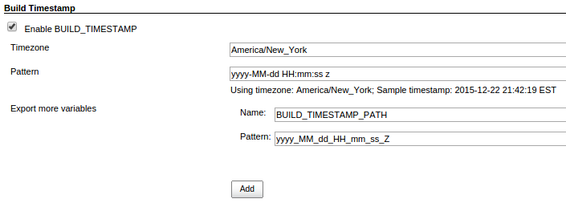

Export build timestamps to build env variables.

[[BuildTimestampPlugin-Configure]]
== Configure

`+BUILD_TIMESTAMP+` exported by default, and you can add more variables
with different format patterns in Global Configure page. +
[.confluence-embedded-file-wrapper]##

[[BuildTimestampPlugin-DaylightSavingTime]]
== Daylight Saving Time

DST is not enabled by default. +
If your location uses DST, you can enable it by setting the `+timezone+`
to the correct `+city+` such as `+America/New_York+`.

[[BuildTimestampPlugin-UsingtimestampsinMaven/Gradle/Shell]]
== Using timestamps in Maven/Gradle/Shell

They are available in Maven build and Gradle build as built-in
properties/variables as well.

Maven: +
As defined property in pom, equals to

[source,syntaxhighlighter-pre]
----
System.getProperty('BUILD_TIMESTAMP')
----

Gradle:

[source,syntaxhighlighter-pre]
----
System.getenv('BUILD_TIMESTAMP')
----

Shell:

[source,syntaxhighlighter-pre]
----
"$BUILD_TIMESTAMP"
----

[[BuildTimestampPlugin-OpenIssues]]
== Open Issues

[[refresh-module--951381443]]
[[refresh--951381443]][[jira-issues--951381443]]
T

Key

Summary

Assignee

Reporter

P

Status

Resolution

Created

Updated

Due

[.refresh-action-group]# #

[[refresh-issues-loading--951381443]]
[.aui-icon .aui-icon-wait]#Loading...#

[#refresh-issues-button--951381443]##
[#refresh-issues-link--951381443]#Refresh#
[#error-message--951381443 .error-message .hidden]# #

[[BuildTimestampPlugin-Changes]]
== Changes

[[BuildTimestampPlugin-1.0.3]]
=== 1.0.3

* https://github.com/jenkinsci/build-timestamp-plugin/pull/3[PR #3]

[[BuildTimestampPlugin-1.0.2]]
=== 1.0.2

* Added Optional date/time shift
+
For additional variables you can define shift (days, hours, minutes)
which will be added to build timestamp. This allows to run build plan
with previous day specified as parameter.

[[BuildTimestampPlugin-1.0.1]]
=== 1.0.1

* Fixed validation issue (combobox does not support validation)

[[BuildTimestampPlugin-1.0.0]]
=== 1.0.0

* Initial release.
